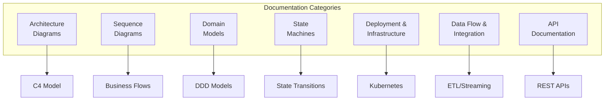
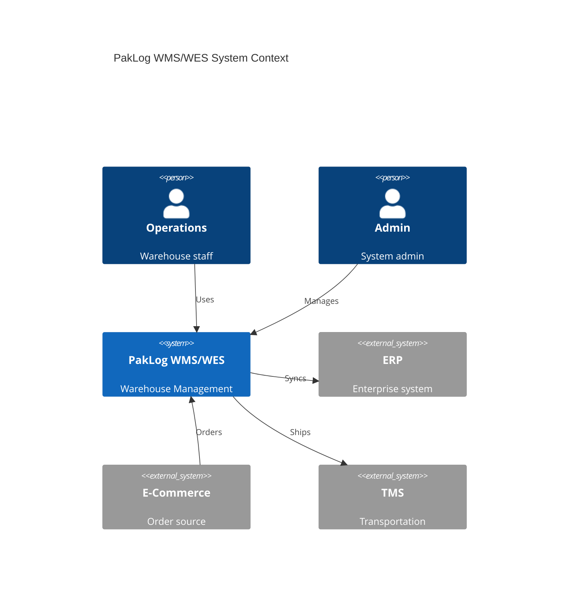
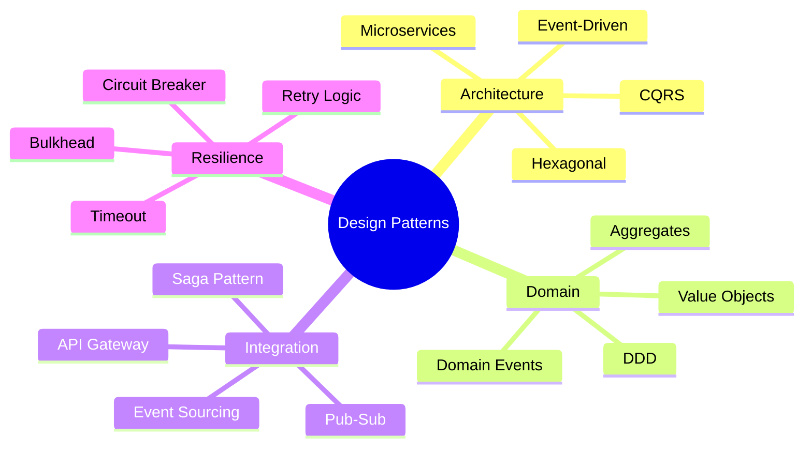

# PakLog WMS/WES System Documentation

## Overview

PakLog is a modern Warehouse Management System (WMS) and Warehouse Execution System (WES) built with microservices architecture, Domain-Driven Design (DDD), and event-driven patterns. This documentation provides comprehensive technical details about the system architecture, implementation, and operations.

---

## Documentation Structure



---

## 📚 Documentation Index

### 1. [Architecture Overview](diagrams/01-ARCHITECTURE-OVERVIEW.md)
**Purpose**: System architecture using C4 model
**Contents**:
- System Context (Level 1)
- Container Architecture (Level 2)
- Component Architecture (Level 3)
- Deployment Architecture
- Technology Stack Overview

**Key Diagrams**:
- C4 Context, Container, Component diagrams
- Deployment topology
- Service communication matrix

---

### 2. [Sequence Diagrams](diagrams/02-SEQUENCE-DIAGRAMS.md)
**Purpose**: Detailed business flow interactions
**Contents**:
- Order Fulfillment Flow
- Wave Planning and Release
- Task Assignment Flow
- Pick Execution Flow
- Pack and Ship Flow
- Inventory Movement
- Error Handling & Compensation

**Key Diagrams**:
- End-to-end order processing
- Distributed saga patterns
- Real-time monitoring flows

---

### 3. [Domain Model Diagrams](diagrams/03-DOMAIN-MODEL-DIAGRAMS.md)
**Purpose**: Domain-Driven Design models and relationships
**Contents**:
- Bounded Contexts
- Aggregate Models
- Entity Relationships
- Value Objects
- Domain Events

**Key Models**:
- Wave Planning Domain
- Task Execution Domain
- Pick Execution Domain
- Location Master Domain

---

### 4. [State Machine Diagrams](diagrams/04-STATE-MACHINE-DIAGRAMS.md)
**Purpose**: Entity lifecycle and state transitions
**Contents**:
- Wave Lifecycle
- Task States
- Pick Session States
- Order States
- Location States
- Inventory States

**Key Patterns**:
- State transition rules
- Event triggers
- Validation logic

---

### 5. [Deployment & Infrastructure](diagrams/05-DEPLOYMENT-INFRASTRUCTURE.md)
**Purpose**: Infrastructure architecture and deployment patterns
**Contents**:
- Kubernetes Architecture
- Network Architecture
- Database Infrastructure
- Message Queue Setup
- Monitoring Stack
- CI/CD Pipeline
- Disaster Recovery
- Security Architecture

**Key Technologies**:
- Kubernetes/Docker
- Kafka/Redis/MongoDB/PostgreSQL
- Prometheus/Grafana
- Service Mesh (Istio)

---

### 6. [Data Flow & Integration](diagrams/06-DATA-FLOW-INTEGRATION.md)
**Purpose**: Data processing and system integration patterns
**Contents**:
- End-to-End Data Flow
- Event Flow Architecture
- Integration Patterns
- ETL/ELT Processes
- Real-time Analytics
- CQRS Implementation
- Event Sourcing

**Key Patterns**:
- Pub-Sub messaging
- Stream processing
- API Gateway patterns
- External system integration

---

### 7. [API Documentation](diagrams/07-API-DOCUMENTATION.md)
**Purpose**: Complete REST API specifications with examples
**Contents**:
- Authentication & Authorization
- Wave Planning APIs
- Task Execution APIs
- Pick Execution APIs
- Pack & Ship APIs
- Location Master APIs
- WebSocket APIs
- Error Handling

**Key Features**:
- OpenAPI 3.0 compatible
- Request/Response examples
- WebSocket real-time updates
- Rate limiting & pagination

---

## System Architecture Summary



---

## Technology Stack

| Layer | Technology | Purpose |
|-------|------------|---------|
| **Language** | Java 21 | Primary development language |
| **Framework** | Spring Boot 3.2 | Microservices framework |
| **Messaging** | Apache Kafka | Event streaming |
| **Databases** | MongoDB, PostgreSQL, Redis | Polyglot persistence |
| **Container** | Docker, Kubernetes | Container orchestration |
| **Monitoring** | Prometheus, Grafana | Observability |
| **API Gateway** | Spring Cloud Gateway | API routing |
| **Service Mesh** | Istio | Service communication |

---

## Service Catalog

### WMS Services (Warehouse Management)
1. **Wave Planning Service** - Wave optimization and release
2. **Location Master Service** - Location and slotting management
3. **Workload Planning Service** - Resource and capacity planning

### WES Services (Warehouse Execution)
1. **Task Execution Service** - Task orchestration and assignment
2. **Pick Execution Service** - Pick session management
3. **Pack & Ship Service** - Packing and shipping operations
4. **Physical Tracking Service** - Inventory and license plate tracking

---

## Key Design Patterns



---

## Quick Links

### Development
- [Quick Start Guide](/QUICK_START_GUIDE.md)
- [Implementation Roadmap](/SIMPLIFIED_ROADMAP.md)
- [API Specifications](diagrams/07-API-DOCUMENTATION.md)

### Architecture
- [System Documentation](/SYSTEM_DOCUMENTATION.md)
- [Architecture Diagrams](diagrams/01-ARCHITECTURE-OVERVIEW.md)
- [Domain Models](diagrams/03-DOMAIN-MODEL-DIAGRAMS.md)

### Operations
- [Deployment Guide](diagrams/05-DEPLOYMENT-INFRASTRUCTURE.md)
- [Monitoring Setup](diagrams/05-DEPLOYMENT-INFRASTRUCTURE.md#monitoring-and-observability-stack)
- [Security Architecture](diagrams/05-DEPLOYMENT-INFRASTRUCTURE.md#security-architecture)

---

## Getting Started

### Prerequisites
- Java 21
- Maven 3.8+
- Docker & Docker Compose
- Kubernetes (for deployment)
- MongoDB, PostgreSQL, Redis
- Apache Kafka

### Local Development Setup
```bash
# Clone repository
git clone https://github.com/paklog/warehouse-operations.git

# Start infrastructure
docker-compose up -d mongodb postgresql redis kafka

# Build services
mvn clean package

# Run a service
cd wave-planning-service
mvn spring-boot:run
```

### API Testing
```bash
# Get access token
curl -X POST http://localhost:8080/oauth/token \
  -d "grant_type=client_credentials" \
  -d "client_id=test" \
  -d "client_secret=secret"

# Create a wave
curl -X POST http://localhost:8080/v1/waves \
  -H "Authorization: Bearer {token}" \
  -H "Content-Type: application/json" \
  -d '{"warehouseId": "WH001", "type": "STANDARD"}'
```

---

## Documentation Statistics

| Metric | Value |
|--------|-------|
| Total Documentation Files | 8 |
| Total Diagrams | 50+ |
| Mermaid Diagrams | 45+ |
| API Endpoints Documented | 25+ |
| Lines of Documentation | 5,000+ |

---

## Contributing

Please refer to our contribution guidelines for:
- Code style standards
- Testing requirements
- Documentation updates
- Pull request process

---

## License

Copyright © 2024 PakLog. All rights reserved.

---

## Support

- **Documentation Issues**: Create issue in repository
- **Architecture Questions**: architecture@paklog.com
- **API Support**: api@paklog.com
- **Slack**: #wms-wes-development

---

*Last Updated: January 2024*
*Version: 1.0.0*
*Status: Production Ready*
