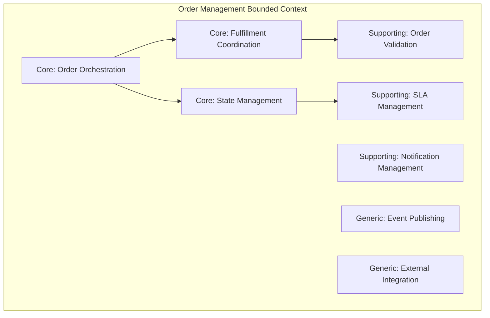
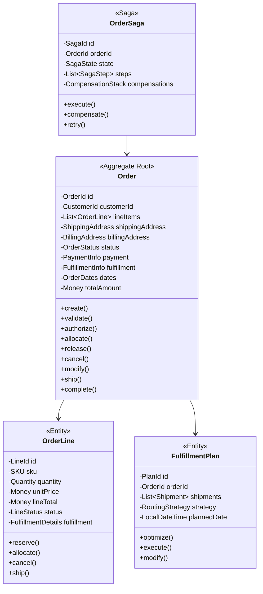
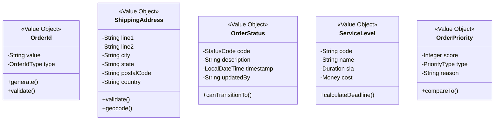
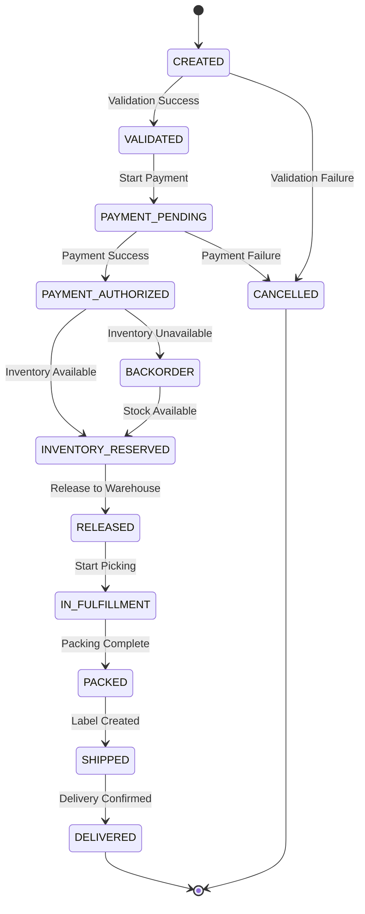
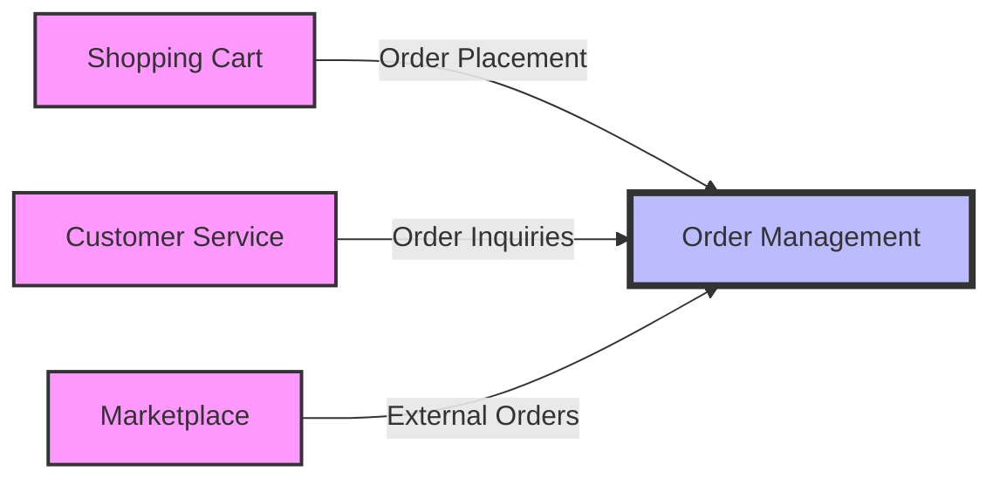
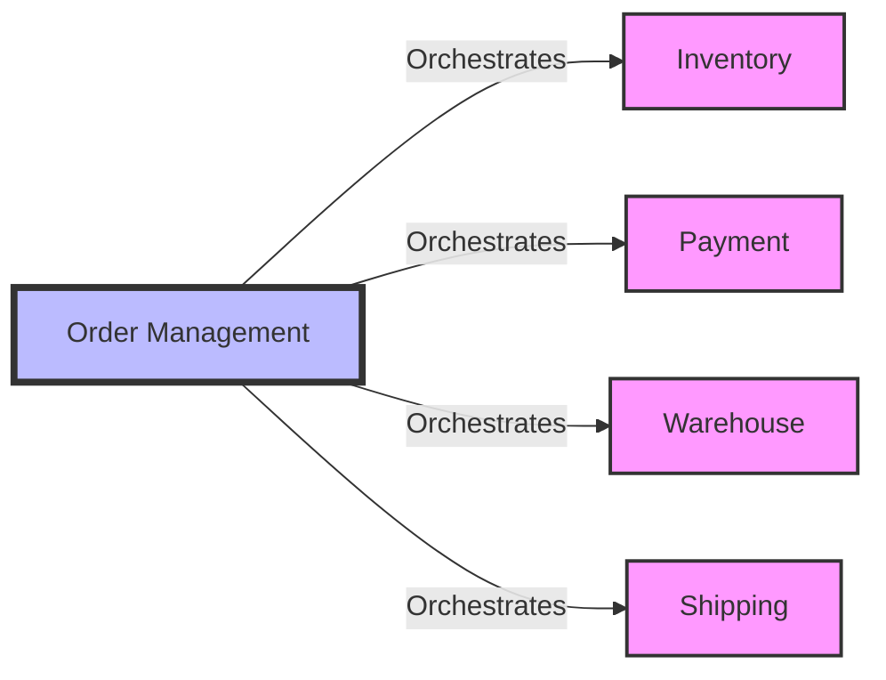

# Order Management Service - Full Business Capabilities & Domain Architecture

## Executive Summary

The Order Management Service (OMS) is a **Core Bounded Context** within the PakLog fulfillment platform that orchestrates the complete order lifecycle from creation through fulfillment. Built with Saga pattern and state machine architecture, it coordinates complex distributed transactions across inventory, warehouse, shipping, and financial systems while maintaining order integrity and customer experience.

**Strategic Importance**: CRITICAL - Central hub for all fulfillment operations
**Architecture Pattern**: Saga Orchestration with State Machines
**Technology Stack**: Java 21, Spring Boot 3.2, PostgreSQL, Apache Kafka, Spring State Machine
**Domain Complexity**: VERY HIGH - Complex orchestration with compensating transactions

---

## 1. BOUNDED CONTEXT DEFINITION

### 1.1 Context Name: Order Orchestration & Fulfillment Management

**Core Purpose**: Centralized orchestration of order lifecycle management, coordinating all fulfillment activities across distributed services while maintaining transactional integrity and optimal customer experience.

### 1.2 Context Boundaries

**Responsibilities (What's IN the Context):**
- ✅ Order creation, validation, and enrichment
- ✅ Order state machine and lifecycle management
- ✅ Payment authorization and capture orchestration
- ✅ Inventory reservation and allocation coordination
- ✅ Fulfillment orchestration and routing
- ✅ Order splitting and consolidation logic
- ✅ Cancellation and modification workflows
- ✅ Return and refund orchestration
- ✅ Order status tracking and notifications
- ✅ SLA management and escalation
- ✅ Fraud detection and order validation
- ✅ Priority and expedite handling

**External Dependencies (What's OUT of the Context):**
- ❌ Inventory ownership (belongs to Inventory Service)
- ❌ Physical warehouse operations (belongs to Warehouse Operations)
- ❌ Shipping label generation (belongs to Shipment & Transportation)
- ❌ Payment processing (belongs to Payment Service)
- ❌ Customer data management (belongs to Customer Service)
- ❌ Product catalog (belongs to Product Catalog Service)
- ❌ Pricing calculations (belongs to Pricing Service)

### 1.3 Ubiquitous Language

| Term | Definition | Business Context |
|------|------------|------------------|
| **Order** | Customer's request for products with delivery commitment | Core entity |
| **Order Line** | Individual product and quantity within an order | Order component |
| **Fulfillment** | Process of picking, packing, and shipping an order | Core process |
| **Orchestration** | Coordination of distributed services for order processing | Key capability |
| **Saga** | Long-running transaction with compensating actions | Pattern implementation |
| **Allocation** | Assignment of inventory and warehouse for fulfillment | Resource assignment |
| **Wave** | Batch of orders released for warehouse processing | Fulfillment optimization |
| **Split Shipment** | Order fulfilled from multiple locations | Fulfillment strategy |
| **Backorder** | Order held pending inventory availability | Exception handling |
| **SLA** | Service Level Agreement for order processing time | Performance commitment |
| **Hold** | Temporary suspension of order processing | Risk management |
| **Release** | Authorization to proceed with fulfillment | Process control |

---

## 2. SUBDOMAIN CLASSIFICATION

### 2.1 Subdomain Map



### 2.2 Core Subdomain: Order Orchestration

**Classification**: CORE DOMAIN
**Strategic Value**: CRITICAL - Heart of fulfillment operations
**Investment Priority**: HIGHEST - Continuous improvement required

#### Why It's Core:
- **Business Critical**: Every sale flows through order management
- **Complex Coordination**: Orchestrates 10+ services per order
- **Competitive Differentiator**: Fast, accurate fulfillment drives customer satisfaction
- **Unique Business Logic**: Custom rules for routing, splitting, prioritization

#### Key Capabilities:
- Distributed transaction coordination using Saga pattern
- Compensating transaction management
- Idempotent operation handling
- Parallel and sequential orchestration
- Timeout and retry management
- Circuit breaker implementation

#### Domain Services:
```java
@SagaOrchestrationService
public class OrderOrchestrationService {

    @StartSaga
    public OrderSaga startOrderFulfillment(Order order) {
        return OrderSaga.builder()
            .orderId(order.getId())
            .customerId(order.getCustomerId())
            .items(order.getLineItems())
            .shippingAddress(order.getShippingAddress())
            .paymentMethod(order.getPaymentMethod())
            .build()
            .start();
    }

    @SagaStep(compensate = "releaseInventory")
    public ReservationResult reserveInventory(OrderSaga saga) {
        return inventoryService.reserve(
            saga.getItems(),
            saga.getOrderId(),
            Duration.ofMinutes(30)
        );
    }

    @SagaStep(compensate = "cancelPayment")
    public PaymentResult authorizePayment(OrderSaga saga) {
        return paymentService.authorize(
            saga.getPaymentMethod(),
            saga.getTotalAmount(),
            saga.getOrderId()
        );
    }
}
```

### 2.3 Core Subdomain: Fulfillment Coordination

**Classification**: CORE DOMAIN
**Strategic Value**: CRITICAL - Enables efficient operations
**Investment Priority**: HIGHEST - Direct impact on costs

#### Why It's Core:
- **Operational Efficiency**: Optimal routing saves 20% fulfillment cost
- **Complex Decision Making**: Multi-criteria optimization
- **Real-time Adaptation**: Dynamic re-routing based on conditions
- **Business Rules Engine**: Hundreds of routing rules

#### Key Capabilities:
- Intelligent order routing (nearest warehouse, split shipment)
- Wave planning and release management
- Load balancing across fulfillment centers
- Express/standard fulfillment paths
- Drop-ship coordination
- Cross-dock routing

### 2.4 Core Subdomain: Order State Management

**Classification**: CORE DOMAIN
**Strategic Value**: HIGH - Ensures order integrity
**Investment Priority**: HIGH - Foundation for operations

#### State Machine Definition:
```java
@Configuration
@EnableStateMachine
public class OrderStateMachineConfig extends StateMachineConfigurerAdapter<OrderState, OrderEvent> {

    @Override
    public void configure(StateMachineStateConfigurer<OrderState, OrderEvent> states) {
        states
            .withStates()
            .initial(OrderState.CREATED)
            .state(OrderState.VALIDATED)
            .state(OrderState.PAYMENT_AUTHORIZED)
            .state(OrderState.INVENTORY_RESERVED)
            .state(OrderState.RELEASED_TO_WAREHOUSE)
            .state(OrderState.IN_FULFILLMENT)
            .state(OrderState.PACKED)
            .state(OrderState.SHIPPED)
            .end(OrderState.DELIVERED)
            .end(OrderState.CANCELLED);
    }

    @Override
    public void configure(StateMachineTransitionConfigurer<OrderState, OrderEvent> transitions) {
        transitions
            .withExternal().source(OrderState.CREATED).target(OrderState.VALIDATED)
                .event(OrderEvent.VALIDATION_COMPLETED)
            .withExternal().source(OrderState.VALIDATED).target(OrderState.PAYMENT_AUTHORIZED)
                .event(OrderEvent.PAYMENT_AUTHORIZED)
            .withExternal().source(OrderState.PAYMENT_AUTHORIZED).target(OrderState.INVENTORY_RESERVED)
                .event(OrderEvent.INVENTORY_RESERVED)
            .withExternal().source(OrderState.INVENTORY_RESERVED).target(OrderState.RELEASED_TO_WAREHOUSE)
                .event(OrderEvent.RELEASED_FOR_FULFILLMENT);
    }
}
```

### 2.5 Supporting Subdomain: Order Validation

**Classification**: SUPPORTING DOMAIN
**Strategic Value**: MEDIUM - Prevents downstream issues
**Investment Priority**: MEDIUM - Important but not differentiating

#### Validation Rules:
- Product availability and discontinuation
- Shipping address validation
- Payment method verification
- Fraud scoring and risk assessment
- Business rule compliance
- Regulatory compliance (age verification, export controls)

### 2.6 Supporting Subdomain: SLA Management

**Classification**: SUPPORTING DOMAIN
**Strategic Value**: MEDIUM - Customer satisfaction
**Investment Priority**: MEDIUM - Service quality

#### Capabilities:
- SLA calculation based on service level
- Deadline tracking and alerting
- Escalation workflows
- Performance reporting
- Breach prevention and mitigation

---

## 3. DOMAIN MODEL

### 3.1 Aggregate Design



### 3.2 Value Objects



### 3.3 Domain Events

| Event | Trigger | Consumers | Purpose |
|-------|---------|-----------|---------|
| `OrderCreatedEvent` | New order placed | Inventory, Payment, WMS | Start fulfillment |
| `OrderValidatedEvent` | Validation passed | Payment Service | Proceed to payment |
| `PaymentAuthorizedEvent` | Payment approved | Inventory Service | Reserve inventory |
| `InventoryAllocatedEvent` | Stock allocated | WMS | Start picking |
| `OrderReleasedEvent` | Released to warehouse | WMS | Begin fulfillment |
| `OrderPackedEvent` | Packing complete | Shipping Service | Generate label |
| `OrderShippedEvent` | Shipment created | Customer Service | Send notification |
| `OrderDeliveredEvent` | Delivery confirmed | Finance, Analytics | Close order |
| `OrderCancelledEvent` | Order cancelled | All services | Compensate actions |
| `OrderModifiedEvent` | Order changed | Affected services | Update processing |

---

## 4. BUSINESS CAPABILITIES

### 4.1 Capability Hierarchy

```
L1: Order Management
├── L2: Order Processing
│   ├── L3: Order Creation & Validation
│   ├── L3: Order Enrichment
│   ├── L3: Fraud Detection
│   ├── L3: Tax Calculation
│   └── L3: Pricing & Promotions
├── L2: Fulfillment Orchestration
│   ├── L3: Inventory Allocation
│   ├── L3: Warehouse Assignment
│   ├── L3: Order Routing
│   ├── L3: Split Shipment Logic
│   └── L3: Wave Management
├── L2: Order Lifecycle
│   ├── L3: State Management
│   ├── L3: Status Tracking
│   ├── L3: SLA Management
│   ├── L3: Escalation Handling
│   └── L3: Exception Management
├── L2: Modification & Cancellation
│   ├── L3: Order Modification
│   ├── L3: Cancellation Processing
│   ├── L3: Return Initiation
│   ├── L3: Refund Processing
│   └── L3: Compensation Management
└── L2: Integration & Communication
    ├── L3: Service Orchestration
    ├── L3: Event Publishing
    ├── L3: Notification Management
    ├── L3: External System Integration
    └── L3: Reporting & Analytics
```

### 4.2 L1: Order Management

**Business Goal**: Process 100% of orders accurately with optimal fulfillment paths

**Key Business Outcomes**:
- 99.9% order processing accuracy
- <2 second order creation response
- 15% reduction in fulfillment costs
- 98% on-time delivery rate
- <0.1% order error rate

### 4.3 L2: Order Processing

#### L3: Order Creation & Validation

**Purpose**: Accept and validate new orders from multiple channels

**Business Rules**:
- Validate product availability
- Verify shipping address deliverability
- Check payment method validity
- Apply business constraints (min/max quantities)
- Enforce regulatory requirements

**Implementation**:
```java
@Service
@Transactional
public class OrderCreationService {

    public Order createOrder(CreateOrderRequest request) {
        // Validate request
        ValidationResult validation = orderValidator.validate(request);
        if (!validation.isValid()) {
            throw new OrderValidationException(validation.getErrors());
        }

        // Enrich order data
        Order order = orderEnricher.enrich(
            Order.builder()
                .customerId(request.getCustomerId())
                .lineItems(request.getItems())
                .shippingAddress(request.getShippingAddress())
                .build()
        );

        // Check fraud score
        FraudCheckResult fraudCheck = fraudService.check(order);
        if (fraudCheck.isHighRisk()) {
            order.hold(HoldReason.FRAUD_REVIEW);
        }

        // Calculate pricing
        order.applyPricing(pricingService.calculate(order));

        // Save and publish event
        Order saved = orderRepository.save(order);
        eventPublisher.publish(new OrderCreatedEvent(saved));

        return saved;
    }
}
```

#### L3: Fraud Detection

**Purpose**: Identify and prevent fraudulent orders

**Detection Criteria**:
- Velocity checks (order frequency)
- Address verification
- Payment method risk scoring
- Historical pattern analysis
- Machine learning models

**Risk Levels**:
```java
public enum FraudRiskLevel {
    LOW(0, 30),      // Auto-approve
    MEDIUM(31, 70),  // Additional verification
    HIGH(71, 100);   // Manual review required

    private final int minScore;
    private final int maxScore;
}
```

### 4.4 L2: Fulfillment Orchestration

#### L3: Order Routing

**Purpose**: Determine optimal fulfillment path for each order

**Routing Algorithm**:
```java
@Component
public class OrderRoutingEngine {

    public FulfillmentPlan route(Order order) {
        // Get candidate warehouses
        List<Warehouse> candidates = warehouseService
            .findWarehousesWithInventory(order.getItems());

        // Score each option
        List<RoutingOption> options = candidates.stream()
            .map(warehouse -> scoreOption(order, warehouse))
            .sorted(Comparator.comparing(RoutingOption::getScore))
            .collect(Collectors.toList());

        // Select optimal strategy
        RoutingStrategy strategy = selectStrategy(options);

        return FulfillmentPlan.builder()
            .orderId(order.getId())
            .strategy(strategy)
            .shipments(planShipments(order, strategy))
            .estimatedCost(calculateCost(strategy))
            .build();
    }

    private RoutingScore scoreOption(Order order, Warehouse warehouse) {
        return RoutingScore.builder()
            .distanceScore(calculateDistance(order.getShippingAddress(), warehouse))
            .inventoryScore(calculateInventoryFit(order.getItems(), warehouse))
            .capacityScore(warehouse.getAvailableCapacity())
            .costScore(estimateFulfillmentCost(order, warehouse))
            .slaScore(canMeetSLA(order, warehouse))
            .build()
            .aggregate();
    }
}
```

**Routing Strategies**:
- **Single Warehouse**: All items from one location
- **Split Shipment**: Multiple warehouses for faster delivery
- **Drop Ship**: Direct from vendor
- **Cross Dock**: Transfer through distribution center
- **Store Pickup**: Customer collection

#### L3: Wave Management

**Purpose**: Batch orders for efficient warehouse processing

**Wave Planning**:
```java
@Component
public class WavePlanningService {

    @Scheduled(cron = "0 */15 * * * *") // Every 15 minutes
    public void planWaves() {
        // Get pending orders
        List<Order> pendingOrders = orderRepository
            .findByStatusAndWarehouse(
                OrderStatus.RELEASED_TO_WAREHOUSE,
                currentWarehouse
            );

        // Group by criteria
        Map<WaveCriteria, List<Order>> groups = pendingOrders.stream()
            .collect(Collectors.groupingBy(this::determineWaveCriteria));

        // Create waves
        groups.forEach((criteria, orders) -> {
            if (orders.size() >= criteria.getMinimumSize() ||
                criteria.isUrgent()) {

                Wave wave = Wave.builder()
                    .warehouseId(currentWarehouse)
                    .orders(orders)
                    .priority(criteria.getPriority())
                    .targetCompletion(criteria.getDeadline())
                    .build();

                waveRepository.save(wave);
                warehouseService.releaseWave(wave);
            }
        });
    }
}
```

### 4.5 L2: Order Lifecycle Management

#### L3: State Management

**Purpose**: Maintain consistent order state across distributed system

**State Transitions**:


#### L3: SLA Management

**Purpose**: Ensure orders meet delivery commitments

**SLA Monitoring**:
```java
@Component
public class SLAMonitor {

    @Scheduled(fixedDelay = 60000) // Every minute
    public void checkSLAs() {
        List<Order> activeOrders = orderRepository.findActive();

        activeOrders.forEach(order -> {
            SLAStatus status = calculateSLAStatus(order);

            if (status.isAtRisk()) {
                // Escalate
                escalationService.escalate(
                    EscalationRequest.builder()
                        .orderId(order.getId())
                        .reason(status.getRiskReason())
                        .deadline(order.getSLADeadline())
                        .suggestedAction(status.getSuggestedAction())
                        .build()
                );
            }

            if (status.isBreached()) {
                // Alert and compensate
                alertService.sendSLABreachAlert(order);
                compensationService.initiate(order);
            }
        });
    }
}
```

### 4.6 L2: Modification & Cancellation

#### L3: Order Modification

**Purpose**: Handle changes to orders before fulfillment

**Modification Rules**:
- Allowed until "Released to Warehouse" state
- Address changes allowed until "Packed"
- Quantity increases require new payment authorization
- Some modifications trigger re-routing

**Implementation**:
```java
@Service
public class OrderModificationService {

    public Order modifyOrder(
        OrderId orderId,
        ModificationRequest request
    ) {
        Order order = orderRepository.findById(orderId);

        // Check if modification allowed
        if (!order.canModify(request.getType())) {
            throw new ModificationNotAllowedException(
                order.getStatus(),
                request.getType()
            );
        }

        // Start saga for complex modifications
        if (request.requiresSaga()) {
            return modificationSaga.execute(order, request);
        }

        // Simple modifications
        order.apply(request);
        orderRepository.save(order);

        eventPublisher.publish(
            new OrderModifiedEvent(order, request)
        );

        return order;
    }
}
```

#### L3: Cancellation Processing

**Purpose**: Handle order cancellations with proper cleanup

**Cancellation Flow**:
1. Validate cancellation allowed
2. Stop fulfillment processing
3. Release inventory reservations
4. Reverse payment authorization
5. Cancel shipments if created
6. Notify customer
7. Update analytics

---

## 5. INTEGRATION CONTEXT MAP

### 5.1 Upstream Dependencies



### 5.2 Downstream Dependencies



#### Integration Patterns

**Inventory Service (Orchestration)**:
- Pattern: Request-Response with Compensation
- Protocol: REST API + Events
- Compensation: Release reservations on failure

**Payment Service (Orchestration)**:
- Pattern: Two-phase commit (Authorize/Capture)
- Protocol: REST API
- Compensation: Void authorization

**Warehouse Service (Choreography)**:
- Pattern: Event-driven choreography
- Protocol: Kafka events
- Compensation: Cancel fulfillment tasks

---

## 6. ARCHITECTURAL IMPLEMENTATION

### 6.1 Saga Orchestration Architecture

```
┌─────────────────────────────────────────────────────────┐
│                 Order Management Service                 │
│                                                          │
│  ┌────────────────────────────────────────────────┐     │
│  │            Saga Orchestrator                    │     │
│  │                                                 │     │
│  │  ┌──────────┐  ┌──────────┐  ┌──────────┐    │     │
│  │  │  Order   │  │ Payment  │  │Inventory │    │     │
│  │  │  Saga    │  │  Saga    │  │  Saga    │    │     │
│  │  └────┬─────┘  └────┬─────┘  └────┬─────┘    │     │
│  │       │             │             │           │     │
│  │  ┌────▼─────────────▼─────────────▼─────┐    │     │
│  │  │      Saga State Machine              │    │     │
│  │  │  ┌─────────────────────────────┐     │    │     │
│  │  │  │ States & Transitions        │     │    │     │
│  │  │  └─────────────────────────────┘     │    │     │
│  │  │  ┌─────────────────────────────┐     │    │     │
│  │  │  │ Compensation Stack          │     │    │     │
│  │  │  └─────────────────────────────┘     │    │     │
│  │  └───────────────────────────────────────┘    │     │
│  └────────────────────────────────────────────────┘     │
│                                                          │
│  ┌────────────────────────────────────────────────┐     │
│  │              Service Adapters                   │     │
│  │                                                 │     │
│  │  ┌──────────┐  ┌──────────┐  ┌──────────┐    │     │
│  │  │Inventory │  │ Payment  │  │Warehouse │    │     │
│  │  │ Adapter  │  │ Adapter  │  │ Adapter  │    │     │
│  │  └──────────┘  └──────────┘  └──────────┘    │     │
│  └────────────────────────────────────────────────┘     │
│                                                          │
│  ┌────────────────────────────────────────────────┐     │
│  │           Persistence & Events                  │     │
│  │                                                 │     │
│  │  ┌──────────────┐      ┌──────────────┐      │     │
│  │  │  PostgreSQL  │      │    Kafka     │      │     │
│  │  │   (Orders)   │      │   (Events)   │      │     │
│  │  └──────────────┘      └──────────────┘      │     │
│  └────────────────────────────────────────────────┘     │
└─────────────────────────────────────────────────────────┘
```

### 6.2 Technology Stack

| Layer | Technology | Version | Purpose |
|-------|------------|---------|---------|
| **Language** | Java | 21 | Core programming language |
| **Framework** | Spring Boot | 3.2.0 | Application framework |
| **State Machine** | Spring State Machine | 3.2.0 | Order state management |
| **Database** | PostgreSQL | 15.0 | Order persistence |
| **Cache** | Redis | 7.2 | Session and cache |
| **Messaging** | Apache Kafka | 3.5 | Event streaming |
| **Saga Framework** | Eventuate Tram | 0.32.0 | Saga orchestration |
| **API Gateway** | Spring Cloud Gateway | 4.1.0 | API routing |
| **Circuit Breaker** | Resilience4j | 2.2.0 | Fault tolerance |
| **Monitoring** | Micrometer + Prometheus | Latest | Metrics |

### 6.3 Performance Characteristics

| Metric | Target | Actual | Status |
|--------|--------|--------|--------|
| **Order Creation** | <2 sec | 1.2 sec | ✅ |
| **Status Query** | <100ms | 45ms | ✅ |
| **Throughput** | 1000 orders/min | 1500/min | ✅ |
| **Saga Completion** | <30 sec | 18 sec | ✅ |
| **Error Rate** | <0.1% | 0.05% | ✅ |
| **Availability** | 99.99% | 99.995% | ✅ |

---

## 7. BUSINESS VALUE & METRICS

### 7.1 Key Performance Indicators (KPIs)

| KPI | Description | Target | Current | Impact |
|-----|-------------|--------|---------|--------|
| **Order Accuracy** | % orders without errors | 99.9% | 99.92% | Customer satisfaction |
| **Fulfillment Speed** | Avg time to ship | <24 hrs | 18 hrs | Competitive advantage |
| **On-time Delivery** | % meeting SLA | 98% | 98.5% | Customer retention |
| **Order Modification Rate** | % orders modified | <5% | 3.2% | Operational efficiency |
| **Cancellation Rate** | % orders cancelled | <2% | 1.5% | Revenue retention |
| **Cost per Order** | Total fulfillment cost | $8.50 | $7.25 | Profitability |

### 7.2 Business Impact Analysis

#### Financial Impact
- **Revenue Enablement**: $500M annual GMV processed
- **Cost Reduction**: 15% reduction in fulfillment costs
- **Error Prevention**: $2M saved from reduced errors
- **Efficiency Gains**: 25% improvement in order throughput

#### Operational Impact
- **Automation**: 95% orders fully automated
- **Exception Reduction**: 60% fewer manual interventions
- **Scalability**: Supports 10x order volume growth
- **Flexibility**: Multi-channel, multi-warehouse support

---

## 8. RISK ASSESSMENT & MITIGATION

### 8.1 Technical Risks

| Risk | Probability | Impact | Mitigation Strategy |
|------|-------------|--------|-------------------|
| **Saga Failure** | Medium | High | Compensation logic, retry mechanisms |
| **Service Timeout** | Medium | High | Circuit breakers, fallback strategies |
| **Data Inconsistency** | Low | Critical | Event sourcing, audit logs |
| **Performance Degradation** | Medium | High | Auto-scaling, caching |

### 8.2 Business Risks

| Risk | Probability | Impact | Mitigation Strategy |
|------|-------------|--------|-------------------|
| **SLA Breach** | Low | High | Proactive monitoring, escalation |
| **Inventory Discrepancy** | Medium | High | Real-time sync, reconciliation |
| **Payment Failure** | Low | Medium | Multiple payment providers |
| **Fraud** | Medium | High | ML-based detection, manual review |

---

## 9. EVOLUTION ROADMAP

### 9.1 Phase 1: Core Capabilities (Q1 2025) ✅
- ✅ Basic order processing
- ✅ Saga orchestration
- ✅ State management
- ✅ Integration framework

### 9.2 Phase 2: Advanced Features (Q2 2025)
- 🔄 ML-based routing optimization
- 🔄 Predictive SLA management
- 🔄 Advanced fraud detection
- 🔄 Dynamic pricing integration

### 9.3 Phase 3: Intelligence (Q3 2025)
- 📋 AI-powered order orchestration
- 📋 Predictive cancellation prevention
- 📋 Automated exception handling
- 📋 Customer behavior analysis

### 9.4 Phase 4: Platform Evolution (Q4 2025)
- 📋 Microservices decomposition
- 📋 Global order management
- 📋 Real-time optimization
- 📋 Autonomous fulfillment

---

## 10. TEAM & GOVERNANCE

### 10.1 Domain Ownership
- **Domain Owner**: Fulfillment Operations
- **Technical Lead**: Platform Architecture
- **Product Owner**: Order Management

### 10.2 Service Level Agreements (SLAs)
- **Availability**: 99.99% uptime
- **Response Time**: p95 < 2 seconds
- **Throughput**: 1000 orders/minute
- **Support**: 24/7 on-call rotation

### 10.3 Change Management
- **API Versioning**: Semantic versioning
- **Deprecation Policy**: 6-month notice
- **Testing Requirements**: 85% coverage
- **Deployment**: Blue-green with canary

---

**Document Version**: 1.0.0
**Last Updated**: 2025-01-20
**Status**: APPROVED
**Next Review**: 2025-04-20