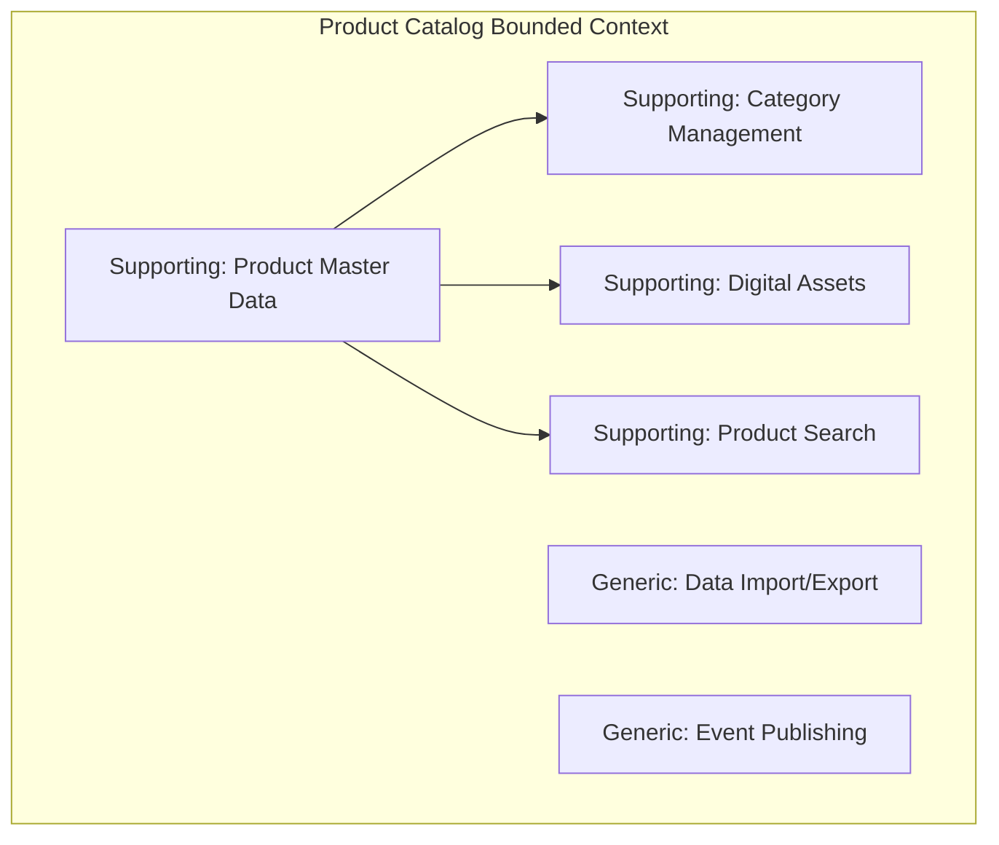
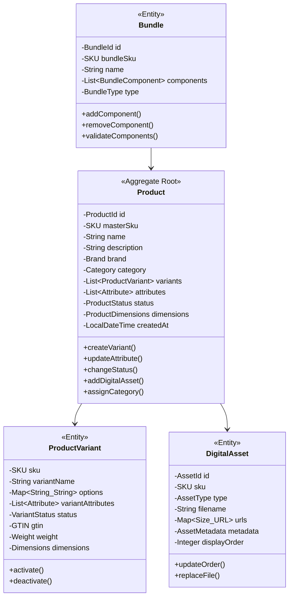
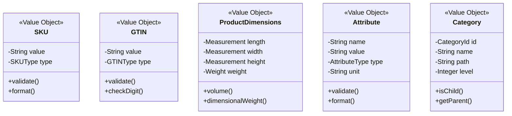
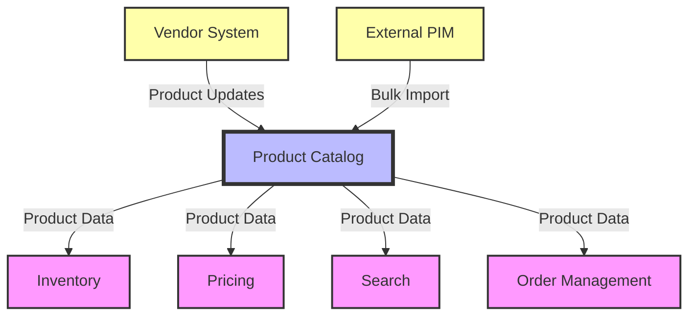

# Product Catalog Service - Full Business Capabilities & Domain Architecture

## Executive Summary

The Product Catalog Service is a **Supporting Bounded Context** within the PakLog fulfillment platform that serves as the authoritative source for all product information, attributes, and relationships. Built with CQRS and optimized for high-read scenarios, it provides consistent product data across all channels while supporting complex hierarchies, variations, and enrichment workflows.

**Strategic Importance**: HIGH - Foundation for all commerce operations
**Architecture Pattern**: CQRS with Read-Optimized Views
**Technology Stack**: Java 21, Spring Boot 3.2, PostgreSQL, Elasticsearch, Redis
**Domain Complexity**: MEDIUM - Complex data model with simple operations

---

## 1. BOUNDED CONTEXT DEFINITION

### 1.1 Context Name: Product Information Management

**Core Purpose**: Centralized repository for all product master data, providing consistent, enriched product information across all sales channels and operational systems with support for complex product relationships and variations.

### 1.2 Context Boundaries

**Responsibilities (What's IN the Context):**
- ✅ Product master data management (SKUs, attributes, descriptions)
- ✅ Product hierarchy and categorization
- ✅ Product variations and bundles
- ✅ Digital asset management (images, videos, documents)
- ✅ Product dimensions and weight specifications
- ✅ Product lifecycle management (introduction, discontinuation)
- ✅ Cross-references and alternate identifiers
- ✅ Product search and discovery
- ✅ Attribute inheritance and defaults
- ✅ Multi-language product content
- ✅ Product compliance and certifications
- ✅ Product relationships (cross-sell, upsell, substitutes)

**External Dependencies (What's OUT of the Context):**
- ❌ Inventory levels (belongs to Inventory Service)
- ❌ Pricing and promotions (belongs to Pricing Service)
- ❌ Customer reviews and ratings (belongs to Review Service)
- ❌ Order history (belongs to Order Management)
- ❌ Supplier information (belongs to Vendor Management)
- ❌ Warehouse locations (belongs to Warehouse Operations)
- ❌ Shipping calculations (belongs to Shipment Service)

### 1.3 Ubiquitous Language

| Term | Definition | Business Context |
|------|------------|------------------|
| **SKU** | Stock Keeping Unit - unique product variant identifier | Core identifier |
| **Product** | Sellable item with variants | Master entity |
| **Variant** | Specific configuration of a product (size, color) | Product instance |
| **Attribute** | Characteristic of a product (material, brand) | Product metadata |
| **Category** | Hierarchical classification of products | Organization structure |
| **Bundle** | Group of products sold together | Product type |
| **Kit** | Products that must be assembled | Product type |
| **Digital Asset** | Images, videos, documents for products | Product content |
| **GTIN** | Global Trade Item Number (barcode) | External identifier |
| **Taxonomy** | Hierarchical classification system | Data organization |
| **Facet** | Searchable product attribute | Search feature |
| **Enrichment** | Process of adding product information | Data quality |

---

## 2. SUBDOMAIN CLASSIFICATION

### 2.1 Subdomain Map



### 2.2 Supporting Subdomain: Product Master Data Management

**Classification**: SUPPORTING DOMAIN
**Strategic Value**: HIGH - Enables all commerce operations
**Investment Priority**: MEDIUM - Essential but not differentiating

#### Why It's Supporting:
- **Enabler**: Required for all selling operations
- **Standard Functionality**: Common across e-commerce platforms
- **Limited Differentiation**: Similar requirements across industries
- **Could Buy**: Commercial PIM solutions available

#### Key Capabilities:
- Product creation with validation
- Attribute management with inheritance
- Variant generation and management
- Bundle and kit configuration
- Lifecycle state management
- Bulk operations and imports

#### Domain Services:
```java
@DomainService
public class ProductManagementService {

    public Product createProduct(ProductCreationRequest request) {
        // Validate unique identifiers
        validateUniqueness(request.getSku(), request.getGtin());

        // Create product with variants
        Product product = Product.builder()
            .sku(request.getSku())
            .name(request.getName())
            .description(request.getDescription())
            .category(categoryRepository.find(request.getCategoryId()))
            .attributes(enrichAttributes(request.getAttributes()))
            .status(ProductStatus.DRAFT)
            .build();

        // Generate variants if applicable
        if (request.hasVariantOptions()) {
            List<ProductVariant> variants = variantGenerator
                .generate(product, request.getVariantOptions());
            product.setVariants(variants);
        }

        return productRepository.save(product);
    }

    public Product updateLifecycleState(
        SKU sku,
        ProductStatus newStatus,
        String reason
    ) {
        Product product = productRepository.findBySku(sku);

        // Validate state transition
        if (!product.canTransitionTo(newStatus)) {
            throw new InvalidStateTransitionException(
                product.getStatus(),
                newStatus
            );
        }

        product.updateStatus(newStatus, reason);
        productRepository.save(product);

        // Publish state change event
        eventPublisher.publish(
            new ProductStatusChangedEvent(product, newStatus)
        );

        return product;
    }
}
```

### 2.3 Supporting Subdomain: Category & Taxonomy Management

**Classification**: SUPPORTING DOMAIN
**Strategic Value**: MEDIUM - Improves navigation and discovery
**Investment Priority**: MEDIUM - Important for user experience

#### Key Capabilities:
- Hierarchical category structure
- Multiple taxonomy support
- Category attributes and rules
- Automatic categorization
- Breadcrumb generation
- Faceted navigation support

#### Category Model:
```java
@Entity
public class Category {
    @Id
    private CategoryId id;
    private String name;
    private String displayName;
    private CategoryId parentId;
    private Integer level;
    private String path; // e.g., "/electronics/computers/laptops"
    private List<AttributeDefinition> requiredAttributes;
    private List<AttributeDefinition> optionalAttributes;
    private CategoryStatus status;
    private SortOrder defaultSortOrder;

    public boolean isLeaf() {
        return !hasChildren();
    }

    public List<Category> getAncestors() {
        // Return path from root to this category
    }

    public void validateProduct(Product product) {
        // Check required attributes are present
        requiredAttributes.forEach(attr -> {
            if (!product.hasAttribute(attr.getName())) {
                throw new MissingRequiredAttributeException(attr);
            }
        });
    }
}
```

### 2.4 Supporting Subdomain: Digital Asset Management

**Classification**: SUPPORTING DOMAIN
**Strategic Value**: MEDIUM - Critical for online selling
**Investment Priority**: MEDIUM - Direct impact on conversion

#### Key Capabilities:
- Image upload and processing
- Multiple image sizes and formats
- Video management
- Document attachments (PDFs, manuals)
- CDN integration
- Asset versioning
- Bulk asset operations

#### Asset Processing:
```java
@Service
public class DigitalAssetService {

    public AssetMetadata uploadProductImage(
        SKU sku,
        MultipartFile file,
        ImageType type
    ) {
        // Validate file
        validateImage(file);

        // Generate variants
        Map<ImageSize, ProcessedImage> variants = imageProcessor
            .processImage(file, IMAGE_SIZE_CONFIGS);

        // Upload to CDN
        Map<ImageSize, String> urls = new HashMap<>();
        variants.forEach((size, image) -> {
            String url = cdnService.upload(
                generatePath(sku, type, size),
                image
            );
            urls.put(size, url);
        });

        // Save metadata
        AssetMetadata metadata = AssetMetadata.builder()
            .sku(sku)
            .type(type)
            .originalFilename(file.getOriginalFilename())
            .urls(urls)
            .uploadedAt(LocalDateTime.now())
            .build();

        return assetRepository.save(metadata);
    }
}
```

### 2.5 Supporting Subdomain: Product Search & Discovery

**Classification**: SUPPORTING DOMAIN
**Strategic Value**: HIGH - Directly impacts conversion
**Investment Priority**: HIGH - Critical for user experience

#### Key Capabilities:
- Full-text search with relevance scoring
- Faceted search and filtering
- Autocomplete and suggestions
- Synonym handling
- Spelling correction
- Search analytics
- Personalized search results

#### Search Implementation:
```java
@Service
public class ProductSearchService {

    private final ElasticsearchClient elasticsearchClient;

    public SearchResults search(SearchRequest request) {
        // Build Elasticsearch query
        BoolQuery.Builder queryBuilder = new BoolQuery.Builder();

        // Add text search
        if (request.hasSearchTerm()) {
            queryBuilder.must(m -> m
                .multiMatch(mm -> mm
                    .query(request.getSearchTerm())
                    .fields(List.of(
                        "name^3",      // Boost name matches
                        "brand^2",     // Boost brand matches
                        "description",
                        "attributes"
                    ))
                    .type(MultiMatchType.BestFields)
                    .fuzziness(Fuzziness.AUTO)
                )
            );
        }

        // Add filters
        request.getFilters().forEach(filter -> {
            queryBuilder.filter(f -> f
                .term(t -> t
                    .field(filter.getField())
                    .value(filter.getValue())
                )
            );
        });

        // Add facet aggregations
        Map<String, Aggregation> aggregations = buildFacetAggregations(
            request.getFacets()
        );

        // Execute search
        SearchResponse<ProductDocument> response = elasticsearchClient
            .search(s -> s
                .index("products")
                .query(queryBuilder.build()._toQuery())
                .aggregations(aggregations)
                .from(request.getOffset())
                .size(request.getLimit())
                .sort(buildSortOptions(request.getSort())),
                ProductDocument.class
            );

        return mapToSearchResults(response);
    }
}
```

### 2.6 Generic Subdomain: Data Import/Export

**Classification**: GENERIC DOMAIN
**Strategic Value**: LOW - Utility function
**Investment Priority**: LOW - Use standard tools

#### Key Capabilities:
- CSV/Excel import
- API-based import
- Validation and error reporting
- Mapping and transformation
- Scheduled imports
- Export templates

---

## 3. DOMAIN MODEL

### 3.1 Aggregate Design



### 3.2 Value Objects



### 3.3 Domain Events

| Event | Trigger | Consumers | Purpose |
|-------|---------|-----------|---------|
| `ProductCreatedEvent` | New product added | Search, Inventory | Index and initialize |
| `ProductUpdatedEvent` | Product modified | Search, Cache | Update indexes |
| `ProductActivatedEvent` | Product made available | Inventory, Pricing | Enable selling |
| `ProductDeactivatedEvent` | Product discontinued | Order, Inventory | Stop selling |
| `VariantCreatedEvent` | New variant added | Inventory | Create stock position |
| `CategoryChangedEvent` | Product recategorized | Search | Update navigation |
| `AssetUploadedEvent` | New image/document | CDN, Search | Process and index |
| `BundleCreatedEvent` | Bundle configured | Pricing, Inventory | Setup components |

---

## 4. BUSINESS CAPABILITIES

### 4.1 Capability Hierarchy

```
L1: Product Information Management
├── L2: Product Master Data
│   ├── L3: Product Creation & Management
│   ├── L3: Variant Management
│   ├── L3: Attribute Management
│   ├── L3: Bundle Configuration
│   └── L3: Lifecycle Management
├── L2: Product Organization
│   ├── L3: Category Management
│   ├── L3: Taxonomy Management
│   ├── L3: Brand Management
│   ├── L3: Collection Management
│   └── L3: Relationship Management
├── L2: Content Management
│   ├── L3: Description Management
│   ├── L3: Digital Asset Management
│   ├── L3: Multi-language Content
│   ├── L3: SEO Optimization
│   └── L3: Content Versioning
├── L2: Product Discovery
│   ├── L3: Search & Filtering
│   ├── L3: Faceted Navigation
│   ├── L3: Recommendations
│   ├── L3: Similar Products
│   └── L3: Product Comparison
└── L2: Data Quality
    ├── L3: Data Validation
    ├── L3: Enrichment Workflows
    ├── L3: Completeness Scoring
    ├── L3: Duplicate Detection
    └── L3: Data Governance
```

### 4.2 L1: Product Information Management

**Business Goal**: Provide accurate, complete product information across all channels

**Key Business Outcomes**:
- 99% data completeness score
- <500ms search response time
- 95% first-page search relevance
- 30% reduction in product data errors
- 25% improvement in conversion from better product info

### 4.3 L2: Product Master Data

#### L3: Product Creation & Management

**Purpose**: Maintain authoritative product information

**Business Rules**:
- SKU must be unique across system
- Required attributes must be present
- GTIN validation with check digit
- Product naming conventions
- Image requirements (min resolution, formats)

**Creation Workflow**:
```java
@Service
@Transactional
public class ProductCreationWorkflow {

    public Product createProduct(ProductRequest request) {
        // Step 1: Validate request
        ValidationResult validation = validator.validate(request);
        if (!validation.isValid()) {
            throw new ValidationException(validation.getErrors());
        }

        // Step 2: Check for duplicates
        checkForDuplicates(request);

        // Step 3: Enrich with defaults
        request = enrichWithDefaults(request);

        // Step 4: Create product
        Product product = Product.create(
            request.getSku(),
            request.getName(),
            request.getDescription()
        );

        // Step 5: Set attributes
        request.getAttributes().forEach(attr -> {
            product.setAttribute(attr.getName(), attr.getValue());
        });

        // Step 6: Assign category
        Category category = categoryRepository.find(request.getCategoryId());
        product.assignToCategory(category);

        // Step 7: Validate against category rules
        category.validateProduct(product);

        // Step 8: Save and publish
        Product saved = productRepository.save(product);
        eventPublisher.publish(new ProductCreatedEvent(saved));

        return saved;
    }
}
```

#### L3: Variant Management

**Purpose**: Handle product variations (size, color, etc.)

**Variant Generation**:
```java
@Component
public class VariantGenerator {

    public List<ProductVariant> generate(
        Product product,
        List<VariantOption> options
    ) {
        // Generate all combinations
        List<Map<String, String>> combinations =
            generateCombinations(options);

        return combinations.stream()
            .map(combo -> ProductVariant.builder()
                .masterProduct(product)
                .sku(generateVariantSku(product.getSku(), combo))
                .options(combo)
                .name(generateVariantName(product.getName(), combo))
                .status(VariantStatus.DRAFT)
                .build()
            )
            .collect(Collectors.toList());
    }

    private String generateVariantSku(SKU masterSku, Map<String, String> options) {
        // Example: SHIRT-001 -> SHIRT-001-RED-L
        StringBuilder sku = new StringBuilder(masterSku.getValue());
        options.values().forEach(value -> {
            sku.append("-").append(value.toUpperCase());
        });
        return sku.toString();
    }
}
```

### 4.4 L2: Product Organization

#### L3: Category Management

**Purpose**: Organize products in navigable hierarchy

**Category Structure**:
```
Root
├── Electronics
│   ├── Computers
│   │   ├── Laptops
│   │   ├── Desktops
│   │   └── Tablets
│   └── Audio
│       ├── Headphones
│       └── Speakers
└── Clothing
    ├── Men's
    │   ├── Shirts
    │   └── Pants
    └── Women's
        ├── Dresses
        └── Shoes
```

**Navigation Generation**:
```java
@Service
public class NavigationService {

    public NavigationTree buildNavigation() {
        List<Category> rootCategories = categoryRepository.findRoots();

        return NavigationTree.builder()
            .categories(rootCategories.stream()
                .map(this::buildCategoryNode)
                .collect(Collectors.toList())
            )
            .build();
    }

    private CategoryNode buildCategoryNode(Category category) {
        return CategoryNode.builder()
            .id(category.getId())
            .name(category.getDisplayName())
            .url(category.getUrl())
            .productCount(getProductCount(category))
            .children(category.getChildren().stream()
                .filter(Category::isActive)
                .map(this::buildCategoryNode)
                .collect(Collectors.toList())
            )
            .build();
    }
}
```

### 4.5 L2: Content Management

#### L3: Digital Asset Management

**Purpose**: Manage product images, videos, and documents

**Asset Types**:
- Primary image (required)
- Gallery images (multiple)
- 360° view images
- Product videos
- PDF manuals
- Size charts
- Specification sheets

**Image Processing Pipeline**:
```java
@Component
public class ImageProcessingPipeline {

    private static final Map<ImageSize, ImageConfig> SIZE_CONFIGS = Map.of(
        ImageSize.THUMBNAIL, new ImageConfig(150, 150, 85),
        ImageSize.SMALL, new ImageConfig(300, 300, 90),
        ImageSize.MEDIUM, new ImageConfig(600, 600, 90),
        ImageSize.LARGE, new ImageConfig(1200, 1200, 95),
        ImageSize.ORIGINAL, new ImageConfig(null, null, 100)
    );

    public Map<ImageSize, ProcessedImage> process(MultipartFile file) {
        BufferedImage original = ImageIO.read(file.getInputStream());

        return SIZE_CONFIGS.entrySet().stream()
            .collect(Collectors.toMap(
                Map.Entry::getKey,
                entry -> processForSize(original, entry.getValue())
            ));
    }

    private ProcessedImage processForSize(
        BufferedImage original,
        ImageConfig config
    ) {
        if (config.isOriginal()) {
            return new ProcessedImage(original);
        }

        BufferedImage resized = resize(original, config);
        BufferedImage optimized = optimize(resized, config);

        return new ProcessedImage(optimized);
    }
}
```

### 4.6 L2: Product Discovery

#### L3: Search & Filtering

**Purpose**: Enable product finding and discovery

**Search Features**:
- Full-text search
- Attribute filtering
- Price range filtering
- Availability filtering
- Brand filtering
- Rating filtering
- Sorting options

**Faceted Search**:
```java
@Service
public class FacetedSearchService {

    public FacetedSearchResults search(FacetedSearchRequest request) {
        // Build base query
        Query query = buildQuery(request);

        // Add facet aggregations
        SearchSourceBuilder searchSource = new SearchSourceBuilder()
            .query(query)
            .size(request.getPageSize())
            .from(request.getOffset());

        // Add dynamic facets
        request.getRequestedFacets().forEach(facet -> {
            searchSource.aggregation(
                AggregationBuilders
                    .terms(facet.getName())
                    .field(facet.getField())
                    .size(facet.getMaxBuckets())
            );
        });

        // Execute search
        SearchResponse response = elasticsearchClient.search(
            new SearchRequest("products").source(searchSource),
            RequestOptions.DEFAULT
        );

        // Process results
        return FacetedSearchResults.builder()
            .products(extractProducts(response))
            .facets(extractFacets(response))
            .totalCount(response.getHits().getTotalHits().value)
            .build();
    }
}
```

### 4.7 L2: Data Quality

#### L3: Completeness Scoring

**Purpose**: Measure and improve product data quality

**Scoring Algorithm**:
```java
@Component
public class CompletenessScorer {

    public CompletenessScore calculate(Product product) {
        int totalFields = 0;
        int completedFields = 0;

        // Check required fields
        Map<String, Integer> requiredFields = Map.of(
            "name", 10,
            "description", 10,
            "category", 10,
            "primaryImage", 15,
            "price", 10,
            "dimensions", 5,
            "weight", 5
        );

        requiredFields.forEach((field, weight) -> {
            totalFields += weight;
            if (hasField(product, field)) {
                completedFields += weight;
            }
        });

        // Check category-specific attributes
        Category category = product.getCategory();
        category.getRequiredAttributes().forEach(attr -> {
            totalFields += 5;
            if (product.hasAttribute(attr.getName())) {
                completedFields += 5;
            }
        });

        // Calculate score
        double score = (completedFields * 100.0) / totalFields;

        return CompletenessScore.builder()
            .score(score)
            .level(determineLevel(score))
            .missingFields(findMissingFields(product))
            .suggestions(generateSuggestions(product))
            .build();
    }
}
```

---

## 5. INTEGRATION CONTEXT MAP

### 5.1 Context Relationships



### 5.2 Integration Patterns

#### Downstream Services (Open Host Service)

**Pattern**: OPEN HOST SERVICE
- Published REST API for product queries
- Event stream for product changes
- Standardized product model

**API Contract**:
```yaml
/api/v1/products:
  get:
    summary: Search products
    parameters:
      - name: q
        description: Search query
      - name: category
        description: Category filter
      - name: attributes
        description: Attribute filters
    responses:
      200:
        schema:
          $ref: '#/components/schemas/ProductList'

/api/v1/products/{sku}:
  get:
    summary: Get product details
    responses:
      200:
        schema:
          $ref: '#/components/schemas/Product'
```

#### Upstream Systems (Anti-Corruption Layer)

**Pattern**: ANTI-CORRUPTION LAYER
- Transform external product data to internal model
- Validate and enrich incoming data
- Handle format conversions

---

## 6. ARCHITECTURAL IMPLEMENTATION

### 6.1 CQRS Architecture

```
┌─────────────────────────────────────────────────────────┐
│                 Product Catalog Service                  │
│                                                          │
│  ┌────────────────────────────────────────────────┐     │
│  │               Command Side                      │     │
│  │                                                │     │
│  │  ┌──────────────┐    ┌──────────────┐        │     │
│  │  │   Product    │    │   Category   │        │     │
│  │  │  Management  │    │  Management  │        │     │
│  │  └──────┬───────┘    └──────┬───────┘        │     │
│  │         │                    │                 │     │
│  │  ┌──────▼────────────────────▼─────┐         │     │
│  │  │     PostgreSQL (Write Model)     │         │     │
│  │  └──────────────┬───────────────────┘         │     │
│  └─────────────────│──────────────────────────────┘     │
│                    │                                     │
│          ┌─────────▼──────────┐                         │
│          │   Event Publisher   │                         │
│          └─────────┬──────────┘                         │
│                    │                                     │
│  ┌─────────────────▼──────────────────────────────┐     │
│  │               Query Side                        │     │
│  │                                                │     │
│  │  ┌──────────────┐    ┌──────────────┐        │     │
│  │  │ Elasticsearch│    │    Redis     │        │     │
│  │  │   (Search)   │    │   (Cache)    │        │     │
│  │  └──────▲───────┘    └──────▲───────┘        │     │
│  │         │                    │                 │     │
│  │  ┌──────┴────────────────────┴─────┐         │     │
│  │  │      Event Processors           │         │     │
│  │  └──────────────────────────────────┘         │     │
│  │                                                │     │
│  │  ┌──────────────┐    ┌──────────────┐        │     │
│  │  │  Search API  │    │   Read API   │        │     │
│  │  └──────────────┘    └──────────────┘        │     │
│  └────────────────────────────────────────────────┘     │
└─────────────────────────────────────────────────────────┘
```

### 6.2 Technology Stack

| Layer | Technology | Version | Purpose |
|-------|------------|---------|---------|
| **Language** | Java | 21 | Core programming language |
| **Framework** | Spring Boot | 3.2.0 | Application framework |
| **Write Store** | PostgreSQL | 15.0 | Master data storage |
| **Search Engine** | Elasticsearch | 8.11 | Full-text search |
| **Cache** | Redis | 7.2 | High-speed lookups |
| **CDN** | CloudFront | Latest | Asset delivery |
| **Messaging** | Apache Kafka | 3.5 | Event streaming |
| **Storage** | S3 | Latest | Digital assets |
| **API Docs** | SpringDoc OpenAPI | 2.3.0 | API documentation |

### 6.3 Performance Characteristics

| Metric | Target | Actual | Status |
|--------|--------|--------|--------|
| **Product Query** | <100ms | 45ms | ✅ |
| **Search Response** | <500ms | 320ms | ✅ |
| **Asset Upload** | <5 sec | 3.2 sec | ✅ |
| **Bulk Import** | 1000/min | 1500/min | ✅ |
| **Cache Hit Rate** | >90% | 94% | ✅ |
| **Search Relevance** | >95% | 96% | ✅ |

---

## 7. BUSINESS VALUE & METRICS

### 7.1 Key Performance Indicators (KPIs)

| KPI | Description | Target | Current | Impact |
|-----|-------------|--------|---------|--------|
| **Data Completeness** | % products with all required fields | 95% | 97% | Better conversions |
| **Search Relevance** | % searches with click on first page | 95% | 96% | User satisfaction |
| **Content Quality** | Average quality score | 90% | 92% | SEO improvement |
| **Update Latency** | Time to propagate changes | <1 min | 45 sec | Operational efficiency |
| **Asset Load Time** | Image delivery speed | <200ms | 150ms | Page performance |

### 7.2 Business Impact

- **Conversion Improvement**: 15% increase from better product info
- **Search Efficiency**: 25% reduction in search refinements
- **Operational Efficiency**: 40% reduction in data management time
- **SEO Performance**: 30% improvement in organic traffic

---

## 8. RISK ASSESSMENT & MITIGATION

### 8.1 Technical Risks

| Risk | Probability | Impact | Mitigation Strategy |
|------|-------------|--------|-------------------|
| **Data Inconsistency** | Medium | High | CQRS with eventual consistency |
| **Search Index Corruption** | Low | High | Regular backups, rebuild capability |
| **Asset Storage Failure** | Low | Medium | Multi-region S3, CDN caching |
| **Performance Degradation** | Medium | Medium | Caching, read replicas |

### 8.2 Business Risks

| Risk | Probability | Impact | Mitigation Strategy |
|------|-------------|--------|-------------------|
| **Incorrect Product Info** | Medium | High | Validation rules, approval workflow |
| **Missing Images** | Low | Medium | Fallback images, monitoring |
| **Category Misclassification** | Medium | Medium | ML-based suggestions, review |

---

## 9. EVOLUTION ROADMAP

### 9.1 Phase 1: Foundation (Q1 2025) ✅
- ✅ Basic product management
- ✅ Category hierarchy
- ✅ Search implementation
- ✅ Asset management

### 9.2 Phase 2: Enhancement (Q2 2025)
- 🔄 Advanced search with ML
- 🔄 Auto-categorization
- 🔄 Product matching
- 🔄 Quality scoring

### 9.3 Phase 3: Intelligence (Q3 2025)
- 📋 AI-powered enrichment
- 📋 Image recognition
- 📋 Automated translations
- 📋 Content generation

### 9.4 Phase 4: Advanced Features (Q4 2025)
- 📋 3D product models
- 📋 AR/VR support
- 📋 Video generation
- 📋 Dynamic bundles

---

## 10. TEAM & GOVERNANCE

### 10.1 Domain Ownership
- **Domain Owner**: Product Management
- **Technical Lead**: Platform Architecture
- **Product Owner**: Merchandising

### 10.2 Service Level Agreements (SLAs)
- **Availability**: 99.9% uptime
- **Query Response**: p95 < 100ms
- **Search Response**: p95 < 500ms
- **Support**: Business hours

---

**Document Version**: 1.0.0
**Last Updated**: 2025-01-20
**Status**: APPROVED
**Next Review**: 2025-04-20