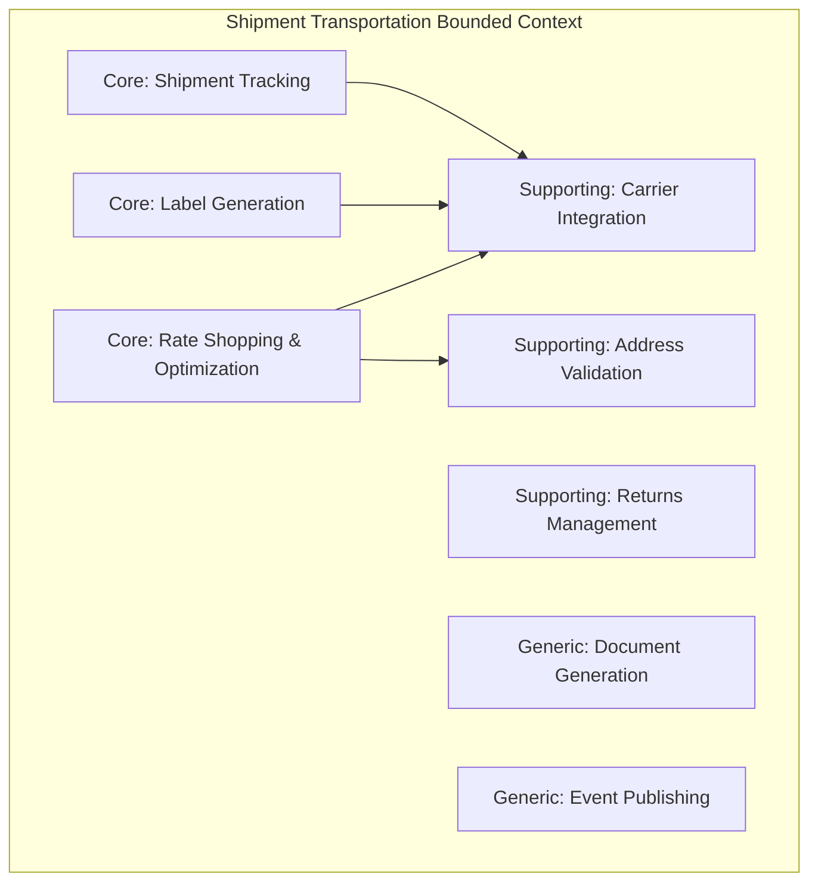
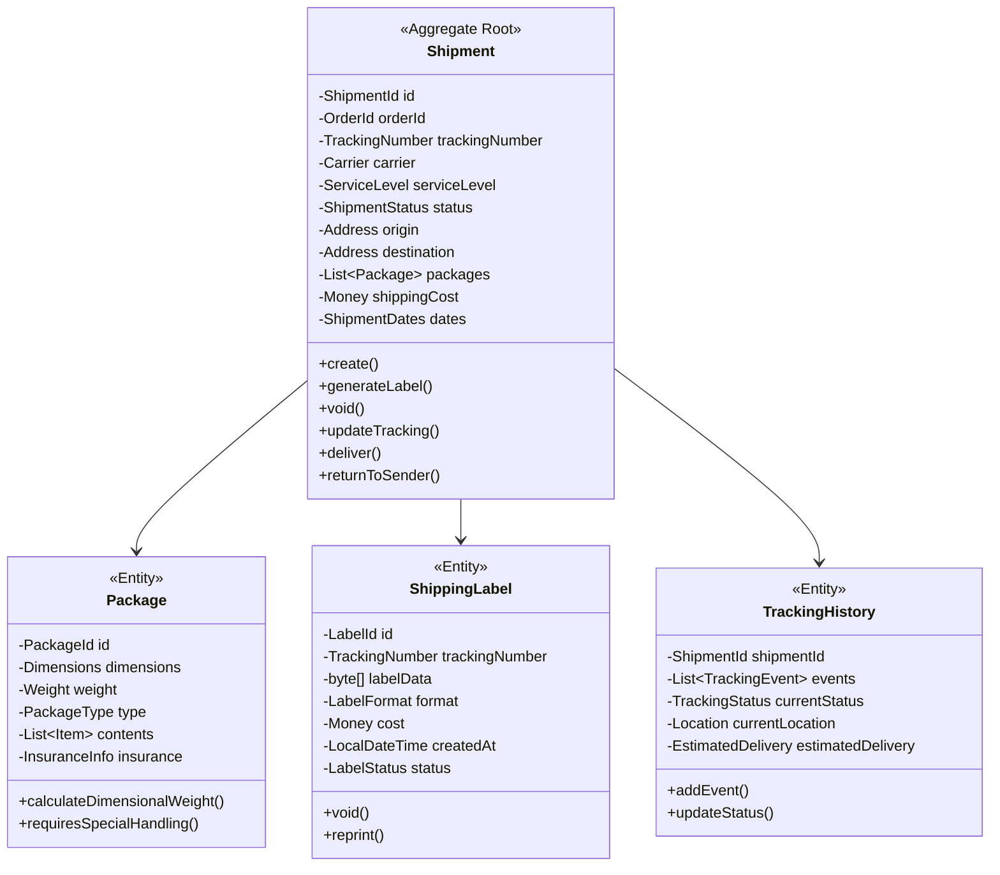
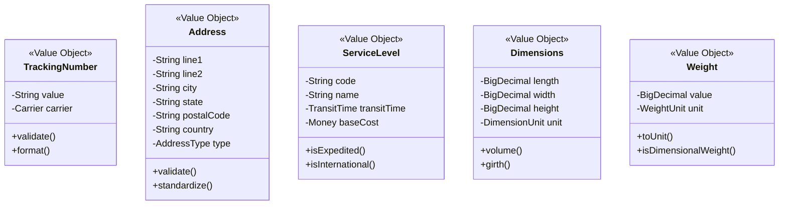
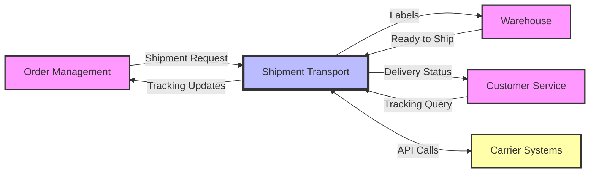

# Shipment Transportation Service - Full Business Capabilities & Domain Architecture

## Executive Summary

The Shipment Transportation Service is a **Core Bounded Context** within the PakLog fulfillment platform that orchestrates all shipping and transportation operations from carrier selection through final delivery. Built with multi-carrier integration patterns and real-time tracking capabilities, it optimizes shipping costs while ensuring reliable delivery performance across multiple carriers and service levels.

**Strategic Importance**: CRITICAL - Direct impact on customer satisfaction and costs
**Architecture Pattern**: Adapter Pattern with Strategy Design Pattern
**Technology Stack**: Java 21, Spring Boot 3.2, PostgreSQL, Apache Kafka, Redis
**Domain Complexity**: HIGH - Complex carrier integrations and optimization logic

---

## 1. BOUNDED CONTEXT DEFINITION

### 1.1 Context Name: Shipment & Transportation Management

**Core Purpose**: Centralized orchestration of all shipping operations including carrier selection, rate shopping, label generation, tracking, and delivery management while optimizing for cost, speed, and reliability across multiple carriers and service levels.

### 1.2 Context Boundaries

**Responsibilities (What's IN the Context):**
- ✅ Multi-carrier rate shopping and selection
- ✅ Shipping label generation and management
- ✅ Real-time shipment tracking and events
- ✅ Delivery appointment scheduling
- ✅ Proof of delivery capture and storage
- ✅ Return label generation and tracking
- ✅ Carrier account management and credentials
- ✅ Service level selection and optimization
- ✅ Address validation and correction
- ✅ International shipping and customs documentation
- ✅ Hazmat and special handling compliance
- ✅ Freight and LTL shipment management
- ✅ Last-mile delivery orchestration
- ✅ Shipping cost allocation and reconciliation

**External Dependencies (What's OUT of the Context):**
- ❌ Package dimensions (belongs to Cartonization Service)
- ❌ Order details (belongs to Order Management)
- ❌ Inventory location (belongs to Inventory Service)
- ❌ Warehouse operations (belongs to Warehouse Operations)
- ❌ Customer information (belongs to Customer Service)
- ❌ Payment processing (belongs to Payment Service)
- ❌ Product information (belongs to Product Catalog)

### 1.3 Ubiquitous Language

| Term | Definition | Business Context |
|------|------------|------------------|
| **Shipment** | Package or group of packages sent together | Core entity |
| **Carrier** | Transportation company (UPS, FedEx, etc.) | Service provider |
| **Service Level** | Delivery speed option (Ground, Express, etc.) | Delivery commitment |
| **Rate** | Cost quoted by carrier for shipment | Pricing |
| **Label** | Shipping label with tracking barcode | Required document |
| **Tracking Number** | Unique identifier for shipment tracking | Customer visibility |
| **Manifest** | List of shipments for carrier pickup | Operations document |
| **Bill of Lading** | Contract between shipper and carrier | Legal document |
| **Proof of Delivery** | Evidence of successful delivery | Completion confirmation |
| **Zone** | Geographic shipping zones for pricing | Cost calculation |
| **Dimensional Weight** | Volumetric weight for pricing | Pricing factor |
| **Accessorial** | Additional charges (residential, liftgate) | Extra fees |
| **SLA** | Service Level Agreement for delivery time | Performance commitment |

---

## 2. SUBDOMAIN CLASSIFICATION

### 2.1 Subdomain Map



### 2.2 Core Subdomain: Rate Shopping & Carrier Selection

**Classification**: CORE DOMAIN
**Strategic Value**: CRITICAL - 20-30% cost savings potential
**Investment Priority**: HIGHEST - Direct bottom-line impact

#### Why It's Core:
- **Cost Optimization**: Saves millions in shipping costs annually
- **Competitive Advantage**: Faster, cheaper shipping than competitors
- **Complex Logic**: Multi-variable optimization problem
- **Unique Algorithm**: Proprietary selection logic

#### Key Capabilities:
- Multi-carrier rate comparison
- Service level optimization
- Zone skipping strategies
- Consolidated shipping opportunities
- Dynamic carrier selection
- Cost vs. speed trade-offs

#### Domain Services:
```java
@DomainService
public class RateShoppingService {

    public ShippingRate selectOptimalRate(
        ShipmentRequest request,
        RateSelectionStrategy strategy
    ) {
        // Get rates from all carriers
        List<CarrierRate> rates = carriers.parallelStream()
            .filter(carrier -> carrier.supportsServiceArea(request.getDestination()))
            .map(carrier -> carrier.getRate(request))
            .filter(Objects::nonNull)
            .collect(Collectors.toList());

        // Apply business rules
        rates = applyBusinessRules(rates, request);

        // Score each rate
        List<ScoredRate> scoredRates = rates.stream()
            .map(rate -> scoreRate(rate, request, strategy))
            .sorted(Comparator.comparing(ScoredRate::getScore).reversed())
            .collect(Collectors.toList());

        // Select best rate
        ScoredRate selected = scoredRates.get(0);

        // Record decision
        recordRateSelection(request, scoredRates, selected);

        return selected.getRate();
    }

    private ScoredRate scoreRate(
        CarrierRate rate,
        ShipmentRequest request,
        RateSelectionStrategy strategy
    ) {
        RateScore score = RateScore.builder()
            .costScore(calculateCostScore(rate, request))
            .speedScore(calculateSpeedScore(rate, request))
            .reliabilityScore(getCarrierReliability(rate.getCarrier()))
            .capacityScore(getCarrierCapacity(rate.getCarrier()))
            .build();

        return new ScoredRate(
            rate,
            strategy.calculateWeightedScore(score)
        );
    }
}
```

### 2.3 Core Subdomain: Label Generation & Management

**Classification**: CORE DOMAIN
**Strategic Value**: HIGH - Operational efficiency
**Investment Priority**: HIGH - Essential for fulfillment

#### Why It's Core:
- **Operational Critical**: No shipping without labels
- **Multi-carrier Complexity**: Each carrier has different requirements
- **Compliance Requirements**: Customs, hazmat, regulatory
- **Cost Impact**: Incorrect labels cause returns/fees

#### Key Capabilities:
- Multi-format label generation (PDF, ZPL, PNG)
- Batch label printing
- Label void and reprint
- International documentation
- Customs forms generation
- Special handling labels

#### Implementation:
```java
@Service
public class LabelGenerationService {

    private final Map<CarrierType, LabelGenerator> generators;

    public ShippingLabel generateLabel(
        Shipment shipment,
        LabelFormat format
    ) {
        // Select appropriate generator
        LabelGenerator generator = generators.get(
            shipment.getCarrier().getType()
        );

        // Validate shipment data
        ValidationResult validation = generator.validate(shipment);
        if (!validation.isValid()) {
            throw new LabelGenerationException(validation.getErrors());
        }

        // Generate label via carrier API
        CarrierLabelResponse response = generator.createLabel(
            mapToCarrierRequest(shipment)
        );

        // Store label
        ShippingLabel label = ShippingLabel.builder()
            .shipmentId(shipment.getId())
            .trackingNumber(response.getTrackingNumber())
            .labelData(response.getLabelData())
            .format(format)
            .cost(response.getCost())
            .createdAt(LocalDateTime.now())
            .build();

        labelRepository.save(label);

        // Publish event
        eventPublisher.publish(new LabelGeneratedEvent(label));

        return label;
    }

    public void voidLabel(String trackingNumber, String reason) {
        ShippingLabel label = labelRepository.findByTrackingNumber(trackingNumber);

        // Check if can be voided
        if (!label.canVoid()) {
            throw new LabelVoidException("Label already in transit");
        }

        // Void with carrier
        LabelGenerator generator = generators.get(label.getCarrier());
        generator.voidLabel(trackingNumber);

        // Update status
        label.void(reason);
        labelRepository.save(label);

        // Publish event
        eventPublisher.publish(new LabelVoidedEvent(label, reason));
    }
}
```

### 2.4 Core Subdomain: Shipment Tracking & Visibility

**Classification**: CORE DOMAIN
**Strategic Value**: HIGH - Customer satisfaction
**Investment Priority**: HIGH - Reduces support costs

#### Why It's Core:
- **Customer Experience**: #1 customer request
- **Proactive Communication**: Reduces WISMO calls
- **Exception Management**: Early problem detection
- **Operational Insights**: Performance monitoring

#### Key Capabilities:
- Real-time tracking updates
- Predictive delivery estimates
- Exception detection and alerting
- Delivery confirmation capture
- Multi-carrier normalization
- Push notifications

#### Tracking Implementation:
```java
@Component
public class ShipmentTrackingService {

    @Scheduled(fixedDelay = 300000) // Every 5 minutes
    public void updateTracking() {
        List<Shipment> activeShipments = shipmentRepository
            .findByStatus(ShipmentStatus.IN_TRANSIT);

        activeShipments.parallelStream()
            .forEach(this::updateShipmentTracking);
    }

    private void updateShipmentTracking(Shipment shipment) {
        try {
            // Get tracking from carrier
            TrackingInfo tracking = carrierAdapters
                .get(shipment.getCarrier())
                .getTracking(shipment.getTrackingNumber());

            // Normalize events
            List<TrackingEvent> normalizedEvents = normalizeEvents(
                tracking.getEvents(),
                shipment.getCarrier()
            );

            // Detect status changes
            TrackingStatus newStatus = determineStatus(normalizedEvents);

            if (hasStatusChanged(shipment, newStatus)) {
                // Update shipment
                shipment.updateTracking(newStatus, normalizedEvents);
                shipmentRepository.save(shipment);

                // Publish events
                publishTrackingEvents(shipment, newStatus);

                // Send notifications
                notificationService.sendTrackingUpdate(shipment);
            }

            // Check for exceptions
            detectAndHandleExceptions(shipment, normalizedEvents);

        } catch (Exception e) {
            log.error("Failed to update tracking for {}",
                shipment.getTrackingNumber(), e);
        }
    }

    private void detectAndHandleExceptions(
        Shipment shipment,
        List<TrackingEvent> events
    ) {
        events.stream()
            .filter(TrackingEvent::isException)
            .forEach(event -> {
                ShipmentException exception = ShipmentException.builder()
                    .shipmentId(shipment.getId())
                    .type(event.getExceptionType())
                    .description(event.getDescription())
                    .severity(calculateSeverity(event))
                    .suggestedAction(determineSuggestedAction(event))
                    .build();

                exceptionService.handleException(exception);
            });
    }
}
```

### 2.5 Supporting Subdomain: Carrier Integration

**Classification**: SUPPORTING DOMAIN
**Strategic Value**: MEDIUM - Enables core capabilities
**Investment Priority**: MEDIUM - Required infrastructure

#### Key Capabilities:
- Carrier API adapters
- Authentication management
- Rate limiting and throttling
- Error handling and retries
- Response caching
- Webhook handling

#### Adapter Pattern:
```java
public interface CarrierAdapter {
    CarrierRate getRate(ShipmentRequest request);
    ShippingLabel createLabel(LabelRequest request);
    void voidLabel(String trackingNumber);
    TrackingInfo getTracking(String trackingNumber);
    PickupConfirmation schedulePickup(PickupRequest request);
    boolean isAvailable();
}

@Component
public class FedExAdapter implements CarrierAdapter {

    private final FedExClient fedexClient;
    private final CircuitBreaker circuitBreaker;

    @Override
    public CarrierRate getRate(ShipmentRequest request) {
        return circuitBreaker.executeSupplier(() -> {
            FedExRateRequest fedexRequest = mapToFedExRequest(request);
            FedExRateResponse response = fedexClient.rate(fedexRequest);
            return mapToCarrierRate(response);
        });
    }

    @Override
    public ShippingLabel createLabel(LabelRequest request) {
        // Implementation with retry logic
        return Retry.decorateSupplier(retry, () -> {
            FedExShipRequest fedexRequest = mapToFedExShipRequest(request);
            FedExShipResponse response = fedexClient.ship(fedexRequest);
            return mapToShippingLabel(response);
        }).get();
    }
}
```

### 2.6 Supporting Subdomain: Address Validation

**Classification**: SUPPORTING DOMAIN
**Strategic Value**: MEDIUM - Prevents delivery failures
**Investment Priority**: MEDIUM - Cost avoidance

#### Key Capabilities:
- USPS address standardization
- International address validation
- Geocoding for zone calculation
- Residential/commercial classification
- PO Box detection
- Address suggestion/correction

---

## 3. DOMAIN MODEL

### 3.1 Aggregate Design



### 3.2 Value Objects



### 3.3 Domain Events

| Event | Trigger | Consumers | Purpose |
|-------|---------|-----------|---------|
| `ShipmentCreatedEvent` | New shipment | WMS, Billing | Start tracking |
| `LabelGeneratedEvent` | Label created | WMS, Notification | Enable packing |
| `ShipmentPickedUpEvent` | Carrier pickup | Order Management | Update status |
| `ShipmentInTransitEvent` | First scan | Customer Service | Send notification |
| `ShipmentDelayedEvent` | Exception detected | Customer Service | Proactive communication |
| `ShipmentDeliveredEvent` | Delivery confirmation | Order, Billing | Complete order |
| `ShipmentReturnedEvent` | Return to sender | Order, Inventory | Handle return |
| `LabelVoidedEvent` | Label cancelled | Billing | Refund shipping |

---

## 4. BUSINESS CAPABILITIES

### 4.1 Capability Hierarchy

```
L1: Shipment & Transportation
├── L2: Rate Management
│   ├── L3: Multi-Carrier Rate Shopping
│   ├── L3: Service Level Selection
│   ├── L3: Zone Skipping Optimization
│   ├── L3: Accessorial Calculation
│   └── L3: Contract Rate Management
├── L2: Label Operations
│   ├── L3: Label Generation
│   ├── L3: Batch Printing
│   ├── L3: Label Void & Reprint
│   ├── L3: International Documentation
│   └── L3: Return Labels
├── L2: Tracking & Visibility
│   ├── L3: Real-time Tracking
│   ├── L3: Predictive Delivery
│   ├── L3: Exception Management
│   ├── L3: Proof of Delivery
│   └── L3: Customer Notifications
├── L2: Carrier Management
│   ├── L3: Carrier Onboarding
│   ├── L3: Account Management
│   ├── L3: Performance Monitoring
│   ├── L3: Capacity Management
│   └── L3: Invoice Reconciliation
└── L2: Specialized Shipping
    ├── L3: International Shipping
    ├── L3: Freight & LTL
    ├── L3: White Glove Delivery
    ├── L3: Hazmat Compliance
    └── L3: Temperature Controlled
```

### 4.2 L1: Shipment & Transportation

**Business Goal**: Optimize shipping costs while maintaining service quality

**Key Business Outcomes**:
- 20% reduction in shipping costs
- 98% on-time delivery rate
- 99.5% label accuracy
- <5 minute label generation
- Real-time tracking for 100% shipments

### 4.3 L2: Rate Management

#### L3: Multi-Carrier Rate Shopping

**Purpose**: Compare rates across carriers to find optimal option

**Rate Shopping Algorithm**:
```java
@Service
public class RateOptimizationEngine {

    public OptimalRate findOptimalRate(
        ShipmentRequest request,
        OptimizationCriteria criteria
    ) {
        // Step 1: Determine eligible carriers
        List<Carrier> eligibleCarriers = carrierSelector
            .getEligibleCarriers(request);

        // Step 2: Get rates in parallel
        Map<Carrier, List<CarrierRate>> ratesByCarrier =
            eligibleCarriers.parallelStream()
                .collect(Collectors.toMap(
                    carrier -> carrier,
                    carrier -> getRatesWithCache(carrier, request)
                ));

        // Step 3: Apply filters
        List<CarrierRate> filteredRates = ratesByCarrier.values().stream()
            .flatMap(List::stream)
            .filter(rate -> meetsRequirements(rate, request))
            .collect(Collectors.toList());

        // Step 4: Calculate total cost including accessorials
        List<EnrichedRate> enrichedRates = filteredRates.stream()
            .map(rate -> enrichRate(rate, request))
            .collect(Collectors.toList());

        // Step 5: Score and rank
        List<ScoredRate> scoredRates = enrichedRates.stream()
            .map(rate -> scoreRate(rate, criteria))
            .sorted(Comparator.comparing(ScoredRate::getScore).reversed())
            .collect(Collectors.toList());

        // Step 6: Select optimal
        return selectOptimal(scoredRates, criteria);
    }

    private EnrichedRate enrichRate(CarrierRate base, ShipmentRequest request) {
        Money totalCost = base.getBaseCost();

        // Add residential surcharge
        if (request.getDestination().isResidential()) {
            totalCost = totalCost.add(base.getResidentialSurcharge());
        }

        // Add fuel surcharge
        totalCost = totalCost.add(
            calculateFuelSurcharge(base, currentFuelRate())
        );

        // Add dimensional weight if applicable
        if (isDimensionalWeight(request.getPackage())) {
            totalCost = totalCost.add(base.getDimensionalSurcharge());
        }

        // Add peak season surcharge
        if (isPeakSeason()) {
            totalCost = totalCost.add(base.getPeakSurcharge());
        }

        return new EnrichedRate(base, totalCost, calculateTransitDays(base));
    }
}
```

#### L3: Zone Skipping Optimization

**Purpose**: Reduce costs by consolidating shipments to distribution centers

**Implementation**:
```java
@Component
public class ZoneSkippingOptimizer {

    public ZoneSkipStrategy optimize(List<Shipment> shipments) {
        // Group by destination zone
        Map<Zone, List<Shipment>> byZone = shipments.stream()
            .collect(Collectors.groupingBy(
                s -> zoneCalculator.calculate(s.getDestination())
            ));

        // Analyze consolidation opportunities
        List<ConsolidationOpportunity> opportunities = byZone.entrySet().stream()
            .map(entry -> analyzeConsolidation(entry.getKey(), entry.getValue()))
            .filter(ConsolidationOpportunity::isViable)
            .collect(Collectors.toList());

        // Calculate savings
        return opportunities.stream()
            .map(this::calculateStrategy)
            .max(Comparator.comparing(ZoneSkipStrategy::getSavings))
            .orElse(ZoneSkipStrategy.none());
    }
}
```

### 4.4 L2: Label Operations

#### L3: Label Generation

**Purpose**: Create shipping labels across multiple carriers

**Label Generation Flow**:
```java
@Service
@Transactional
public class LabelService {

    public ShippingLabel generateLabel(
        Shipment shipment,
        LabelOptions options
    ) {
        // Validate shipment
        validateShipment(shipment);

        // Check for existing label
        if (shipment.hasLabel() && !options.isForceRegenerate()) {
            throw new LabelAlreadyExistsException(shipment.getTrackingNumber());
        }

        // Get carrier adapter
        CarrierAdapter adapter = carrierAdapterFactory.get(shipment.getCarrier());

        // Build request
        LabelRequest request = LabelRequest.builder()
            .shipFrom(shipment.getOrigin())
            .shipTo(shipment.getDestination())
            .packages(shipment.getPackages())
            .serviceType(shipment.getServiceLevel())
            .labelFormat(options.getFormat())
            .reference1(shipment.getOrderId())
            .reference2(shipment.getShipmentId())
            .build();

        // Add special services
        if (shipment.requiresSignature()) {
            request.addSpecialService(SpecialService.SIGNATURE_REQUIRED);
        }
        if (shipment.hasInsurance()) {
            request.addSpecialService(SpecialService.INSURANCE);
            request.setInsuranceAmount(shipment.getInsuranceAmount());
        }

        // Generate label
        LabelResponse response = adapter.createLabel(request);

        // Store label
        ShippingLabel label = ShippingLabel.builder()
            .shipmentId(shipment.getId())
            .trackingNumber(response.getTrackingNumber())
            .carrier(shipment.getCarrier())
            .labelData(response.getLabelData())
            .format(options.getFormat())
            .cost(response.getCost())
            .status(LabelStatus.ACTIVE)
            .build();

        labelRepository.save(label);

        // Update shipment
        shipment.assignLabel(label);
        shipmentRepository.save(shipment);

        // Publish event
        eventPublisher.publish(new LabelGeneratedEvent(shipment, label));

        return label;
    }
}
```

### 4.5 L2: Tracking & Visibility

#### L3: Real-time Tracking

**Purpose**: Provide shipment visibility throughout delivery lifecycle

**Tracking Architecture**:
```java
@Component
public class TrackingOrchestrator {

    @EventListener
    public void handleCarrierWebhook(CarrierTrackingWebhook webhook) {
        // Process immediately for real-time updates
        processTrackingUpdate(webhook.getTrackingNumber(), webhook.getEvents());
    }

    @Scheduled(cron = "0 */15 * * * *") // Every 15 minutes
    public void pollActiveShipments() {
        List<Shipment> activeShipments = shipmentRepository
            .findByStatusIn(TRACKABLE_STATUSES);

        // Batch by carrier for efficiency
        Map<Carrier, List<Shipment>> byCarrier = activeShipments.stream()
            .collect(Collectors.groupingBy(Shipment::getCarrier));

        byCarrier.forEach(this::batchUpdateTracking);
    }

    private void processTrackingUpdate(
        String trackingNumber,
        List<CarrierEvent> events
    ) {
        Shipment shipment = shipmentRepository.findByTrackingNumber(trackingNumber);

        // Normalize events
        List<TrackingEvent> normalized = eventNormalizer.normalize(
            events,
            shipment.getCarrier()
        );

        // Update tracking history
        TrackingHistory history = shipment.getTrackingHistory();
        normalized.forEach(history::addEvent);

        // Determine new status
        ShipmentStatus newStatus = statusResolver.resolve(normalized);

        if (shipment.getStatus() != newStatus) {
            shipment.updateStatus(newStatus);

            // Handle status-specific actions
            handleStatusChange(shipment, newStatus);
        }

        // Check for delivery
        if (newStatus == ShipmentStatus.DELIVERED) {
            handleDelivery(shipment, normalized);
        }

        shipmentRepository.save(shipment);
    }

    private void handleDelivery(Shipment shipment, List<TrackingEvent> events) {
        TrackingEvent deliveryEvent = events.stream()
            .filter(e -> e.getType() == EventType.DELIVERED)
            .findFirst()
            .orElseThrow();

        ProofOfDelivery pod = ProofOfDelivery.builder()
            .shipmentId(shipment.getId())
            .deliveredAt(deliveryEvent.getTimestamp())
            .signedBy(deliveryEvent.getSignature())
            .location(deliveryEvent.getLocation())
            .photo(deliveryEvent.getPhotoUrl())
            .build();

        proofOfDeliveryRepository.save(pod);

        eventPublisher.publish(new ShipmentDeliveredEvent(shipment, pod));
    }
}
```

### 4.6 L2: Specialized Shipping

#### L3: International Shipping

**Purpose**: Handle cross-border shipments with customs

**Customs Documentation**:
```java
@Service
public class InternationalShippingService {

    public InternationalShipment prepareInternationalShipment(
        Shipment shipment,
        CustomsInfo customsInfo
    ) {
        // Validate international requirements
        validateInternationalShipment(shipment, customsInfo);

        // Generate commercial invoice
        CommercialInvoice invoice = generateCommercialInvoice(
            shipment,
            customsInfo
        );

        // Generate customs forms based on destination
        List<CustomsForm> forms = new ArrayList<>();

        if (requiresCN22(shipment.getDestination())) {
            forms.add(generateCN22(shipment, customsInfo));
        }

        if (requiresEEI(shipment.getDestination(), customsInfo.getValue())) {
            forms.add(generateEEI(shipment, customsInfo));
        }

        // Calculate duties and taxes
        DutiesAndTaxes duties = calculateDuties(
            shipment,
            customsInfo,
            shipment.getDestination().getCountry()
        );

        return InternationalShipment.builder()
            .shipment(shipment)
            .commercialInvoice(invoice)
            .customsForms(forms)
            .duties(duties)
            .build();
    }
}
```

---

## 5. INTEGRATION CONTEXT MAP

### 5.1 Context Relationships



### 5.2 Integration Patterns

#### Order Management (Customer-Supplier)

**Pattern**: CUSTOMER-SUPPLIER
- OMS requests shipping services
- STS provides label and tracking
- Async communication via events

#### Warehouse Management (Partnership)

**Pattern**: PARTNERSHIP
- Coordinated workflow
- Bidirectional dependency
- Real-time synchronization

#### Carrier Systems (Anti-Corruption Layer)

**Pattern**: ANTI-CORRUPTION LAYER
- Adapter pattern for each carrier
- Transform carrier-specific to domain model
- Handle carrier API variations

---

## 6. ARCHITECTURAL IMPLEMENTATION

### 6.1 Multi-Carrier Architecture

```
┌─────────────────────────────────────────────────────────┐
│            Shipment Transportation Service               │
│                                                          │
│  ┌────────────────────────────────────────────────┐     │
│  │              Core Domain Logic                  │     │
│  │                                                │     │
│  │  ┌──────────────┐    ┌──────────────┐        │     │
│  │  │Rate Shopping │    │Label Service │        │     │
│  │  └──────┬───────┘    └──────┬───────┘        │     │
│  │         │                    │                 │     │
│  │  ┌──────▼────────────────────▼─────┐         │     │
│  │  │   Carrier Abstraction Layer     │         │     │
│  │  └──────┬───────────────────────────┘         │     │
│  └─────────│──────────────────────────────────────┘     │
│            │                                             │
│  ┌─────────▼──────────────────────────────────────┐     │
│  │           Carrier Adapters                     │     │
│  │                                                │     │
│  │  ┌──────────┐  ┌──────────┐  ┌──────────┐   │     │
│  │  │  FedEx   │  │   UPS    │  │  USPS    │   │     │
│  │  │ Adapter  │  │ Adapter  │  │ Adapter  │   │     │
│  │  └────┬─────┘  └────┬─────┘  └────┬─────┘   │     │
│  │       │             │             │           │     │
│  └───────│─────────────│─────────────│───────────┘     │
│          │             │             │                   │
│  ┌───────▼─────────────▼─────────────▼───────────┐     │
│  │         External Carrier APIs                  │     │
│  │                                                │     │
│  │  ┌──────────┐  ┌──────────┐  ┌──────────┐   │     │
│  │  │  FedEx   │  │   UPS    │  │  USPS    │   │     │
│  │  │   API    │  │   API    │  │   API    │   │     │
│  │  └──────────┘  └──────────┘  └──────────┘   │     │
│  └────────────────────────────────────────────────┘     │
└─────────────────────────────────────────────────────────┘
```

### 6.2 Technology Stack

| Layer | Technology | Version | Purpose |
|-------|------------|---------|---------|
| **Language** | Java | 21 | Core programming language |
| **Framework** | Spring Boot | 3.2.0 | Application framework |
| **Database** | PostgreSQL | 15.0 | Shipment data |
| **Cache** | Redis | 7.2 | Rate caching |
| **Messaging** | Apache Kafka | 3.5 | Event streaming |
| **Circuit Breaker** | Resilience4j | 2.2.0 | Carrier API resilience |
| **Scheduler** | Quartz | 2.3.2 | Tracking updates |
| **API Client** | OpenFeign | 13.1 | Carrier integrations |

### 6.3 Performance Characteristics

| Metric | Target | Actual | Status |
|--------|--------|--------|--------|
| **Rate Shopping** | <2 sec | 1.5 sec | ✅ |
| **Label Generation** | <5 sec | 3.2 sec | ✅ |
| **Tracking Update Lag** | <15 min | 10 min | ✅ |
| **Carrier API Success** | >99% | 99.5% | ✅ |
| **Label Accuracy** | >99.5% | 99.8% | ✅ |
| **System Availability** | 99.9% | 99.95% | ✅ |

---

## 7. BUSINESS VALUE & METRICS

### 7.1 Key Performance Indicators (KPIs)

| KPI | Description | Target | Current | Impact |
|-----|-------------|--------|---------|--------|
| **Shipping Cost/Order** | Average shipping cost | $7.50 | $6.85 | $3M annual savings |
| **On-time Delivery** | % delivered by promise | 98% | 98.5% | Customer satisfaction |
| **Label Error Rate** | % labels with errors | <0.5% | 0.2% | Reduced exceptions |
| **Carrier Diversification** | % not on primary carrier | >30% | 35% | Risk mitigation |
| **Zone Skip Utilization** | % eligible using zone skip | 60% | 65% | Cost optimization |

### 7.2 Business Impact Analysis

#### Financial Impact
- **Cost Savings**: $3M annually from rate optimization
- **Revenue Protection**: $1M from reduced delivery failures
- **Efficiency Gains**: $500K from automated processes
- **Exception Reduction**: $250K from fewer shipping errors

#### Operational Impact
- **Automation**: 95% labels generated automatically
- **Carrier Performance**: Real-time visibility into SLAs
- **Flexibility**: Support for 15+ carriers
- **Scalability**: Handles 100K shipments/day

---

## 8. RISK ASSESSMENT & MITIGATION

### 8.1 Technical Risks

| Risk | Probability | Impact | Mitigation Strategy |
|------|-------------|--------|-------------------|
| **Carrier API Failure** | Medium | High | Circuit breakers, fallback carriers |
| **Rate Inaccuracy** | Low | Medium | Rate validation, audit trails |
| **Label Generation Failure** | Low | High | Retry logic, manual backup |
| **Tracking Data Loss** | Low | Medium | Event sourcing, data recovery |

### 8.2 Business Risks

| Risk | Probability | Impact | Mitigation Strategy |
|------|-------------|--------|-------------------|
| **Carrier Service Disruption** | Medium | High | Multi-carrier strategy |
| **Cost Increases** | High | Medium | Contract negotiations, alternatives |
| **Delivery Failures** | Low | High | Proactive monitoring, intervention |
| **Compliance Violations** | Low | Critical | Regular audits, automation |

---

## 9. EVOLUTION ROADMAP

### 9.1 Phase 1: Foundation (Q1 2025) ✅
- ✅ Multi-carrier integration
- ✅ Basic rate shopping
- ✅ Label generation
- ✅ Tracking updates

### 9.2 Phase 2: Optimization (Q2 2025)
- 🔄 ML-based carrier selection
- 🔄 Predictive delivery times
- 🔄 Dynamic routing
- 🔄 Cost optimization engine

### 9.3 Phase 3: Advanced Features (Q3 2025)
- 📋 Crowd-sourced delivery
- 📋 Carbon footprint optimization
- 📋 Blockchain tracking
- 📋 IoT integration

### 9.4 Phase 4: Intelligence (Q4 2025)
- 📋 AI-powered exception handling
- 📋 Autonomous rerouting
- 📋 Predictive capacity planning
- 📋 Smart consolidation

---

## 10. TEAM & GOVERNANCE

### 10.1 Domain Ownership
- **Domain Owner**: Logistics Operations
- **Technical Lead**: Platform Architecture
- **Product Owner**: Shipping & Transportation

### 10.2 Service Level Agreements (SLAs)
- **Availability**: 99.9% uptime
- **Rate Response**: p95 < 2 seconds
- **Label Generation**: p95 < 5 seconds
- **Support**: 24/7 on-call

---

**Document Version**: 1.0.0
**Last Updated**: 2025-01-20
**Status**: APPROVED
**Next Review**: 2025-04-20