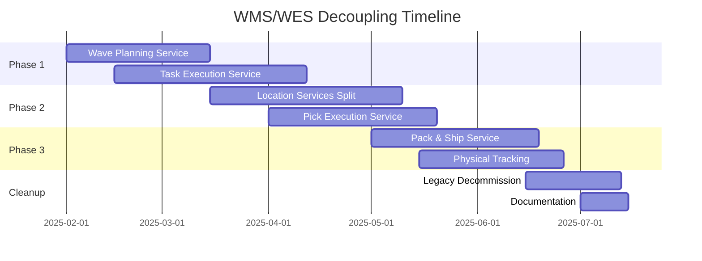

# WMS/WES Service Decoupling Plan
## PakLog Warehouse Management System Architectural Refactoring

**Document Version**: 1.0.0
**Created**: 2025-01-18
**Status**: DRAFT
**Estimated Duration**: 6 months
**Risk Level**: HIGH - Core system refactoring

---

## Executive Summary

This document outlines the comprehensive plan to decouple warehouse management functionality into separate WMS (Warehouse Management System) and WES (Warehouse Execution System) services. The current architecture mixes strategic planning and execution concerns, creating deployment coupling, scalability issues, and unclear ownership boundaries.

### Key Goals
1. **Clear Separation of Concerns**: WMS for strategic planning, WES for real-time execution
2. **Independent Scalability**: Allow WES to scale independently for high-throughput operations
3. **Team Autonomy**: Clear service ownership and boundaries
4. **Future Readiness**: Prepare for automation, robotics, and multi-agent orchestration (MAO)

### Success Criteria
- ✅ Zero downtime during migration
- ✅ Maintained or improved performance metrics
- ✅ 100% functional parity with existing system
- ✅ <5% code duplication across services
- ✅ Complete event-driven integration

---

## Current State Analysis

### Existing Service Architecture

```
paklog/
├── order-management/        ✅ Correctly aligned with WMS
├── inventory/              ✅ Correctly aligned with WMS
├── product-catalog/        ✅ Separate concern
├── cartonization/         ✅ Separate concern
└── shipment-transportation/ ✅ Separate concern
```

### Key Problems
1. **Mixed Responsibilities**: Strategic planning coupled with execution
2. **Deployment Coupling**: Cannot deploy WMS changes without affecting WES
3. **Scaling Limitations**: Cannot scale execution independently from planning
4. **Team Bottlenecks**: Multiple teams working on same codebase

---

## Target State Architecture

### Service Decomposition

```
paklog/
├── wms-services/
│   ├── order-management/        (existing - no change)
│   ├── inventory-management/    (existing - no change)
│   ├── wave-planning/           ✨ NEW - Strategic wave planning
│   ├── location-master/         ✨ NEW - Location configuration
│   └── workload-planning/       ✨ NEW - Capacity and labor planning
│
├── wes-services/
│   ├── task-execution/          ✨ NEW - Task orchestration and assignment
│   ├── pick-execution/          ✨ NEW - Picking operations + put wall
│   ├── pack-ship/              ✨ NEW - Packing + quality + shipping
│   ├── physical-tracking/       ✨ NEW - License plates + location state
│   └── material-handling/       ✨ NEW - Future automation (Phase 2)
│
├── shared-services/
│   ├── quality-management/      ✨ NEW - Quality inspection workflows
│   └── location-tracking/       ✨ NEW - Real-time location state
│
└── common/
    ├── paklog-events/           ✨ NEW - Shared event definitions
    ├── paklog-domain/           ✨ NEW - Common domain models
    └── paklog-integration/      ✨ NEW - Integration patterns
```

---

## Migration Strategy

### Approach: Strangler Fig Pattern
1. Create new services alongside existing monolith
2. Implement proxy/facade pattern for gradual migration
3. Use feature flags for traffic routing
4. Shadow mode for validation before cutover
5. Gradual decommissioning of old code

### Risk Mitigation
- **Blue-Green Deployment**: Zero downtime releases
- **Event Sourcing**: Complete audit trail during migration
- **Reconciliation Service**: Detect and fix inconsistencies
- **Rollback Strategy**: Quick revert capability at each phase

---

## Project 1: Wave Planning Service (WMS)

### Overview
Create a dedicated WMS service for wave planning and workload management to handle strategic planning decisions.

### Scope
**In Scope:**
- Wave strategy configuration and planning
- Wave capacity management
- Carrier cutoff time management
- Wave release orchestration (authorization, not execution)
- Workload forecasting and capacity planning
- Labor planning and optimization

**Out of Scope:**
- Physical pick list generation (stays in WES)
- Task assignment (moves to WES)
- Actual picking execution (WES responsibility)

### Technical Implementation

#### 1.1 Service Structure
```java
wave-planning-service/
├── src/main/java/com/paklog/wms/wave/
│   ├── domain/
│   │   ├── aggregate/
│   │   │   ├── Wave.java
│   │   │   ├── WavePlan.java
│   │   │   └── WaveStrategy.java
│   │   ├── entity/
│   │   │   ├── WaveMetrics.java
│   │   │   └── CarrierCutoff.java
│   │   ├── valueobject/
│   │   │   ├── WaveId.java
│   │   │   ├── WaveStatus.java
│   │   │   └── Priority.java
│   │   ├── service/
│   │   │   ├── WavePlanningService.java
│   │   │   ├── CapacityCalculationService.java
│   │   │   └── WorkloadForecastingService.java
│   │   └── repository/
│   │       └── WaveRepository.java
│   │
│   ├── application/
│   │   ├── command/
│   │   │   ├── CreateWaveCommand.java
│   │   │   ├── ReleaseWaveCommand.java
│   │   │   └── CancelWaveCommand.java
│   │   ├── query/
│   │   │   ├── GetWaveStatusQuery.java
│   │   │   └── ListPendingWavesQuery.java
│   │   └── saga/
│   │       └── WaveReleaseSaga.java
│   │
│   ├── infrastructure/
│   │   ├── persistence/
│   │   │   └── MongoWaveRepository.java
│   │   ├── messaging/
│   │   │   ├── KafkaEventPublisher.java
│   │   │   └── OrderEventListener.java
│   │   └── rest/
│   │       └── WaveController.java
│   │
│   └── integration/
│       ├── inventory/
│       │   └── InventoryServiceClient.java
│       └── order/
│           └── OrderServiceClient.java
│
├── src/main/resources/
│   ├── application.yml
│   └── db/migration/
│       └── V1__create_wave_tables.sql
│
└── src/test/java/
    ├── unit/
    ├── integration/
    └── contract/
```

#### 1.2 Domain Model Migration
```java
// Core Wave Aggregate
@AggregateRoot
@Document(collection = "waves")
public class Wave {
    @Id
    private String waveId;
    private WaveStatus status;
    private List<String> orderIds;
    private WavePriority priority;
    private WaveStrategy strategy;
    private LocalDateTime plannedReleaseTime;
    private LocalDateTime actualReleaseTime;
    private String assignedWarehouseId;
    private String assignedZone;
    private WaveMetrics metrics;
    private int version; // Optimistic locking

    // State transitions
    public void plan(List<String> orderIds, WaveStrategy strategy) {
        // Business logic for wave planning
        validateOrders(orderIds);
        this.orderIds = orderIds;
        this.strategy = strategy;
        this.status = WaveStatus.PLANNED;
        registerEvent(new WavePlannedEvent(this));
    }

    public void release() {
        ensureStatus(WaveStatus.PLANNED);
        ensureInventoryAllocated();
        this.status = WaveStatus.RELEASED;
        this.actualReleaseTime = LocalDateTime.now();
        registerEvent(new WaveReleasedEvent(this));
    }

    public void complete() {
        ensureStatus(WaveStatus.IN_PROGRESS);
        this.status = WaveStatus.COMPLETED;
        registerEvent(new WaveCompletedEvent(this));
    }
}
```

#### 1.3 Event Definitions
```java
// Events Published
@CloudEvent
public class WavePlannedEvent {
    private String waveId;
    private List<String> orderIds;
    private String warehouseId;
    private String strategy;
    private LocalDateTime plannedReleaseTime;
}

@CloudEvent
public class WaveReleasedEvent {
    private String waveId;
    private List<String> orderIds;
    private String warehouseId;
    private String assignedZone;
    private Priority priority;
}

// Events Consumed
- FulfillmentOrderValidatedEvent (from Order Management)
- InventoryAllocatedEvent (from Inventory)
- PickingCompletedEvent (from Pick Execution - future)
```

#### 1.4 API Contracts
```yaml
openapi: 3.0.0
paths:
  /api/v1/waves:
    post:
      summary: Create new wave
      requestBody:
        content:
          application/json:
            schema:
              $ref: '#/components/schemas/CreateWaveRequest'

  /api/v1/waves/{waveId}/release:
    post:
      summary: Release wave for execution
      parameters:
        - name: waveId
          in: path
          required: true

  /api/v1/waves/{waveId}:
    get:
      summary: Get wave details
      parameters:
        - name: waveId
          in: path
          required: true
```

#### 1.5 Migration Steps

**Phase 1.1: Setup (Week 1-2)**
```bash
# Create new repository
git init wave-planning-service
cd wave-planning-service

# Setup Spring Boot project
spring init --dependencies=web,data-mongodb,kafka,actuator \
  --groupId=com.paklog.wms --artifactId=wave-planning-service

# Create domain models
mkdir -p ./src/main/java/com/paklog/wms/wave/domain
```

**Phase 1.2: Shadow Mode (Week 3-4)**
```java
// In existing service
@EventListener
public void onWaveCreated(WaveCreatedEvent event) {
    // Existing logic continues
    processWaveLocally(event);

    // Also forward to new service (shadow mode)
    wavePlanningServiceClient.createWave(event);

    // Compare results
    metricsCollector.compareWaveResults(
        localResult,
        remoteResult
    );
}
```

**Phase 1.3: Gradual Cutover (Week 5-6)**
```java
// Feature flag based routing
@Service
public class WaveServiceRouter {
    @Value("${feature.wave-planning.percentage:0}")
    private int routingPercentage;

    public WaveResponse processWave(WaveRequest request) {
        if (shouldRouteToNew(request.getCustomerId())) {
            return wavePlanningService.process(request);
        } else {
            return legacyWaveService.process(request);
        }
    }

    private boolean shouldRouteToNew(String customerId) {
        return customerId.hashCode() % 100 < routingPercentage;
    }
}
```

### Success Metrics
- ✅ Wave planning latency <500ms p95
- ✅ Zero data loss during migration
- ✅ 100% event delivery success
- ✅ No impact on order fulfillment

### Timeline
- **Week 1-2**: Service setup and domain model migration
- **Week 3-4**: Shadow mode implementation
- **Week 5-6**: Gradual traffic cutover (10% → 50% → 100%)
- **Week 7**: Legacy code removal

---

## Project 2: Task Execution Service (WES)

### Overview
Create a unified task execution service that consolidates work management from multiple contexts into a single WES service responsible for all task orchestration and assignment.

### Scope
**In Scope:**
- Unified task model for all work types
- Task generation from waves, orders, and events
- Task assignment and routing to associates
- Task queue management and prioritization
- Real-time task status tracking
- Mobile app API for task execution
- Labor productivity tracking

**Out of Scope:**
- Wave planning (WMS responsibility)
- Inventory allocation (WMS responsibility)
- Physical execution details (Pick/Pack services)

### Technical Implementation

#### 2.1 Service Structure
```java
task-execution-service/
├── src/main/java/com/paklog/wes/task/
│   ├── domain/
│   │   ├── aggregate/
│   │   │   ├── WorkTask.java
│   │   │   └── TaskAssignment.java
│   │   ├── entity/
│   │   │   ├── TaskQueue.java
│   │   │   └── Associate.java
│   │   ├── valueobject/
│   │   │   ├── TaskType.java
│   │   │   ├── TaskStatus.java
│   │   │   └── Priority.java
│   │   ├── service/
│   │   │   ├── TaskOrchestrationService.java
│   │   │   ├── TaskAssignmentService.java
│   │   │   └── TaskOptimizationService.java
│   │   └── factory/
│   │       ├── PickTaskFactory.java
│   │       ├── PackTaskFactory.java
│   │       └── ReplenishTaskFactory.java
│   │
│   ├── application/
│   │   ├── command/
│   │   │   ├── CreateTaskCommand.java
│   │   │   ├── AssignTaskCommand.java
│   │   │   └── CompleteTaskCommand.java
│   │   ├── query/
│   │   │   ├── GetAssignedTasksQuery.java
│   │   │   └── GetTaskQueueQuery.java
│   │   └── handler/
│   │       ├── WaveReleasedHandler.java
│   │       └── InventoryEventHandler.java
│   │
│   └── infrastructure/
│       ├── api/
│       │   ├── TaskController.java
│       │   └── MobileTaskController.java
│       └── messaging/
│           └── TaskEventPublisher.java
```

#### 2.2 Unified Task Model
```java
@AggregateRoot
@Document(collection = "work_tasks")
public class WorkTask {
    @Id
    private String taskId;
    private TaskType type; // PICK, PACK, PUTAWAY, COUNT, REPLENISH
    private TaskStatus status;
    private Priority priority;
    private String assignedTo;
    private LocalDateTime createdAt;
    private LocalDateTime assignedAt;
    private LocalDateTime startedAt;
    private LocalDateTime completedAt;
    private String referenceId; // Wave, Order, etc.
    private Map<String, Object> taskContext; // Type-specific data
    private Duration estimatedDuration;
    private Location taskLocation;

    // Polymorphic task creation
    public static WorkTask createPickTask(
        String waveId,
        List<PickInstruction> instructions
    ) {
        WorkTask task = new WorkTask();
        task.type = TaskType.PICK;
        task.referenceId = waveId;
        task.taskContext = Map.of("instructions", instructions);
        task.priority = calculatePickPriority(instructions);
        return task;
    }

    // Task lifecycle
    public void assign(String associateId) {
        ensureStatus(TaskStatus.PENDING);
        validateAssociate(associateId);
        this.assignedTo = associateId;
        this.assignedAt = LocalDateTime.now();
        this.status = TaskStatus.ASSIGNED;
        registerEvent(new TaskAssignedEvent(this));
    }

    public void start() {
        ensureStatus(TaskStatus.ASSIGNED);
        this.startedAt = LocalDateTime.now();
        this.status = TaskStatus.IN_PROGRESS;
        registerEvent(new TaskStartedEvent(this));
    }

    public void complete(Map<String, Object> results) {
        ensureStatus(TaskStatus.IN_PROGRESS);
        this.completedAt = LocalDateTime.now();
        this.status = TaskStatus.COMPLETED;
        this.taskContext.putAll(results);
        registerEvent(new TaskCompletedEvent(this));
    }
}
```

#### 2.3 Task Assignment Engine
```java
@Service
public class TaskAssignmentService {

    public TaskAssignment assignTask(WorkTask task) {
        // Get available associates
        List<Associate> availableAssociates = associateRepository
            .findByStatusAndSkills(
                AssociateStatus.AVAILABLE,
                task.getRequiredSkills()
            );

        // Score each associate
        List<AssociateScore> scores = availableAssociates.stream()
            .map(associate -> scoreAssociate(associate, task))
            .sorted(Comparator.reverseOrder())
            .collect(Collectors.toList());

        // Assign to best match
        Associate selected = scores.get(0).getAssociate();
        task.assign(selected.getId());

        // Update associate status
        selected.assignTask(task.getTaskId());

        // Send notification
        notificationService.notifyAssociate(selected, task);

        return new TaskAssignment(task, selected);
    }

    private AssociateScore scoreAssociate(
        Associate associate,
        WorkTask task
    ) {
        double score = 0;

        // Distance to task location
        score += scoreDistance(
            associate.getCurrentLocation(),
            task.getTaskLocation()
        );

        // Skill match
        score += scoreSkillMatch(
            associate.getSkills(),
            task.getRequiredSkills()
        );

        // Current workload
        score += scoreWorkload(
            associate.getCurrentTasks()
        );

        // Historical performance
        score += scorePerformance(
            associate.getProductivityMetrics(),
            task.getType()
        );

        return new AssociateScore(associate, score);
    }
}
```

#### 2.4 Event Integration
```java
@Component
public class WaveEventHandler {

    @EventHandler
    public void handle(WaveReleasedEvent event) {
        // Generate pick tasks from wave
        List<WorkTask> pickTasks = pickTaskFactory
            .createTasksFromWave(event);

        // Save tasks
        pickTasks.forEach(taskRepository::save);

        // Assign tasks
        pickTasks.forEach(taskAssignmentService::assignTask);

        // Publish task creation events
        pickTasks.forEach(task ->
            eventPublisher.publish(new TaskCreatedEvent(task))
        );
    }
}
```

### Migration Strategy
1. **Create unified Work Management Context**
2. **Unify task models** from Pick, Pack, and other contexts
3. **Consolidate task assignment** logic
4. **Create mobile API** for associates
5. **Implement real-time tracking**

### Timeline
- **Week 1-2**: Service setup and unified task model
- **Week 3-4**: Event handlers and task factories
- **Week 5-6**: Assignment engine and mobile API
- **Week 7-8**: Integration testing and cutover

---

## Project 3: Location Services Split

### Overview
Split the current Location context into two services: Location Master (WMS) for configuration and Physical Tracking (WES) for real-time state.

### Scope

#### 3.1 Location Master Service (WMS)
**In Scope:**
- Location hierarchy definition (Warehouse → Zone → Aisle → Bay → Bin)
- Location attributes and configuration
- Capacity management
- Slotting rules and optimization
- ABC velocity classification

**Domain Model:**
```java
@AggregateRoot
@Document(collection = "location_masters")
public class LocationMaster {
    @Id
    private String locationId;
    private String warehouseId;
    private String zone;
    private String aisle;
    private String bay;
    private String bin;
    private LocationType type; // PICK, RESERVE, STAGE, DOCK
    private Dimensions dimensions;
    private WeightCapacity weightCapacity;
    private VolumeCapacity volumeCapacity;
    private List<String> restrictions; // HAZMAT, FROZEN, etc.
    private SlottingClass slottingClass; // A, B, C
    private boolean active;

    // Configuration methods
    public void configureCapacity(Capacity newCapacity) {
        validateCapacity(newCapacity);
        this.weightCapacity = newCapacity.getWeight();
        this.volumeCapacity = newCapacity.getVolume();
        registerEvent(new LocationCapacityConfiguredEvent(this));
    }

    public void assignSlottingClass(SlottingClass newClass) {
        this.slottingClass = newClass;
        registerEvent(new LocationSlottingChangedEvent(this));
    }
}
```

#### 3.2 Physical Tracking Service (WES)
**In Scope:**
- Real-time location state tracking
- License plate management
- Physical movement execution
- Location availability
- RTLS integration

**Domain Model:**
```java
@AggregateRoot
@Document(collection = "location_states")
public class LocationState {
    @Id
    private String locationId; // Links to LocationMaster
    private OccupancyStatus occupancyStatus;
    private int currentItemCount;
    private double currentWeight;
    private double currentVolume;
    private List<String> licensePlates;
    private LocationStatus status; // AVAILABLE, OCCUPIED, BLOCKED
    private String blockedReason;
    private LocalDateTime lastMovement;
    private LocalDateTime lastCycleCount;

    // State management
    public void recordMovement(Movement movement) {
        updateOccupancy(movement);
        this.lastMovement = LocalDateTime.now();
        registerEvent(new LocationMovementEvent(this, movement));
    }

    public void blockLocation(String reason) {
        this.status = LocationStatus.BLOCKED;
        this.blockedReason = reason;
        registerEvent(new LocationBlockedEvent(this));
    }
}

@AggregateRoot
@Document(collection = "license_plates")
public class LicensePlate {
    @Id
    private String licensePlateId;
    private LicensePlateType type; // PALLET, CASE, CARTON, TOTE
    private List<LPItem> contents;
    private String currentLocationId;
    private LPStatus status;
    private String parentLicensePlateId; // For nested LPs
    private LocalDateTime createdAt;
    private LocalDateTime lastMovedAt;

    public void moveTo(String newLocationId) {
        validateLocation(newLocationId);
        String oldLocation = this.currentLocationId;
        this.currentLocationId = newLocationId;
        this.lastMovedAt = LocalDateTime.now();
        registerEvent(new LicensePlateMoved(this, oldLocation, newLocationId));
    }
}
```

### Integration Pattern
```java
// Bi-directional synchronization
Location Master Service (WMS) ←→ Physical Tracking Service (WES)

// Events from Location Master → Physical Tracking
- LocationCreatedEvent
- LocationCapacityChangedEvent
- LocationDeactivatedEvent

// Events from Physical Tracking → Location Master
- LocationCapacityExceededEvent
- LocationBlockedEvent
- AbnormalInventoryDetectedEvent
```

### Migration Steps
1. **Data Model Separation**: Split location table into master and state
2. **Dual Write Phase**: Both services write during transition
3. **Read Migration**: Gradually migrate reads to appropriate service
4. **Event Synchronization**: Implement bi-directional sync
5. **Legacy Cleanup**: Remove old location context

### Timeline
- **Week 1-2**: Create both services with data models
- **Week 3-4**: Implement bi-directional sync
- **Week 5-6**: Dual write implementation
- **Week 7-8**: Cutover and validation

---

## Project 4: Pick Execution Service (WES)

### Overview
Extract picking and put wall operations into a dedicated WES service for pick execution optimization.

### Scope
**In Scope:**
- Pick list execution (not planning)
- Pick path optimization algorithms
- Mobile picking application backend
- Put wall operations
- Batch picking coordination
- Pick accuracy tracking
- Short pick handling

### Technical Implementation

#### 4.1 Domain Model
```java
@AggregateRoot
@Document(collection = "pick_sessions")
public class PickSession {
    @Id
    private String sessionId;
    private String pickListId;
    private String pickerId;
    private List<PickInstruction> instructions;
    private PickStrategy strategy; // DISCRETE, BATCH, ZONE, CLUSTER
    private PickPath optimizedPath;
    private SessionStatus status;
    private List<PickConfirmation> confirmations;
    private LocalDateTime startedAt;
    private LocalDateTime completedAt;
    private PickMetrics metrics;

    public void optimizePath(LocationGraph graph) {
        this.optimizedPath = pathOptimizer.optimize(
            instructions,
            graph,
            strategy
        );
        reorderInstructions();
    }

    public void confirmPick(
        String instructionId,
        int quantity,
        String barcode
    ) {
        PickInstruction instruction = findInstruction(instructionId);
        validateBarcode(barcode, instruction.getSku());

        if (quantity < instruction.getQuantity()) {
            handleShortPick(instruction, quantity);
        }

        confirmations.add(new PickConfirmation(
            instructionId,
            quantity,
            LocalDateTime.now()
        ));

        if (allInstructionsComplete()) {
            complete();
        }
    }
}

@Entity
public class PutWallSlot {
    private String slotId;
    private int slotNumber;
    private String assignedOrderId;
    private SlotStatus status;
    private List<SlotItem> items;
    private int expectedItemCount;
    private int currentItemCount;

    public void addItem(String sku, int quantity) {
        validateSku(sku);
        items.add(new SlotItem(sku, quantity));
        currentItemCount += quantity;

        if (currentItemCount >= expectedItemCount) {
            status = SlotStatus.COMPLETE;
            registerEvent(new PutWallOrderCompleteEvent(
                assignedOrderId,
                slotId
            ));
        }
    }
}
```

#### 4.2 Path Optimization Engine
```java
@Service
public class PickPathOptimizer {

    public PickPath optimize(
        List<PickInstruction> instructions,
        LocationGraph warehouse,
        PickStrategy strategy
    ) {
        return switch (strategy) {
            case DISCRETE -> optimizeDiscrete(instructions, warehouse);
            case BATCH -> optimizeBatch(instructions, warehouse);
            case ZONE -> optimizeZone(instructions, warehouse);
            case CLUSTER -> optimizeCluster(instructions, warehouse);
        };
    }

    private PickPath optimizeBatch(
        List<PickInstruction> instructions,
        LocationGraph warehouse
    ) {
        // Group by proximity
        List<LocationCluster> clusters = clusterLocations(
            instructions.stream()
                .map(PickInstruction::getLocation)
                .collect(Collectors.toList())
        );

        // Solve TSP for each cluster
        List<Location> optimizedSequence = new ArrayList<>();
        for (LocationCluster cluster : clusters) {
            List<Location> clusterPath = solveTSP(
                cluster.getLocations(),
                warehouse
            );
            optimizedSequence.addAll(clusterPath);
        }

        return new PickPath(
            optimizedSequence,
            calculateDistance(optimizedSequence),
            estimateTime(optimizedSequence)
        );
    }

    private List<Location> solveTSP(
        List<Location> locations,
        LocationGraph warehouse
    ) {
        // Nearest neighbor heuristic with 2-opt improvement
        List<Location> tour = nearestNeighbor(locations, warehouse);
        return twoOptImprovement(tour, warehouse);
    }
}
```

#### 4.3 Mobile API
```java
@RestController
@RequestMapping("/api/v1/mobile/picking")
public class MobilePickingController {

    @GetMapping("/next-task")
    public PickTaskResponse getNextTask(
        @AuthenticationPrincipal Associate picker
    ) {
        PickSession activeSession = sessionRepository
            .findActiveByPicker(picker.getId())
            .orElseGet(() -> assignNewSession(picker));

        PickInstruction nextInstruction = activeSession
            .getNextInstruction();

        return PickTaskResponse.builder()
            .instruction(nextInstruction)
            .navigation(generateNavigation(
                picker.getCurrentLocation(),
                nextInstruction.getLocation()
            ))
            .build();
    }

    @PostMapping("/confirm")
    public ConfirmationResponse confirmPick(
        @RequestBody PickConfirmationRequest request,
        @AuthenticationPrincipal Associate picker
    ) {
        PickSession session = sessionRepository
            .findActiveByPicker(picker.getId())
            .orElseThrow();

        session.confirmPick(
            request.getInstructionId(),
            request.getQuantity(),
            request.getBarcode()
        );

        sessionRepository.save(session);

        return ConfirmationResponse.builder()
            .success(true)
            .nextInstruction(session.getNextInstruction())
            .build();
    }
}
```

### Timeline
- **Week 1-2**: Extract picking context
- **Week 3-4**: Path optimization implementation
- **Week 5-6**: Mobile API and put wall
- **Week 7**: Integration and testing

---

## Project 5: Pack & Ship Service (WES)

### Overview
Consolidate packing, quality control, and shipping preparation into a unified WES service.

### Scope
**In Scope:**
- Packing station operations
- Quality inspection workflows
- Carton selection
- Weight verification
- Shipping label generation coordination
- Packing material management

### Implementation Highlights
```java
@AggregateRoot
public class PackingSession {
    private String sessionId;
    private String orderId;
    private String packerId;
    private String stationId;
    private List<ItemToScan> itemsToScan;
    private String selectedCarton;
    private Weight actualWeight;
    private PackingStatus status;
    private QualityCheck qualityCheck;

    public void scanItem(String barcode) {
        ItemToScan item = findByBarcode(barcode);
        item.markScanned();

        if (requiresQualityCheck(item)) {
            initiateQualityCheck(item);
        }

        if (allItemsScanned()) {
            readyForCartonSelection();
        }
    }

    public void performQualityCheck(QualityCheckResult result) {
        this.qualityCheck = new QualityCheck(result);

        if (!result.passed()) {
            handleQualityFailure(result);
        }
    }

    public void weighAndClose(Weight weight) {
        validateWeight(weight);
        this.actualWeight = weight;
        this.status = PackingStatus.READY_TO_SHIP;
        registerEvent(new PackingCompletedEvent(this));
    }
}
```

### Timeline
- **Week 1-2**: Service setup
- **Week 3-4**: Packing workflow implementation
- **Week 5-6**: Quality integration
- **Week 7**: Shipping label coordination

---

## Project 6: Physical Tracking Service (WES)

### Overview
Create a dedicated service for real-time physical tracking including license plates and movements.

### Scope
**In Scope:**
- License plate lifecycle management
- Physical movement tracking
- Real-time location state
- RTLS integration
- Movement history and audit

### Key Features
```java
@Service
public class MovementTrackingService {

    public void trackMovement(MovementRequest request) {
        // Validate movement
        LocationState fromLocation = locationRepository
            .findById(request.getFromLocationId());
        LocationState toLocation = locationRepository
            .findById(request.getToLocationId());

        // Update license plate
        LicensePlate lp = licensePlateRepository
            .findById(request.getLicensePlateId());
        lp.moveTo(request.getToLocationId());

        // Update location states
        fromLocation.removeLP(lp.getId());
        toLocation.addLP(lp.getId());

        // Create movement record
        Movement movement = new Movement(
            request,
            LocalDateTime.now()
        );
        movementRepository.save(movement);

        // Publish event
        eventPublisher.publish(new PhysicalMovementEvent(movement));
    }
}
```

### Timeline
- **Week 1-2**: License plate management
- **Week 3-4**: Movement tracking
- **Week 5**: RTLS integration
- **Week 6**: Testing and validation

---

## Common Components

### Shared Event Library
```java
paklog-events/
├── src/main/java/com/paklog/events/
│   ├── wms/
│   │   ├── WaveReleasedEvent.java
│   │   ├── InventoryAllocatedEvent.java
│   │   └── LocationConfiguredEvent.java
│   ├── wes/
│   │   ├── TaskCompletedEvent.java
│   │   ├── PickingCompletedEvent.java
│   │   └── MovementCompletedEvent.java
│   └── common/
│       ├── CloudEventBuilder.java
│       └── EventMetadata.java
```

### Integration Patterns Library
```java
paklog-integration/
├── src/main/java/com/paklog/integration/
│   ├── saga/
│   │   ├── SagaOrchestrator.java
│   │   └── CompensationManager.java
│   ├── outbox/
│   │   ├── OutboxProcessor.java
│   │   └── TransactionalOutbox.java
│   └── reconciliation/
│       ├── ReconciliationService.java
│       └── VarianceDetector.java
```

---

## Integration Testing Strategy

### Contract Testing
```java
@SpringBootTest
@AutoConfigureMockMvc
class WaveReleaseContractTest {

    @Test
    void whenWaveReleased_thenTasksGenerated() {
        // Given: Wave Planning Service publishes event
        WaveReleasedEvent event = createWaveReleasedEvent();

        // When: Event is published
        kafkaTemplate.send("wms.wave.events", event);

        // Then: Task Execution Service creates tasks
        await().atMost(5, SECONDS).until(() -> {
            List<WorkTask> tasks = taskRepository
                .findByReferenceId(event.getWaveId());
            return tasks.size() == event.getOrderIds().size();
        });
    }
}
```

### End-to-End Testing
```java
@E2ETest
class FullFulfillmentFlowTest {

    @Test
    void completeOrderFulfillmentFlow() {
        // 1. Create order (WMS)
        Order order = orderService.createOrder(orderRequest);

        // 2. Plan wave (WMS)
        Wave wave = waveService.planWave(Arrays.asList(order));

        // 3. Release wave (WMS → WES)
        waveService.release(wave);

        // 4. Generate tasks (WES)
        await().until(() -> taskService.hasTasks(wave));

        // 5. Execute picking (WES)
        PickSession session = pickService.startSession(wave);
        pickService.complete(session);

        // 6. Pack order (WES)
        PackingSession packing = packService.pack(order);

        // 7. Verify completion
        assertThat(order.getStatus()).isEqualTo(PACKED);
    }
}
```

---

## Monitoring & Observability

### Key Metrics

#### Service Health Metrics
```yaml
metrics:
  wms:
    wave_planning:
      - wave_creation_rate
      - wave_release_latency
      - wave_size_distribution
    location_master:
      - configuration_change_rate
      - slotting_optimization_time

  wes:
    task_execution:
      - task_creation_rate
      - task_assignment_latency
      - task_completion_rate
    pick_execution:
      - pick_rate_per_hour
      - pick_accuracy
      - path_optimization_time
```

#### Integration Metrics
```yaml
integration:
  event_bus:
    - message_throughput
    - message_lag
    - failed_message_rate
  api_gateway:
    - request_latency
    - error_rate
    - circuit_breaker_trips
```

### Distributed Tracing
```java
@Component
public class TracingConfiguration {

    @Bean
    public Tracer tracer() {
        return OpenTelemetry.builder()
            .addSpanProcessor(JaegerSpanExporter.builder()
                .setEndpoint("http://jaeger:14250")
                .build())
            .build()
            .getTracer("paklog");
    }
}
```

---

## Rollback Strategy

### Service Level Rollback
```yaml
deployment:
  strategy: blue-green
  rollback:
    triggers:
      - error_rate > 5%
      - latency_p95 > 1000ms
      - health_check_failures > 3

    procedure:
      1. Route traffic back to blue environment
      2. Investigate issues in green environment
      3. Fix and redeploy to green
      4. Retry cutover
```

### Data Rollback
```sql
-- Maintain audit trail for rollback
CREATE TABLE migration_audit (
    id SERIAL PRIMARY KEY,
    service_name VARCHAR(100),
    migration_step VARCHAR(100),
    old_value JSONB,
    new_value JSONB,
    timestamp TIMESTAMP,
    rolled_back BOOLEAN DEFAULT FALSE
);

-- Rollback procedure
CREATE PROCEDURE rollback_migration(
    p_service_name VARCHAR,
    p_from_timestamp TIMESTAMP
)
AS $$
BEGIN
    -- Restore old values from audit
    UPDATE target_table t
    SET data = a.old_value
    FROM migration_audit a
    WHERE a.service_name = p_service_name
      AND a.timestamp >= p_from_timestamp
      AND a.rolled_back = FALSE;

    -- Mark as rolled back
    UPDATE migration_audit
    SET rolled_back = TRUE
    WHERE service_name = p_service_name
      AND timestamp >= p_from_timestamp;
END;
$$;
```

---

## Risk Register

| Risk | Probability | Impact | Mitigation |
|------|------------|---------|------------|
| Data inconsistency during migration | High | High | Reconciliation service, audit trail |
| Performance degradation | Medium | High | Shadow mode testing, gradual rollout |
| Integration failures | Medium | High | Circuit breakers, fallback mechanisms |
| Team knowledge gaps | High | Medium | Training, documentation, pair programming |
| Rollback complexity | Low | High | Blue-green deployment, data versioning |

---

## Success Criteria

### Technical Success
- ✅ All services deployed and operational
- ✅ <5% code duplication
- ✅ 100% API contract coverage
- ✅ >80% test coverage
- ✅ <100ms p95 latency for critical paths

### Business Success
- ✅ Zero downtime during migration
- ✅ No degradation in fulfillment metrics
- ✅ Improved deployment frequency (daily vs. weekly)
- ✅ Reduced incident resolution time (< 1 hour)
- ✅ Team satisfaction improvement

---

## Timeline Summary



---

## Appendix A: Database Migration Scripts

### Wave Planning Service
```sql
-- Create wave planning database
CREATE DATABASE wave_planning_db;

-- Create wave tables
CREATE TABLE waves (
    wave_id VARCHAR(50) PRIMARY KEY,
    status VARCHAR(20),
    order_ids JSON,
    priority VARCHAR(20),
    strategy VARCHAR(50),
    planned_release_time TIMESTAMP,
    actual_release_time TIMESTAMP,
    metrics JSON
);
```

### Location Split
```sql
-- Location Master (WMS)
CREATE TABLE location_master (
    location_id VARCHAR(50) PRIMARY KEY,
    warehouse_id VARCHAR(20),
    zone VARCHAR(10),
    aisle VARCHAR(10),
    bay VARCHAR(10),
    bin VARCHAR(10),
    type VARCHAR(20),
    capacity_weight DECIMAL,
    capacity_volume DECIMAL,
    slotting_class CHAR(1),
    active BOOLEAN
);

-- Location State (WES)
CREATE TABLE location_state (
    location_id VARCHAR(50) PRIMARY KEY,
    occupancy_status VARCHAR(20),
    current_item_count INT,
    current_weight DECIMAL,
    current_volume DECIMAL,
    status VARCHAR(20),
    blocked_reason VARCHAR(255),
    last_movement TIMESTAMP,
    FOREIGN KEY (location_id) REFERENCES location_master(location_id)
);
```

---

## Appendix B: API Documentation

### Wave Planning Service API
```yaml
openapi: 3.0.0
info:
  title: Wave Planning Service API
  version: 1.0.0
servers:
  - url: https://api.paklog.com/wms/wave-planning/v1
paths:
  /waves:
    post:
      summary: Create new wave
      operationId: createWave
      requestBody:
        required: true
        content:
          application/json:
            schema:
              type: object
              properties:
                orderIds:
                  type: array
                  items:
                    type: string
                strategy:
                  type: string
                  enum: [TIME_BASED, CARRIER_BASED, ZONE_BASED]
                priority:
                  type: string
                  enum: [STANDARD, HIGH, CRITICAL]
      responses:
        201:
          description: Wave created successfully
          content:
            application/json:
              schema:
                $ref: '#/components/schemas/Wave'
```

---

## Appendix C: Event Catalog

### WMS Events
```json
{
  "WaveReleasedEvent": {
    "source": "wave-planning-service",
    "type": "com.paklog.wms.wave.released.v1",
    "data": {
      "waveId": "string",
      "orderIds": ["string"],
      "warehouseId": "string",
      "priority": "string",
      "releasedAt": "datetime"
    }
  }
}
```

### WES Events
```json
{
  "TaskCompletedEvent": {
    "source": "task-execution-service",
    "type": "com.paklog.wes.task.completed.v1",
    "data": {
      "taskId": "string",
      "taskType": "string",
      "completedBy": "string",
      "completedAt": "datetime",
      "metrics": {}
    }
  }
}
```

---

## Document Control

| Version | Date | Author | Changes |
|---------|------|--------|---------|
| 1.0.0 | 2025-01-18 | Architecture Team | Initial plan |
| | | | |

## Approval

| Role | Name | Date | Signature |
|------|------|------|-----------|
| CTO | | | |
| VP Engineering | | | |
| Lead Architect | | | |
| WMS Team Lead | | | |
| WES Team Lead | | | |

---

**END OF DOCUMENT**