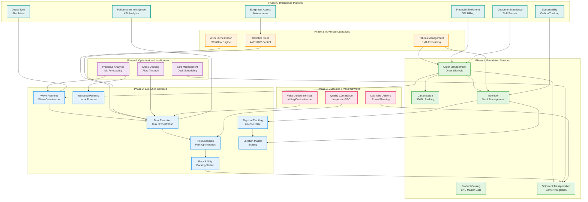
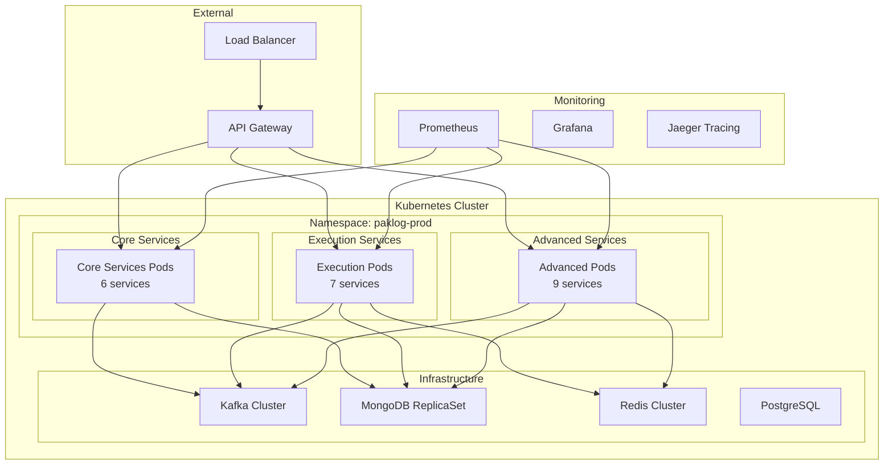

# PakLog Complete System Architecture Overview

## Microservices Ecosystem - 21 Core Services

## Service Categories and Responsibilities

### Phase 1: Foundation Services (Core)
1. **Cartonization** - 3D bin-packing optimization for shipping cartons
2. **Inventory** - Real-time inventory tracking and management
3. **Order Management** - Order lifecycle from creation to fulfillment
4. **Product Catalog** - SKU master data and product information
5. **Shipment Transportation** - Carrier integration and shipment tracking

### Phase 2: Execution Services (Operational Layer)
6. **Wave Planning** - Intelligent wave creation and optimization
7. **Task Execution** - Task queue management and assignment
8. **Pick Execution** - Mobile picking with path optimization (TSP)
9. **Pack & Ship** - Packing station operations and shipping
10. **Physical Tracking** - License plate and asset tracking
11. **Location Master** - Warehouse location and slotting management
12. **Workload Planning** - Labor forecasting and shift planning

### Phase 3: Advanced Operations
13. **Returns Management** - RMA processing and fraud detection
14. **Robotics Fleet Management** - AMR/AGV orchestration with A* pathfinding
15. **WES Orchestration Engine** - Workflow orchestration with saga pattern

### Phase 4: Optimization & Intelligence
16. **Predictive Analytics Platform** - ML-based forecasting and predictions
17. **Yard Management System** - Dock door scheduling and trailer tracking
18. **Cross-Docking Operations** - Flow-through and consolidation

### Phase 5: Customer & Value Services
19. **Last-Mile Delivery** - Route optimization with VRP algorithm
20. **Value-Added Services** - Kitting, customization, gift wrapping
21. **Quality Compliance** - Statistical Process Control (SPC) and inspection

### Phase 6: Intelligence Platform (Supporting Services)
- **Digital Twin Simulation** - Virtual warehouse modeling and what-if analysis
- **Sustainability Management** - Carbon footprint tracking and ESG reporting
- **Customer Experience Hub** - Order tracking and customer self-service
- **Performance Intelligence** - KPI dashboards and anomaly detection
- **Equipment Asset Management** - Predictive maintenance and TCO
- **Financial Settlement** - 3PL billing and activity-based costing

## Technology Stack

### Core Technologies
- **Language**: Java 21
- **Framework**: Spring Boot 3.2.5
- **Architecture**: Hexagonal (Ports & Adapters), Domain-Driven Design
- **Messaging**: Apache Kafka with CloudEvents
- **Databases**: MongoDB (primary), PostgreSQL (location-master), Redis (caching)
- **Container**: Docker & Kubernetes
- **Monitoring**: Prometheus, Grafana, OpenTelemetry

### Architectural Patterns
- **Hexagonal Architecture** - Clean separation of concerns
- **Domain-Driven Design** - Rich domain models with bounded contexts
- **Event-Driven Architecture** - Asynchronous communication via domain events
- **CQRS** - Command Query Responsibility Segregation
- **Saga Pattern** - Distributed transaction management (WES)
- **Transactional Outbox** - Reliable event publishing
- **Circuit Breaker** - Resilience4j for fault tolerance

## Integration Points

### Event-Driven Communication
All services communicate via Apache Kafka using CloudEvents specification:
- **Domain Events** - Business events (OrderCreated, PickCompleted, etc.)
- **Integration Events** - Cross-service communication
- **Command Events** - Triggering actions in other services

### REST APIs
Each service exposes RESTful APIs for:
- Query operations (GET)
- Command operations (POST, PUT, DELETE)
- Health checks and metrics

### External Integrations
- **ERP Systems** - SAP, Oracle, Microsoft Dynamics
- **E-commerce Platforms** - Order sources
- **Carrier Systems** - FedEx, UPS, DHL
- **WCS/MHE** - Warehouse Control Systems
- **IoT Devices** - Sensors, RFID, scanners

## Deployment Architecture

## Key Architectural Decisions

1. **Microservices Architecture** - Independent deployment and scaling
2. **Event-Driven Design** - Loose coupling between services
3. **Hexagonal Architecture** - Clean separation of domain and infrastructure
4. **Domain-Driven Design** - Rich domain models with bounded contexts
5. **CQRS Pattern** - Optimized read and write operations
6. **Saga Pattern** - Managing distributed transactions
7. **MongoDB as Primary Store** - Flexible document model for domain aggregates
8. **Kafka for Events** - Reliable, scalable event streaming
9. **Redis for Caching** - Fast access to frequently used data
10. **CloudEvents Specification** - Standardized event format