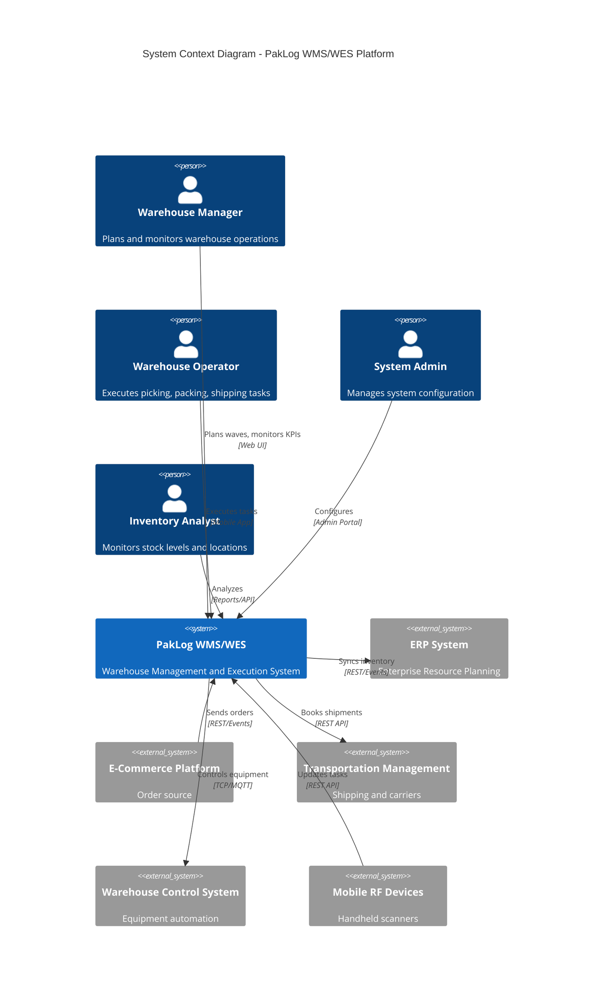
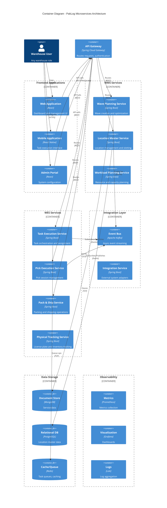
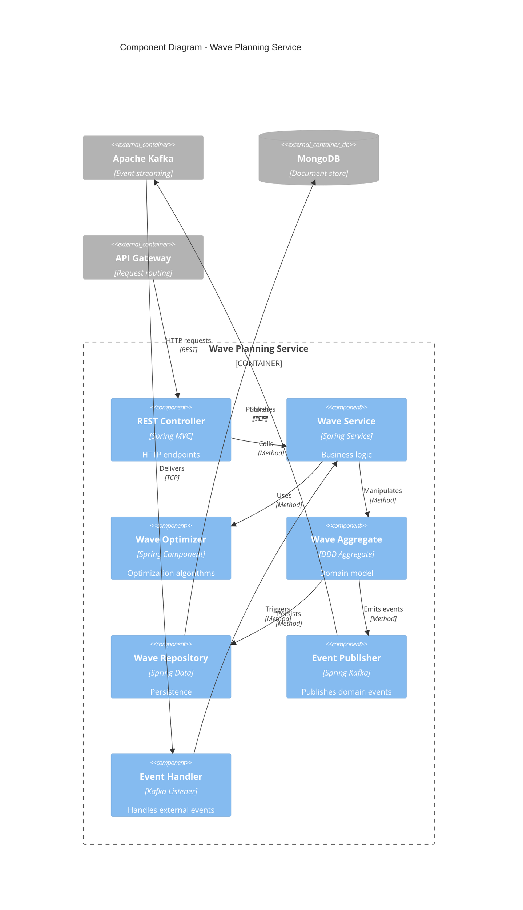
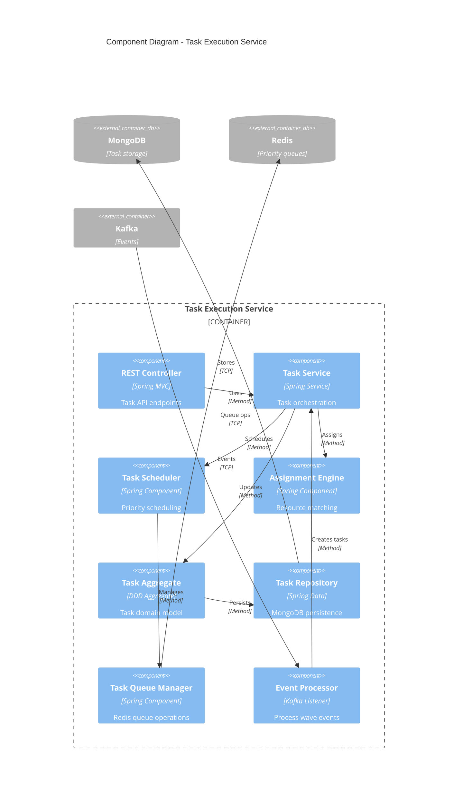
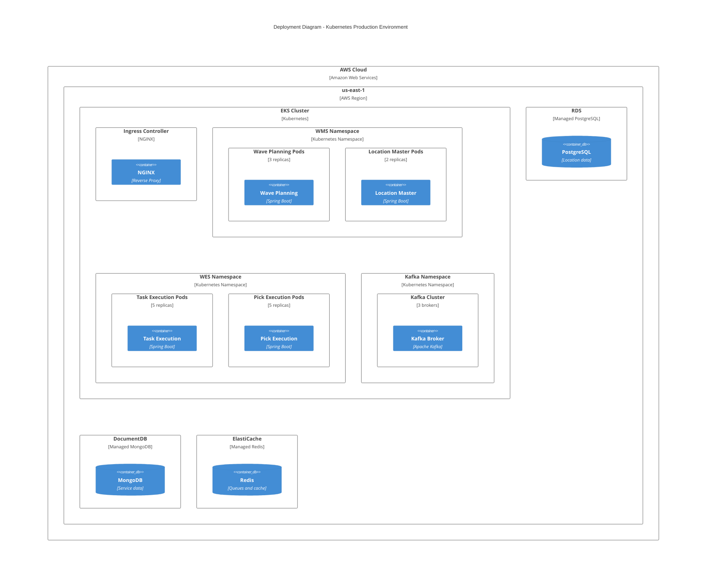
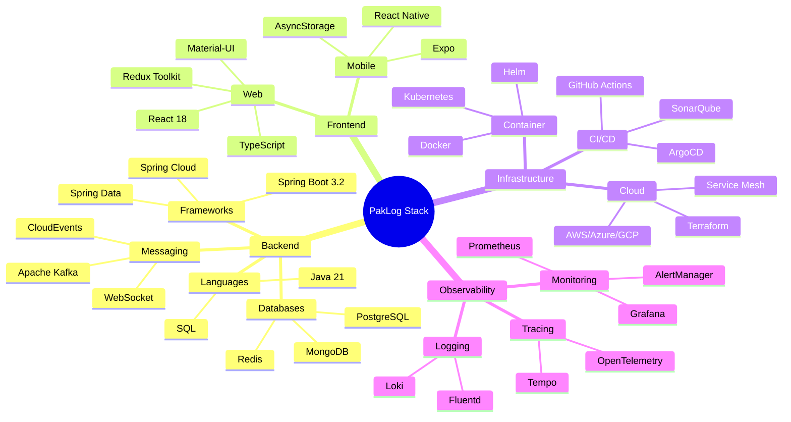
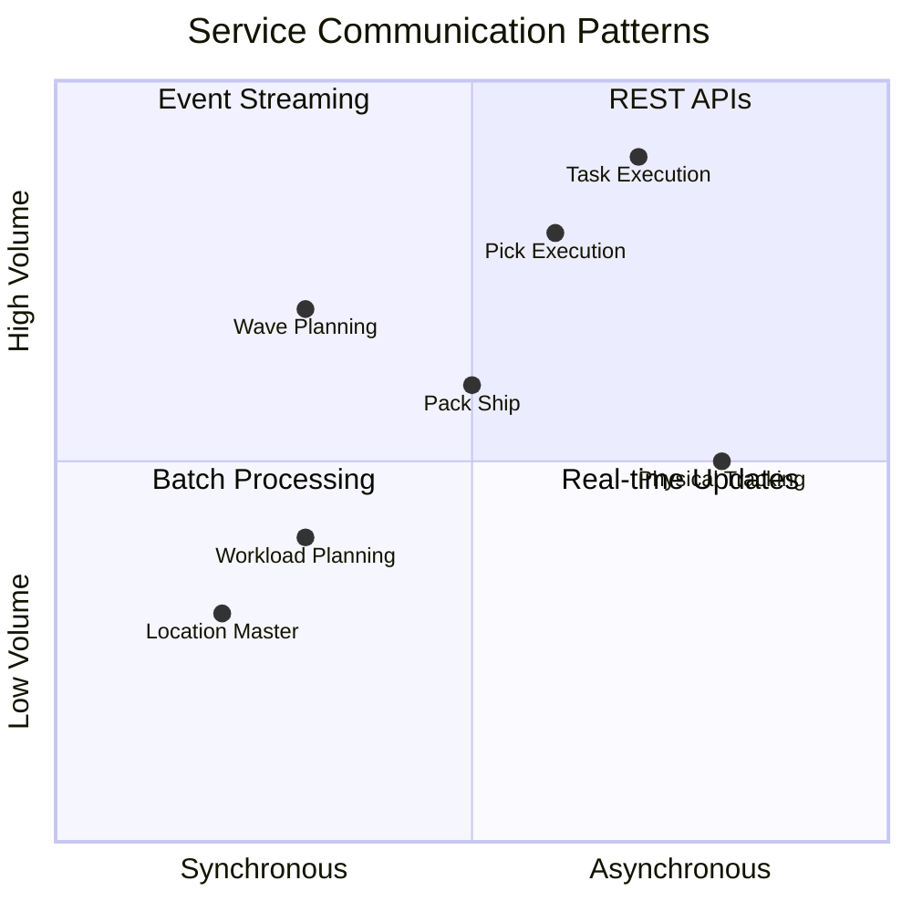

# PakLog WMS/WES Architecture Overview

## Table of Contents
1. [System Context (C4 Level 1)](#system-context-c4-level-1)
2. [Container Architecture (C4 Level 2)](#container-architecture-c4-level-2)
3. [Component Architecture (C4 Level 3)](#component-architecture-c4-level-3)
4. [Deployment Architecture](#deployment-architecture)
5. [Technology Stack](#technology-stack)

---

## System Context (C4 Level 1)

---

## Container Architecture (C4 Level 2)

---

## Component Architecture (C4 Level 3)

### Wave Planning Service Components

### Task Execution Service Components

---

## Deployment Architecture

---

## Technology Stack

---

## Service Communication Matrix

