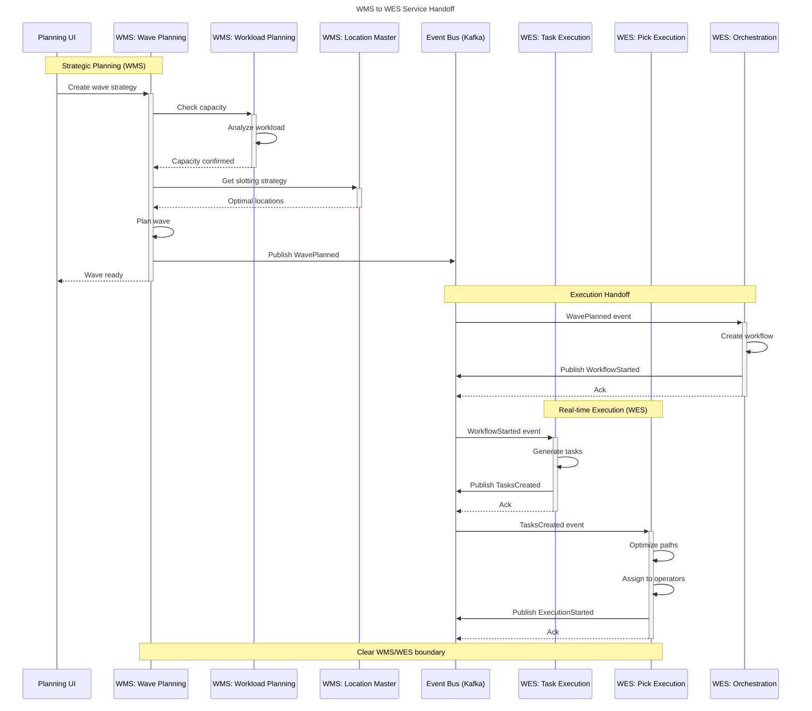
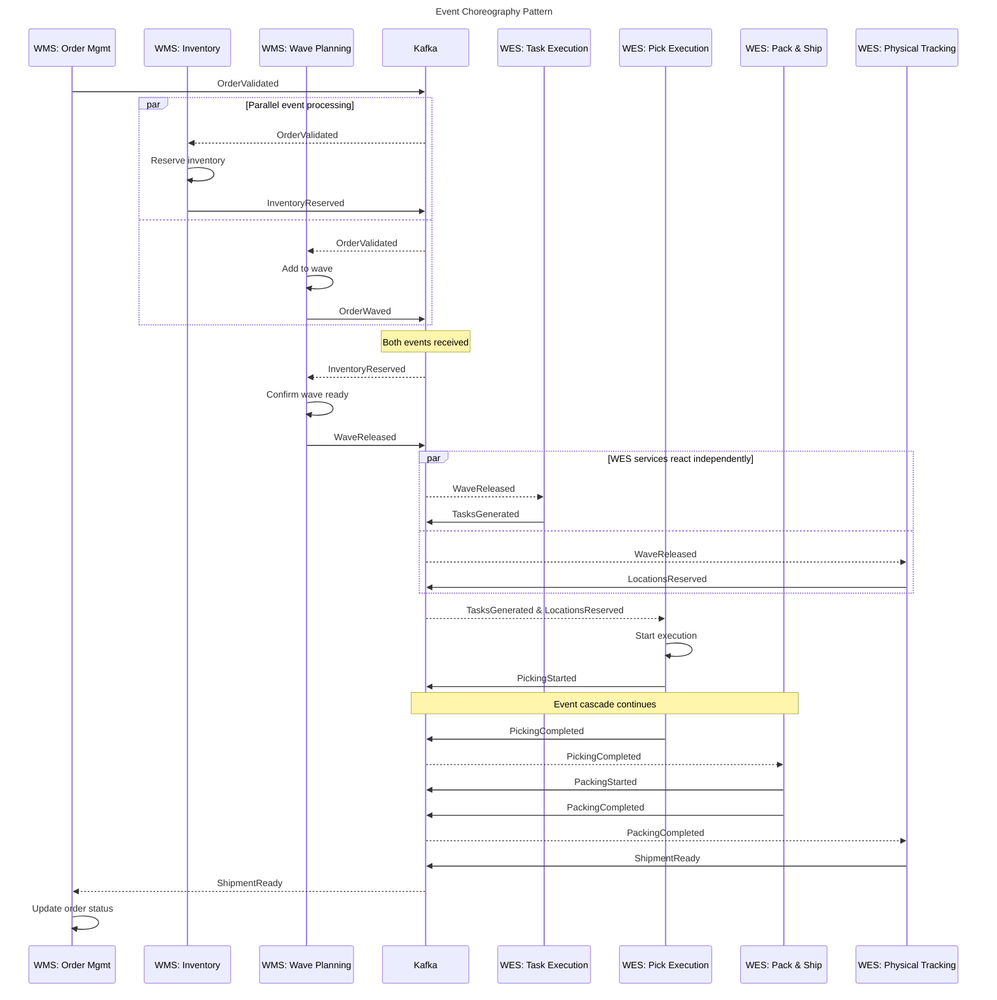
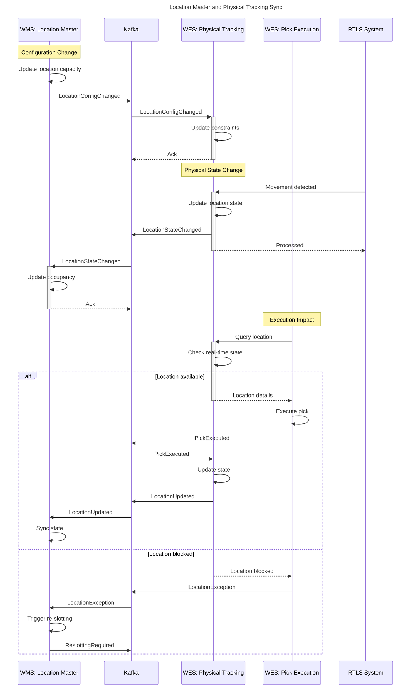
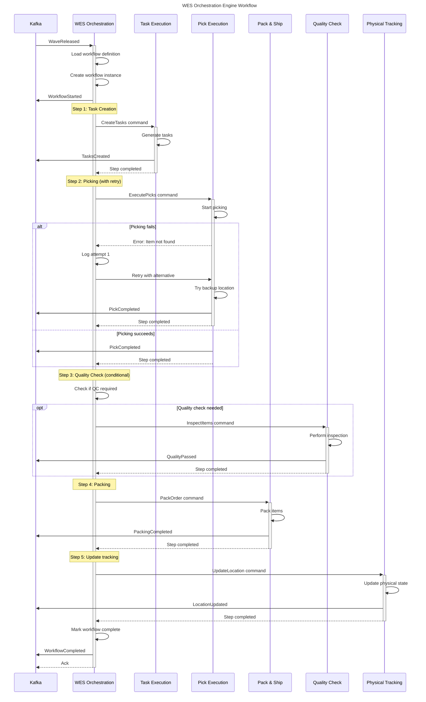
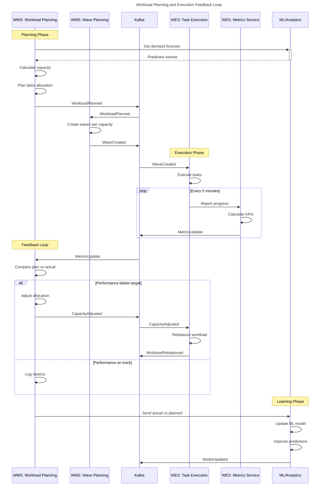

# PakLog Extended Sequence Diagrams - WMS/WES Integration

## Table of Contents
1. [WMS to WES Handoff](#wms-to-wes-handoff)
2. [Cross-Service Event Choreography](#cross-service-event-choreography)
3. [Location State Synchronization](#location-state-synchronization)
4. [WES Orchestration Workflow](#wes-orchestration-workflow)
5. [Workload Planning Integration](#workload-planning-integration)

---

## WMS to WES Handoff

Shows the clear separation between WMS strategic planning and WES execution.

---

## Cross-Service Event Choreography

Event-driven choreography between multiple services without central orchestration.

---

## Location State Synchronization

Bi-directional synchronization between Location Master (WMS) and Physical Tracking (WES).

---

## WES Orchestration Workflow

Complex workflow orchestration managed by WES Orchestration Engine.

---

## Workload Planning Integration

Integration between Workload Planning and real-time execution metrics.

---

## Notes on Sequence Diagrams

### Key Design Patterns Illustrated

1. **Event-Driven Architecture**: All services communicate primarily through Kafka events
2. **Saga Pattern**: Complex workflows use compensation for failure handling
3. **CQRS**: Commands flow through orchestration, queries can be direct
4. **Circuit Breaker**: Services handle failures gracefully with retries
5. **Event Sourcing**: All state changes are captured as events

### Service Boundaries

- **WMS Services**: Strategic planning, configuration, optimization
- **WES Services**: Real-time execution, physical operations, task management
- **Shared Services**: Cross-cutting concerns like quality, authentication

### Communication Patterns

- **Synchronous**: REST/gRPC for queries and immediate responses
- **Asynchronous**: Kafka for events and long-running operations
- **WebSocket**: Real-time updates for UI dashboards
- **Batch**: Scheduled jobs for optimization and analytics