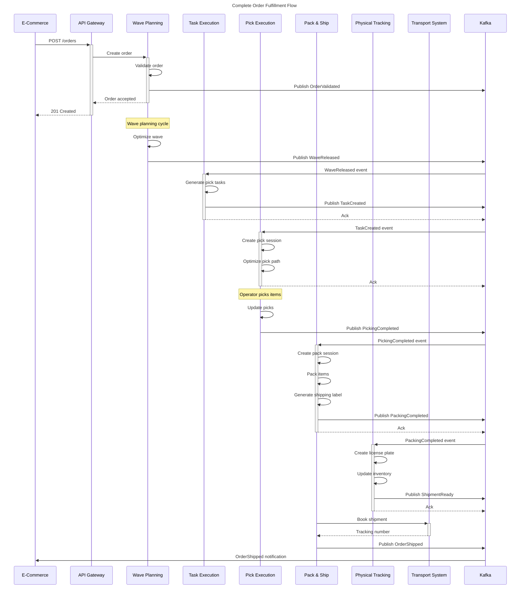
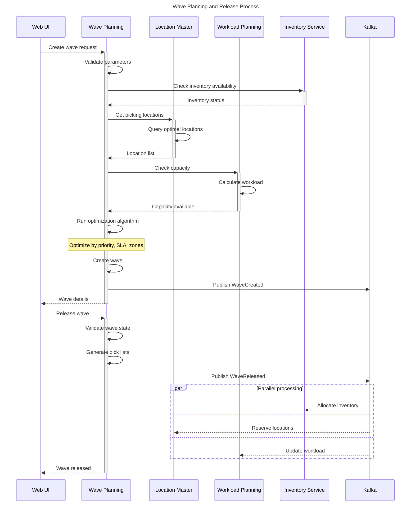
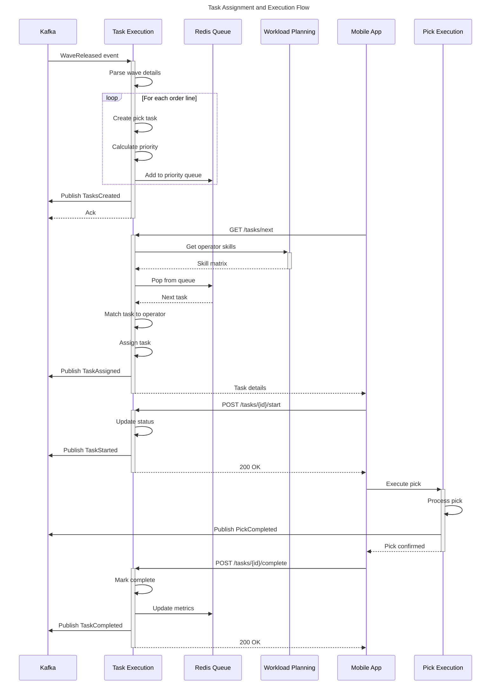
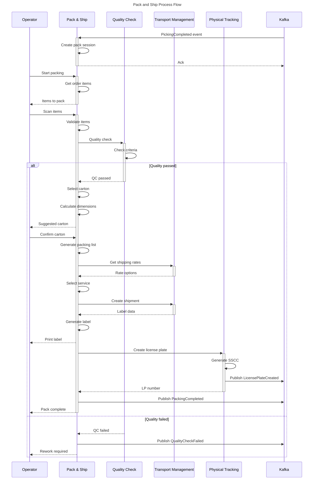
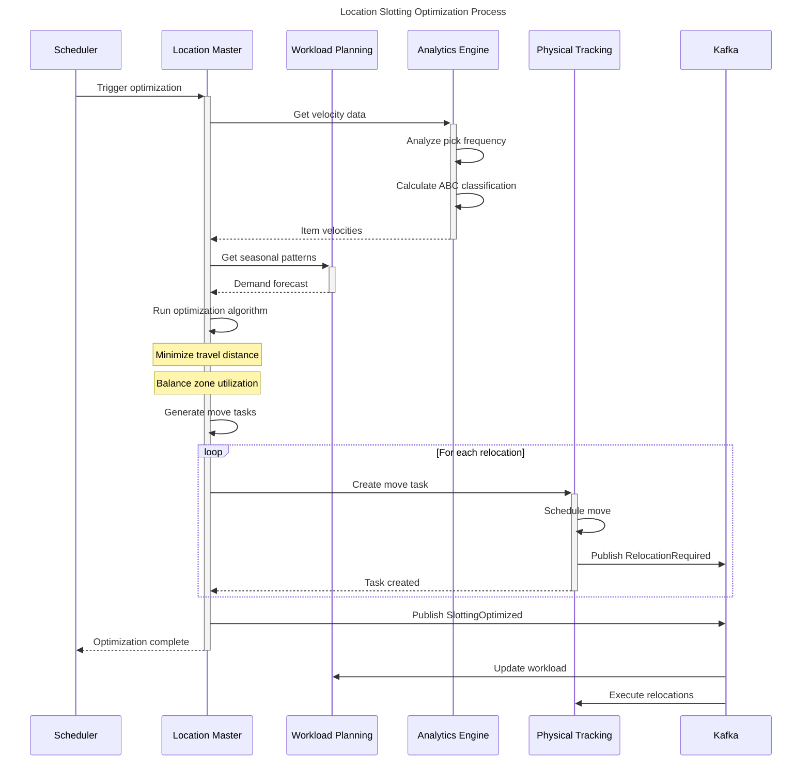
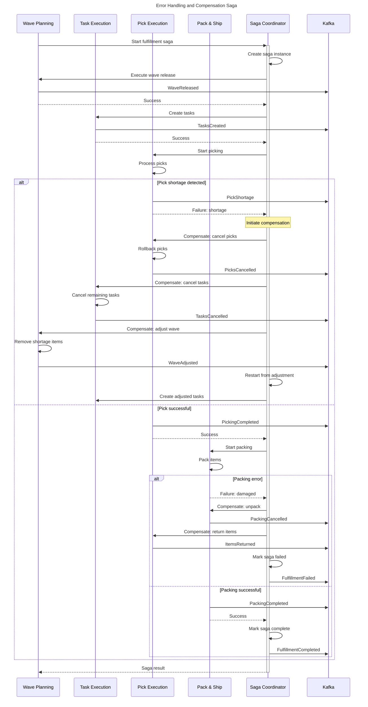
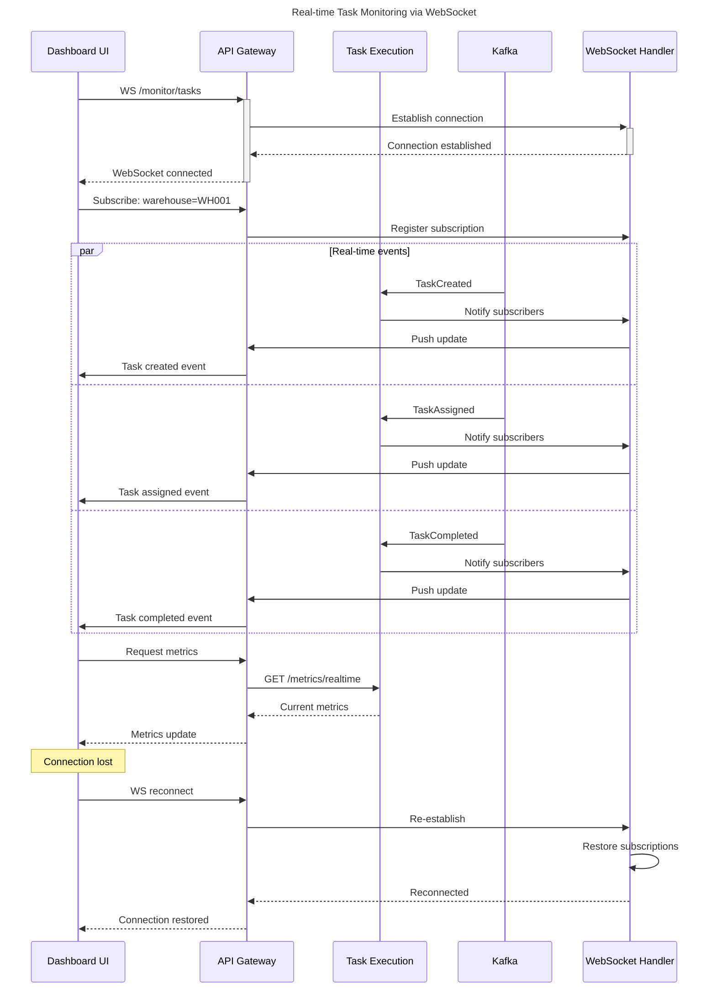
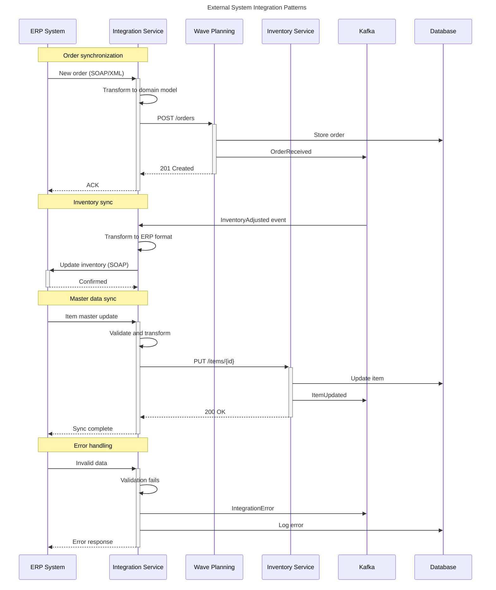

# PakLog Sequence Diagrams - Business Flows

## Table of Contents
1. [Order Fulfillment Flow](#order-fulfillment-flow)
2. [Wave Planning and Release](#wave-planning-and-release)
3. [Task Assignment Flow](#task-assignment-flow)
4. [Pick Execution Flow](#pick-execution-flow)
5. [Pack and Ship Flow](#pack-and-ship-flow)
6. [Inventory Movement Flow](#inventory-movement-flow)
7. [Location Slotting Optimization](#location-slotting-optimization)
8. [Error Handling and Compensation](#error-handling-and-compensation)

---

## Order Fulfillment Flow

Complete end-to-end order fulfillment process from order receipt to shipment.



---

## Wave Planning and Release

Detailed wave planning, optimization, and release process.



---

## Task Assignment Flow

Task creation, prioritization, and assignment to operators.



---

## Pick Execution Flow

Detailed picking process with path optimization and exception handling.

```mermaid
sequenceDiagram
    title Pick Execution with Path Optimization

    participant OP as Operator Device
    participant PE as Pick Execution
    participant LM as Location Master
    participant PT as Physical Tracking
    participant K as Kafka

    OP->>+PE: Start pick session
    PE->>PE: Create session
    PE->>+LM: Get pick locations
    LM-->>-PE: Location details

    PE->>PE: Run TSP algorithm
    Note over PE: Optimize pick path using 2-opt

    PE->>PE: Generate pick sequence
    PE-->>-OP: Optimized pick list

    loop For each pick
        OP->>+PE: Scan location
        PE->>PE: Validate location

        alt Location correct
            PE-->>OP: Show items to pick
            OP->>PE: Scan items
            PE->>PE: Validate items

            alt Items correct
                PE->>+PT: Update inventory
                PT->>PT: Deduct from location
                PT->>K: Publish InventoryMoved
                PT-->>-PE: Updated
                PE-->>-OP: Pick confirmed
            else Items incorrect
                PE->>PE: Log discrepancy
                PE->>K: Publish PickException
                PE-->>OP: Report issue
            end
        else Location incorrect
            PE-->>-OP: Wrong location
        end
    end

    OP->>+PE: Complete session
    PE->>PE: Validate all picks
    PE->>K: Publish PickSessionCompleted
    PE-->>-OP: Session summary
```

---

## Pack and Ship Flow

Packing, quality check, and shipping label generation process.



---

## Inventory Movement Flow

Inventory transfers between locations and cycle counting.

```mermaid
sequenceDiagram
    title Inventory Movement and Tracking

    participant OP as Operator
    participant PT as Physical Tracking
    participant LM as Location Master
    participant INV as Inventory Service
    participant K as Kafka

    OP->>+PT: Initiate transfer
    PT->>PT: Create movement record

    PT->>+LM: Validate source location
    LM-->>-PT: Location status

    PT->>+INV: Check availability
    INV-->>-PT: Available quantity

    alt Sufficient inventory
        PT->>PT: Reserve quantity
        PT-->>OP: Scan items

        OP->>PT: Confirm items
        PT->>PT: Validate scans

        PT->>+LM: Validate target location
        LM->>LM: Check capacity
        LM-->>-PT: Can receive

        PT->>PT: Execute transfer
        PT->>INV: Update balances

        par Update locations
            PT->>LM: Update source
        and
            PT->>LM: Update target
        end

        PT->>K: Publish InventoryMoved
        PT-->>-OP: Transfer complete

    else Insufficient inventory
        PT-->>-OP: Not enough stock
    end

    Note over PT,OP: Cycle Count Process

    OP->>+PT: Start cycle count
    PT->>+LM: Get location items
    LM-->>-PT: Expected items

    PT-->>-OP: Items to count

    OP->>+PT: Submit counts
    PT->>PT: Compare counts

    alt Count matches
        PT->>K: Publish CycleCountCompleted
        PT-->>-OP: Count confirmed
    else Discrepancy found
        PT->>PT: Calculate variance
        PT->>K: Publish InventoryAdjustment
        PT->>INV: Adjust inventory
        PT-->>OP: Recount required
    end
```

---

## Location Slotting Optimization

Dynamic slotting optimization based on velocity and seasonality.



---

## Error Handling and Compensation

Distributed saga pattern for handling failures and compensating transactions.



---

## Real-time Task Monitoring

WebSocket-based real-time monitoring of task execution.



---

## Integration with External Systems

External system integration patterns.

