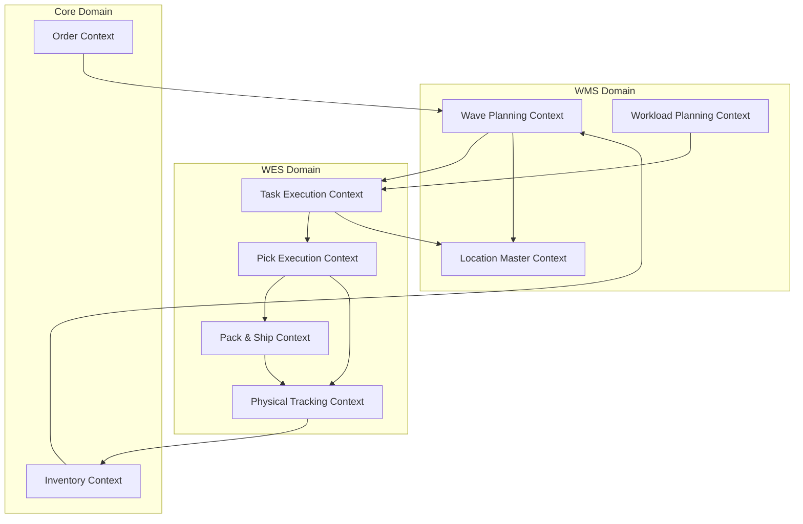
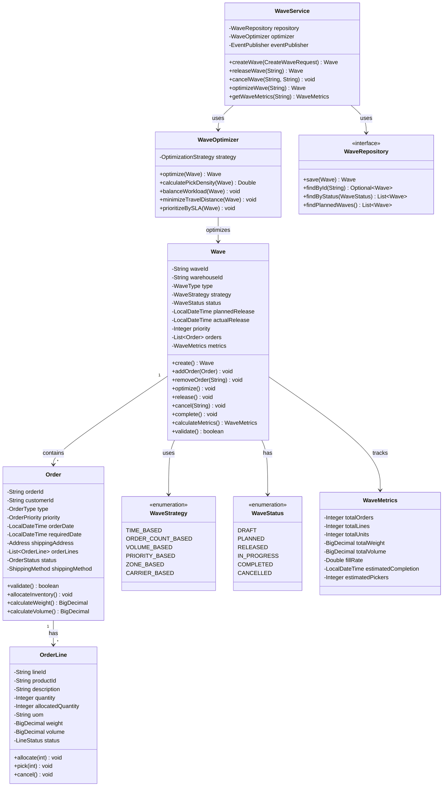
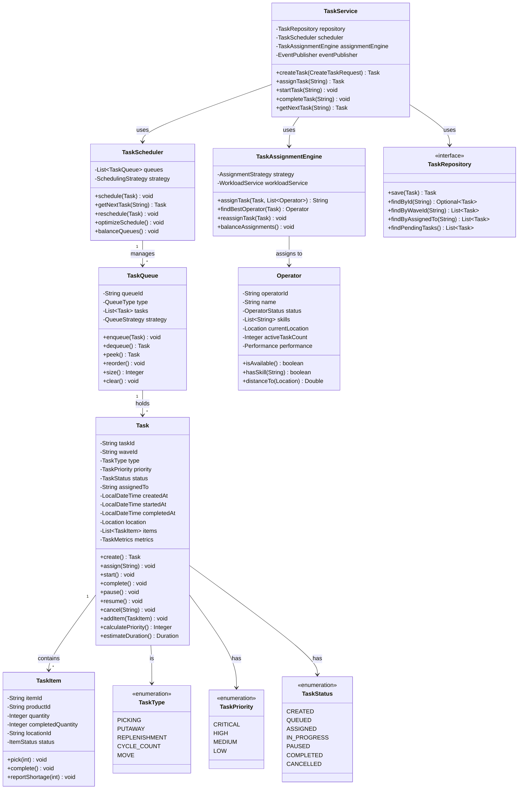
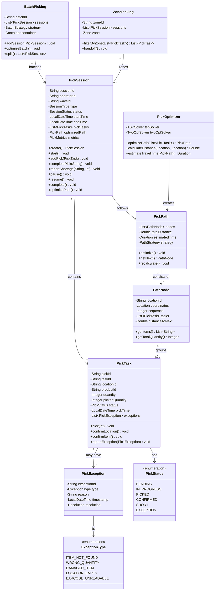
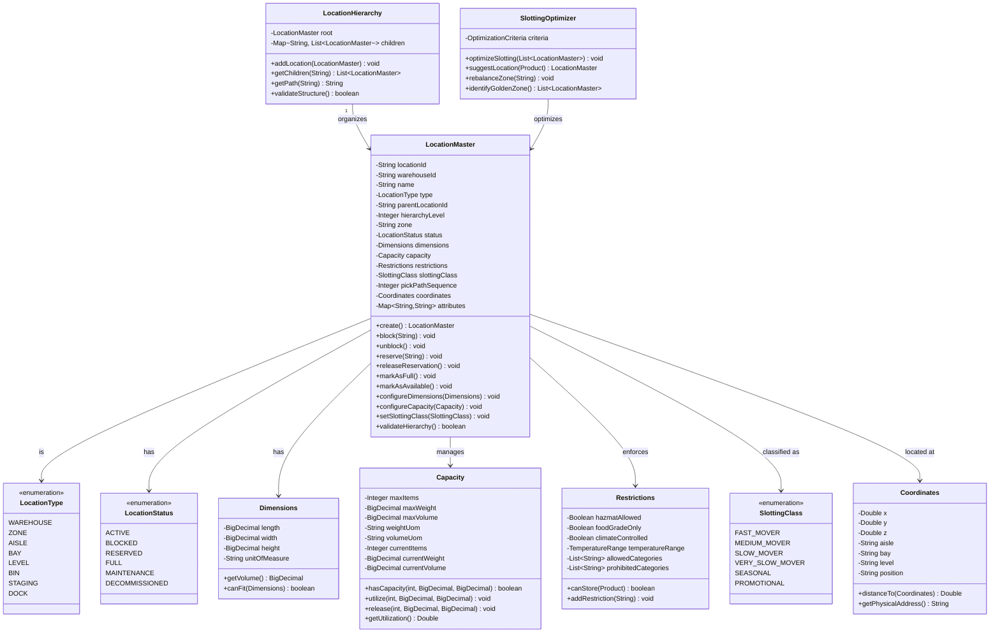
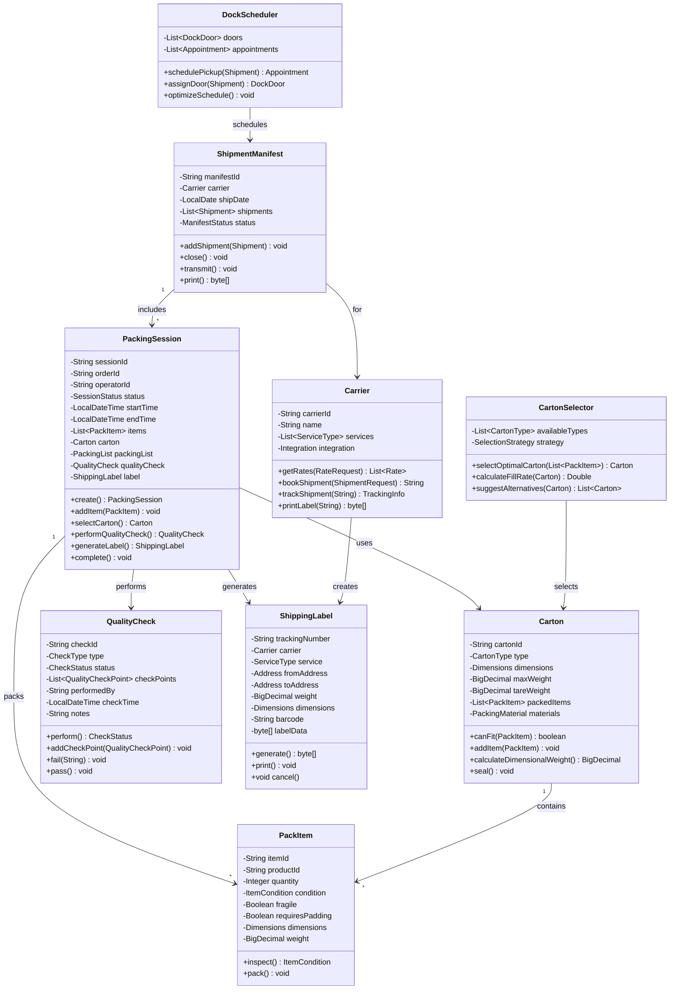
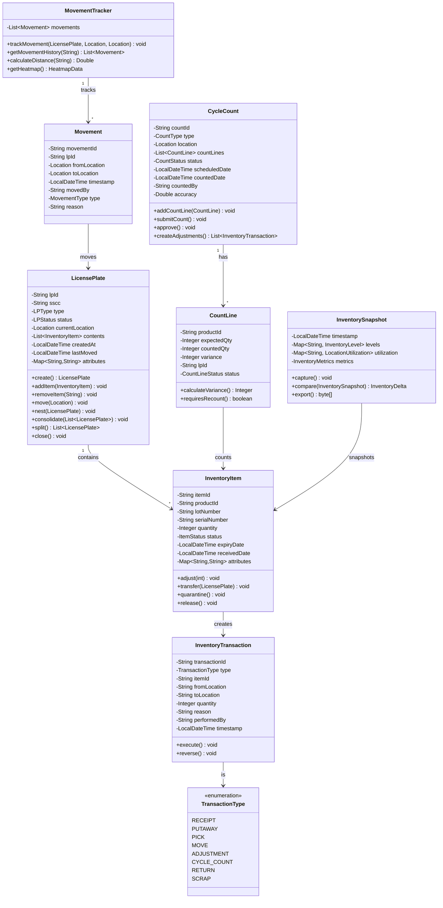
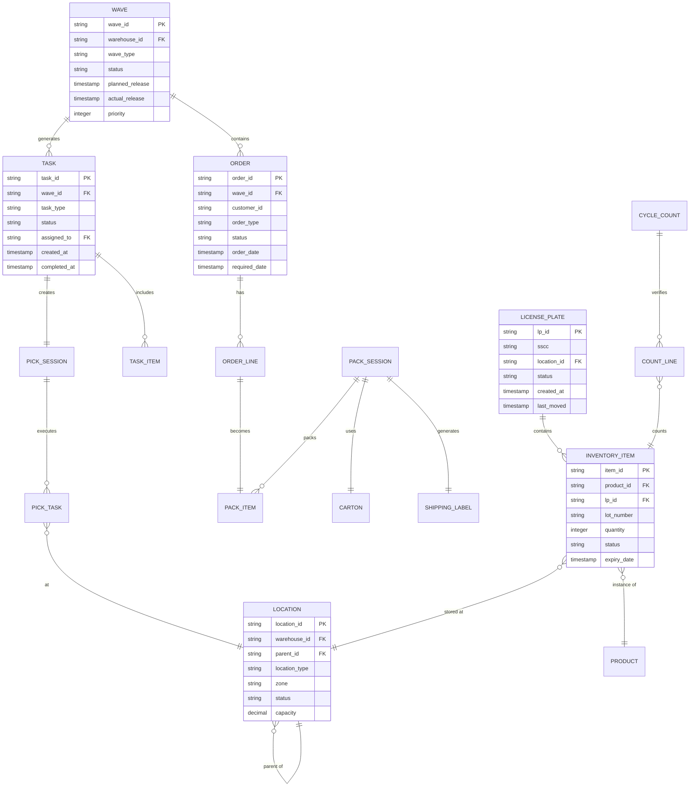
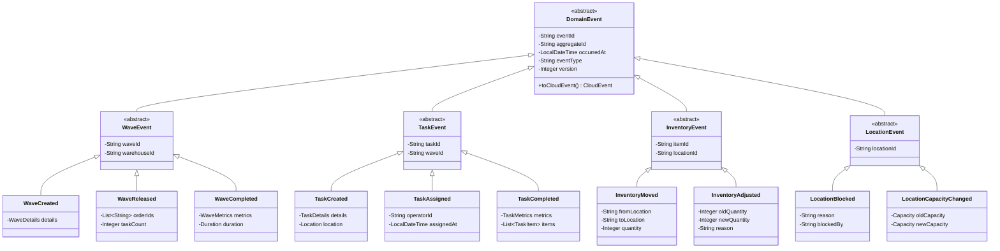

# PakLog Domain Model Diagrams

## Table of Contents
1. [Domain Bounded Contexts](#domain-bounded-contexts)
2. [Wave Planning Domain Model](#wave-planning-domain-model)
3. [Task Execution Domain Model](#task-execution-domain-model)
4. [Pick Execution Domain Model](#pick-execution-domain-model)
5. [Location Master Domain Model](#location-master-domain-model)
6. [Pack & Ship Domain Model](#pack--ship-domain-model)
7. [Physical Tracking Domain Model](#physical-tracking-domain-model)
8. [Entity Relationships](#entity-relationships)
9. [Value Objects](#value-objects)
10. [Domain Events](#domain-events)

---

## Domain Bounded Contexts

Overview of Domain-Driven Design bounded contexts and their relationships.

---

## Wave Planning Domain Model

---

## Task Execution Domain Model

---

## Pick Execution Domain Model

---

## Location Master Domain Model

---

## Pack & Ship Domain Model

---

## Physical Tracking Domain Model

---

## Entity Relationships

Complete entity relationship diagram across all services.

---

## Value Objects

Shared value objects across domains.

```mermaid
classDiagram
    class Money {
        -BigDecimal amount
        -Currency currency
        +add(Money) Money
        +subtract(Money) Money
        +multiply(BigDecimal) Money
        +equals(Money) boolean
    }

    class Address {
        -String line1
        -String line2
        -String city
        -String state
        -String postalCode
        -String country
        +format() String
        +validate() boolean
    }

    class Weight {
        -BigDecimal value
        -WeightUnit unit
        +convertTo(WeightUnit) Weight
        +add(Weight) Weight
        +compareTo(Weight) int
    }

    class Volume {
        -BigDecimal value
        -VolumeUnit unit
        +convertTo(VolumeUnit) Volume
        +add(Volume) Volume
        +fromDimensions(Dimensions) Volume
    }

    class Temperature {
        -BigDecimal value
        -TemperatureUnit unit
        +convertTo(TemperatureUnit) Temperature
        +inRange(TemperatureRange) boolean
    }

    class DateTimeRange {
        -LocalDateTime start
        -LocalDateTime end
        +contains(LocalDateTime) boolean
        +overlaps(DateTimeRange) boolean
        +duration() Duration
    }

    class Barcode {
        -String value
        -BarcodeType type
        +validate() boolean
        +encode() byte[]
        +decode(byte[]) String
    }

    class Percentage {
        -BigDecimal value
        +of(BigDecimal) BigDecimal
        +add(Percentage) Percentage
        +complement() Percentage
    }
```

---

## Domain Events

Event-driven architecture with domain events.

