# PakLog State Machine Diagrams

## Table of Contents
1. [Wave Lifecycle State Machine](#wave-lifecycle-state-machine)
2. [Task State Machine](#task-state-machine)
3. [Pick Session State Machine](#pick-session-state-machine)
4. [Order State Machine](#order-state-machine)
5. [Location State Machine](#location-state-machine)
6. [License Plate State Machine](#license-plate-state-machine)
7. [Inventory Item State Machine](#inventory-item-state-machine)
8. [Pack Session State Machine](#pack-session-state-machine)
9. [Shipment State Machine](#shipment-state-machine)
10. [Operator State Machine](#operator-state-machine)

---

## Wave Lifecycle State Machine

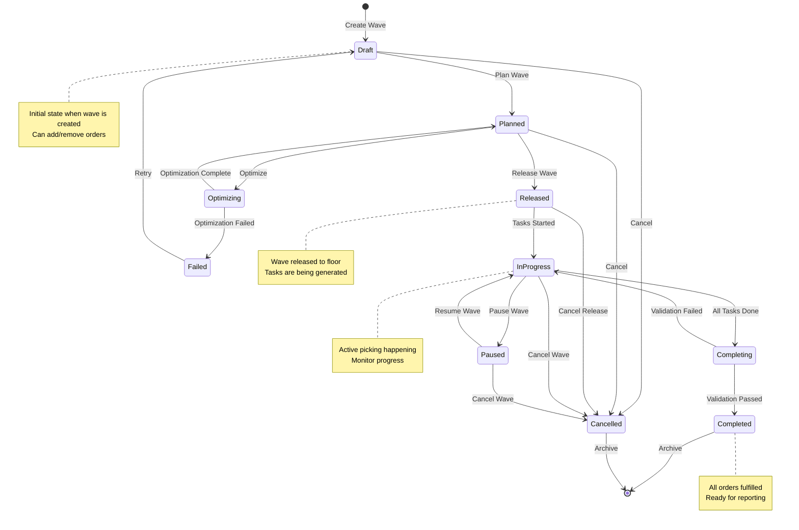

---

## Task State Machine

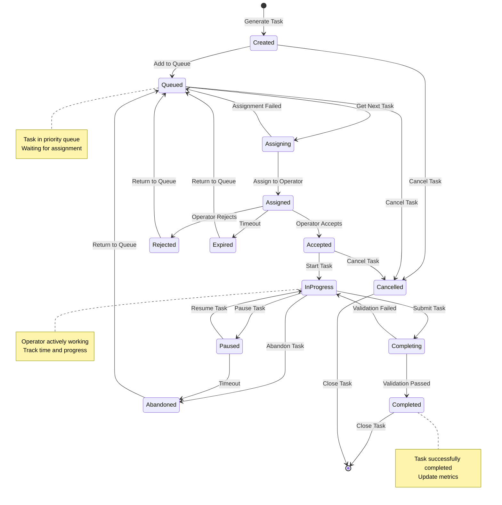

---

## Pick Session State Machine

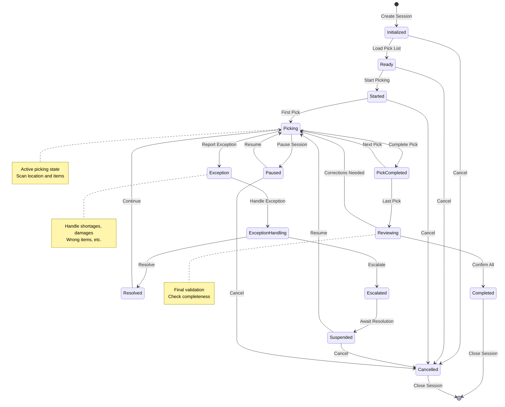

---

## Order State Machine

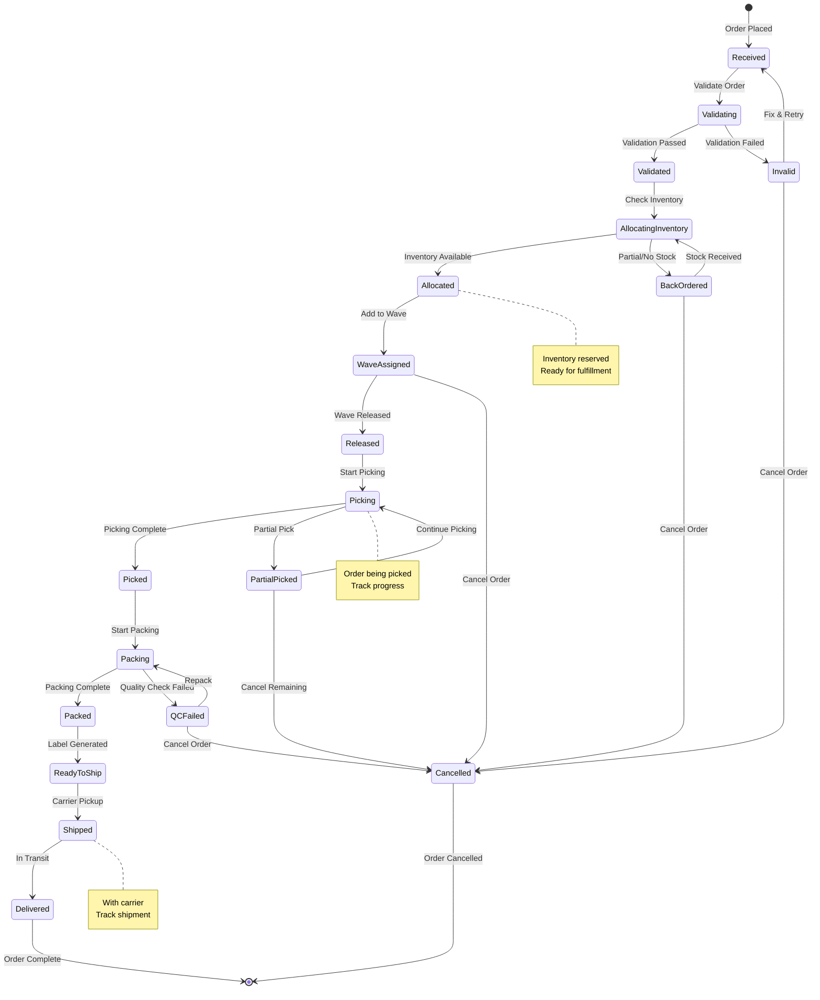

---

## Location State Machine

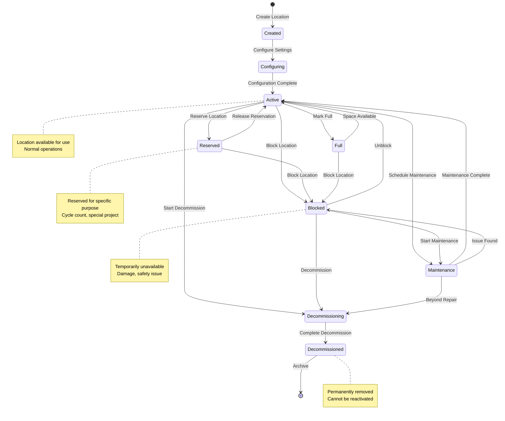

---

## License Plate State Machine

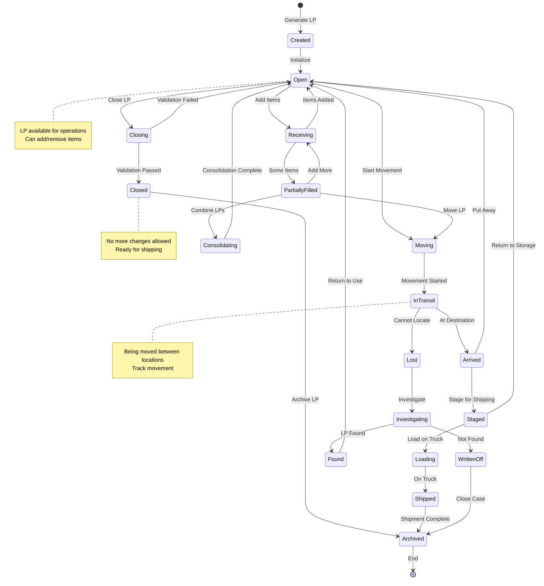

---

## Inventory Item State Machine

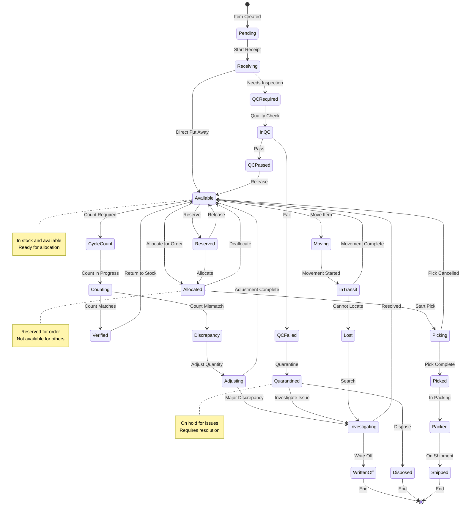

---

## Pack Session State Machine

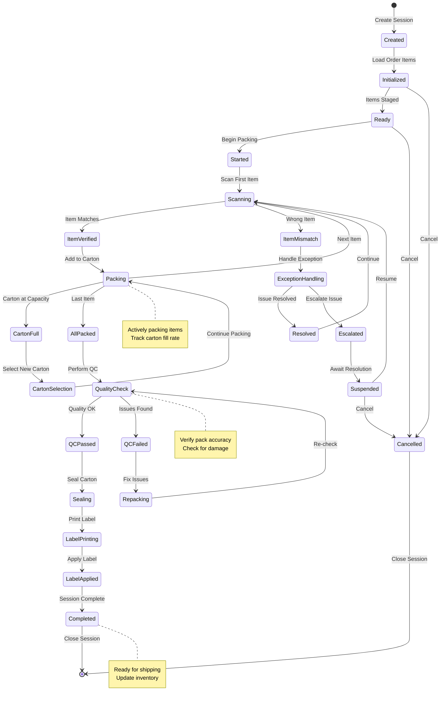

---

## Shipment State Machine

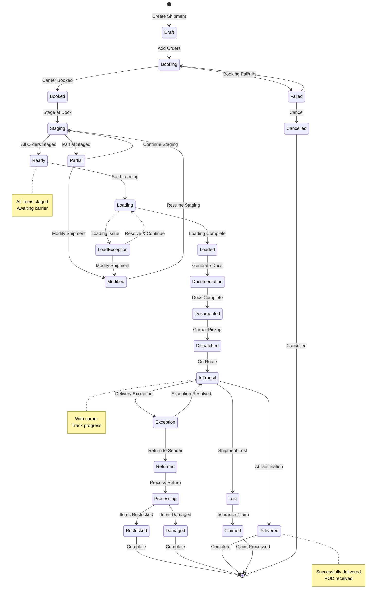

---

## Operator State Machine

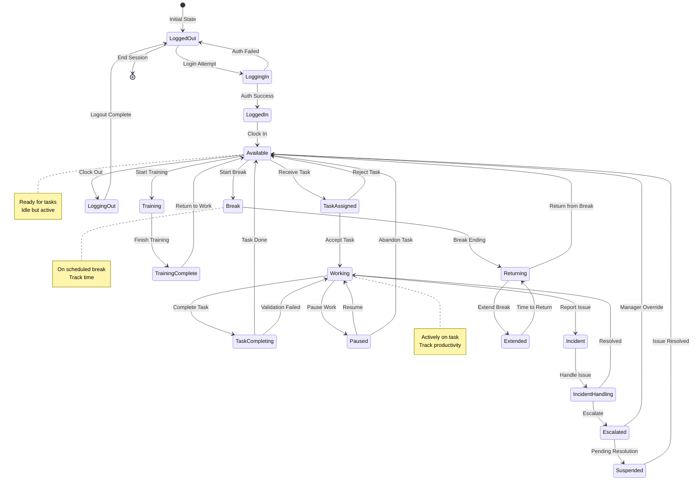

---

## Complex Process State Machine - Returns

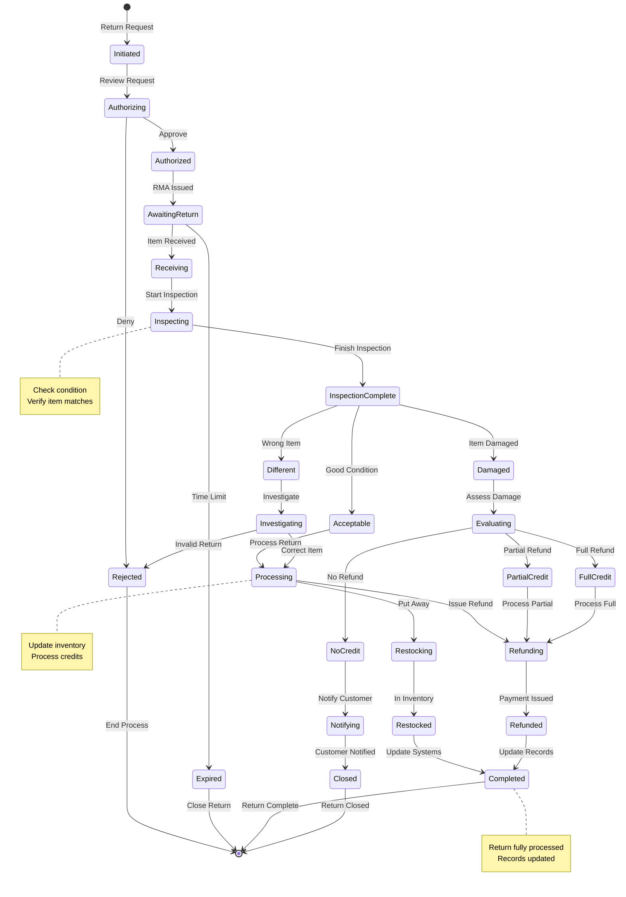