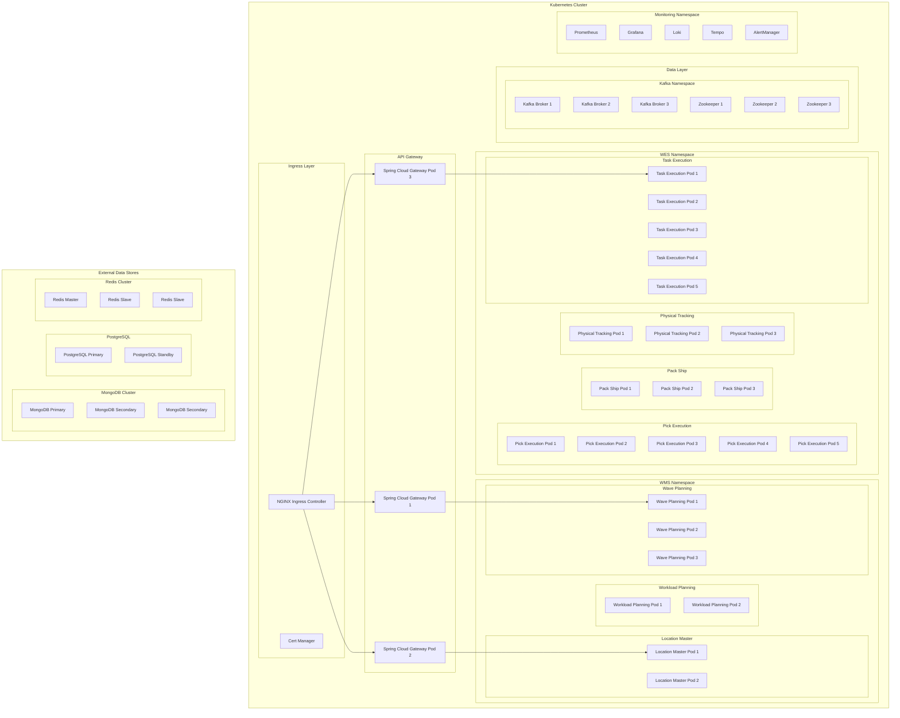
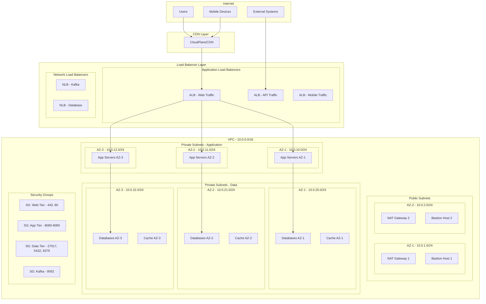
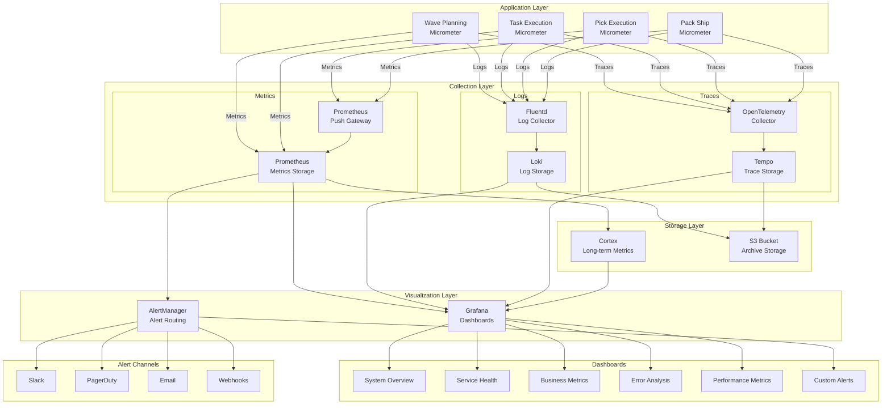
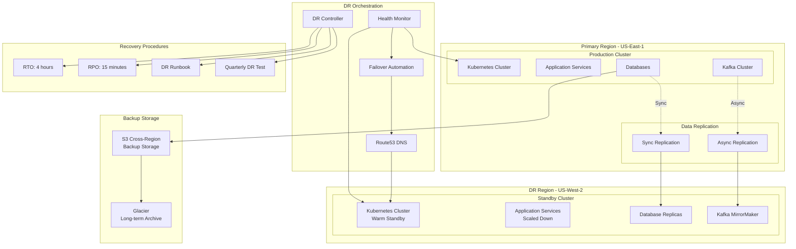
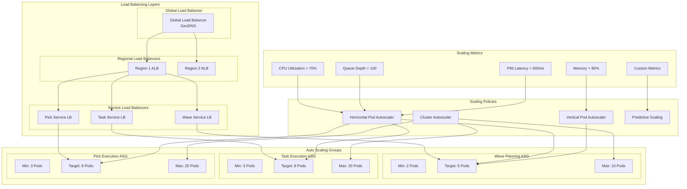
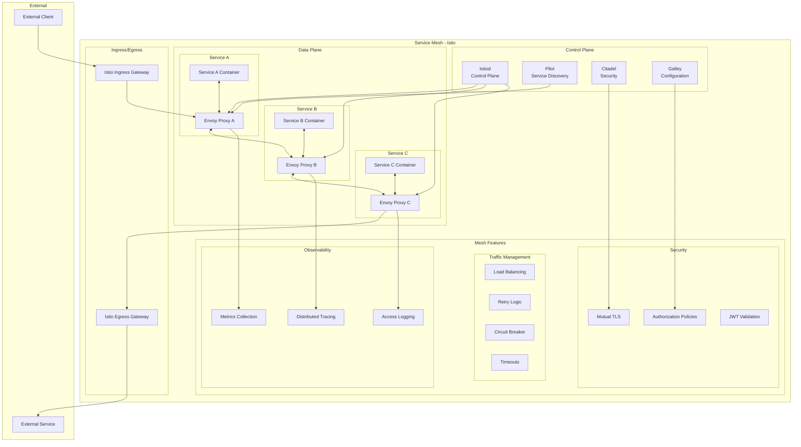

# PakLog Deployment and Infrastructure Diagrams

## Table of Contents
1. [Kubernetes Deployment Architecture](#kubernetes-deployment-architecture)
2. [Network Architecture](#network-architecture)
3. [Database Infrastructure](#database-infrastructure)
4. [Message Queue Infrastructure](#message-queue-infrastructure)
5. [Monitoring and Observability Stack](#monitoring-and-observability-stack)
6. [CI/CD Pipeline](#cicd-pipeline)
7. [Disaster Recovery Architecture](#disaster-recovery-architecture)
8. [Security Architecture](#security-architecture)
9. [Load Balancing and Scaling](#load-balancing-and-scaling)
10. [Service Mesh Architecture](#service-mesh-architecture)

---

## Kubernetes Deployment Architecture

---

## Network Architecture

---

## Database Infrastructure

```mermaid
graph TB
    subgraph "MongoDB Replica Set"
        subgraph "Primary Region"
            MONGO_P[MongoDB Primary<br/>Writes]
            MONGO_S1[MongoDB Secondary<br/>Reads]
            MONGO_S2[MongoDB Secondary<br/>Reads]
            MONGO_ARB[MongoDB Arbiter]
        end

        subgraph "DR Region"
            MONGO_DR[MongoDB Secondary<br/>DR Standby]
        end
    end

    subgraph "PostgreSQL Cluster"
        subgraph "Primary"
            PG_MASTER[PostgreSQL Primary<br/>Read/Write]
            PGBOUNCER1[PgBouncer<br/>Connection Pooling]
        end

        subgraph "Replicas"
            PG_REPLICA1[PostgreSQL Replica 1<br/>Read Only]
            PG_REPLICA2[PostgreSQL Replica 2<br/>Read Only]
            PGBOUNCER2[PgBouncer<br/>Connection Pooling]
        end

        subgraph "Backup"
            PG_BACKUP[Backup Server<br/>WAL Archive]
        end
    end

    subgraph "Redis Cluster"
        subgraph "Master Nodes"
            REDIS_M1[Redis Master 1<br/>Slots 0-5460]
            REDIS_M2[Redis Master 2<br/>Slots 5461-10922]
            REDIS_M3[Redis Master 3<br/>Slots 10923-16383]
        end

        subgraph "Slave Nodes"
            REDIS_S1[Redis Slave 1]
            REDIS_S2[Redis Slave 2]
            REDIS_S3[Redis Slave 3]
        end

        REDIS_SENTINEL[Redis Sentinel<br/>Failover Management]
    end

    subgraph "Application Services"
        WMS[WMS Services]
        WES[WES Services]
        ANALYTICS[Analytics Services]
    end

    WMS --> MONGO_P
    WMS --> MONGO_S1
    WES --> MONGO_S2

    WMS --> PGBOUNCER1
    WES --> PGBOUNCER2

    WMS --> REDIS_M1
    WES --> REDIS_M2
    ANALYTICS --> REDIS_M3

    MONGO_P -.->|Replication| MONGO_S1
    MONGO_P -.->|Replication| MONGO_S2
    MONGO_P -.->|Replication| MONGO_DR

    PG_MASTER -.->|Streaming Replication| PG_REPLICA1
    PG_MASTER -.->|Streaming Replication| PG_REPLICA2
    PG_MASTER -.->|WAL Archive| PG_BACKUP

    REDIS_M1 -.->|Replication| REDIS_S1
    REDIS_M2 -.->|Replication| REDIS_S2
    REDIS_M3 -.->|Replication| REDIS_S3
```

---

## Message Queue Infrastructure

```mermaid
graph TB
    subgraph "Kafka Cluster"
        subgraph "Brokers"
            BROKER1[Broker 1<br/>Leader Partitions]
            BROKER2[Broker 2<br/>Leader Partitions]
            BROKER3[Broker 3<br/>Leader Partitions]
        end

        subgraph "Zookeeper Ensemble"
            ZK1[Zookeeper 1<br/>Leader]
            ZK2[Zookeeper 2<br/>Follower]
            ZK3[Zookeeper 3<br/>Follower]
        end

        subgraph "Topics"
            subgraph "WMS Topics"
                T1[wave-events<br/>Partitions: 6<br/>Replication: 3]
                T2[order-events<br/>Partitions: 6<br/>Replication: 3]
                T3[inventory-events<br/>Partitions: 12<br/>Replication: 3]
            end

            subgraph "WES Topics"
                T4[task-events<br/>Partitions: 12<br/>Replication: 3]
                T5[pick-events<br/>Partitions: 12<br/>Replication: 3]
                T6[pack-events<br/>Partitions: 6<br/>Replication: 3]
            end

            subgraph "Integration Topics"
                T7[external-events<br/>Partitions: 3<br/>Replication: 3]
                T8[error-events<br/>Partitions: 3<br/>Replication: 3]
            end
        end
    end

    subgraph "Producers"
        P1[Wave Planning Service]
        P2[Task Execution Service]
        P3[Pick Execution Service]
        P4[Integration Service]
    end

    subgraph "Consumers"
        subgraph "Consumer Group 1"
            C1A[Task Service Instance 1]
            C1B[Task Service Instance 2]
            C1C[Task Service Instance 3]
        end

        subgraph "Consumer Group 2"
            C2A[Pick Service Instance 1]
            C2B[Pick Service Instance 2]
        end
    end

    subgraph "Kafka Connect"
        KC1[MongoDB Sink Connector]
        KC2[Elasticsearch Sink Connector]
        KC3[S3 Sink Connector]
    end

    subgraph "Schema Registry"
        SR[Confluent Schema Registry<br/>Avro Schemas]
    end

    P1 --> T1
    P1 --> T2
    P2 --> T4
    P3 --> T5
    P4 --> T7

    T1 --> C1A
    T1 --> C1B
    T4 --> C2A
    T4 --> C2B

    T1 --> KC1
    T4 --> KC2
    T7 --> KC3

    BROKER1 -.->|Metadata| ZK1
    BROKER2 -.->|Metadata| ZK1
    BROKER3 -.->|Metadata| ZK1

    P1 -.->|Schema| SR
    C1A -.->|Schema| SR
```

---

## Monitoring and Observability Stack

---

## CI/CD Pipeline

```mermaid
graph LR
    subgraph "Development"
        DEV[Developer]
        IDE[IDE/Local]
    end

    subgraph "Source Control"
        GIT[GitHub/GitLab]
        BRANCH[Feature Branch]
        PR[Pull Request]
        MAIN[Main Branch]
    end

    subgraph "CI Pipeline"
        subgraph "Build Stage"
            MAVEN[Maven Build]
            TEST[Unit Tests]
            SONAR[SonarQube Analysis]
        end

        subgraph "Security Scan"
            SAST[SAST Scan]
            DEPS[Dependency Check]
            SECRETS[Secret Scanning]
        end

        subgraph "Container Stage"
            DOCKER[Docker Build]
            SCAN[Container Scan]
            PUSH[Push to Registry]
        end
    end

    subgraph "Artifact Storage"
        NEXUS[Nexus Repository]
        ECR[ECR/Docker Registry]
        HELM[Helm Charts]
    end

    subgraph "CD Pipeline"
        subgraph "Dev Environment"
            DEV_DEPLOY[Deploy to Dev]
            DEV_TEST[Smoke Tests]
        end

        subgraph "Staging Environment"
            STAGE_DEPLOY[Deploy to Staging]
            INTEGRATION[Integration Tests]
            PERF[Performance Tests]
        end

        subgraph "Production"
            APPROVAL[Manual Approval]
            PROD_DEPLOY[Blue-Green Deploy]
            HEALTH[Health Checks]
            ROLLBACK[Rollback if Failed]
        end
    end

    subgraph "Infrastructure as Code"
        TERRAFORM[Terraform]
        ANSIBLE[Ansible]
        K8S_MANIFESTS[K8s Manifests]
    end

    DEV --> IDE
    IDE --> GIT
    GIT --> BRANCH
    BRANCH --> PR
    PR --> MAIN

    MAIN --> MAVEN
    MAVEN --> TEST
    TEST --> SONAR

    SONAR --> SAST
    SAST --> DEPS
    DEPS --> SECRETS

    SECRETS --> DOCKER
    DOCKER --> SCAN
    SCAN --> PUSH

    PUSH --> NEXUS
    PUSH --> ECR
    PUSH --> HELM

    ECR --> DEV_DEPLOY
    HELM --> DEV_DEPLOY
    DEV_DEPLOY --> DEV_TEST

    DEV_TEST --> STAGE_DEPLOY
    STAGE_DEPLOY --> INTEGRATION
    INTEGRATION --> PERF

    PERF --> APPROVAL
    APPROVAL --> PROD_DEPLOY
    PROD_DEPLOY --> HEALTH
    HEALTH -.->|Failed| ROLLBACK

    TERRAFORM --> DEV_DEPLOY
    TERRAFORM --> STAGE_DEPLOY
    TERRAFORM --> PROD_DEPLOY

    ANSIBLE --> DEV_DEPLOY
    K8S_MANIFESTS --> DEV_DEPLOY
```

---

## Disaster Recovery Architecture

---

## Security Architecture

```mermaid
graph TB
    subgraph "Edge Security"
        WAF[Web Application Firewall]
        DDOS[DDoS Protection]
        CDN_SEC[CDN Security]
    end

    subgraph "Network Security"
        subgraph "Perimeter"
            FW[Firewall Rules]
            NSG[Network Security Groups]
            NACL[Network ACLs]
        end

        subgraph "Internal"
            MESH[Service Mesh<br/>mTLS]
            SEGMENT[Network Segmentation]
            PRIVATELINK[Private Endpoints]
        end
    end

    subgraph "Identity & Access"
        subgraph "Authentication"
            OIDC[OIDC Provider]
            MFA[Multi-Factor Auth]
            SSO[Single Sign-On]
        end

        subgraph "Authorization"
            RBAC[Role-Based Access]
            POLICIES[IAM Policies]
            SVC_ACCOUNTS[Service Accounts]
        end
    end

    subgraph "Data Security"
        subgraph "Encryption"
            TLS[TLS in Transit]
            AES[AES-256 at Rest]
            KMS[Key Management Service]
        end

        subgraph "Data Protection"
            DLP[Data Loss Prevention]
            MASKING[Data Masking]
            TOKENIZATION[Tokenization]
        end
    end

    subgraph "Application Security"
        subgraph "Code Security"
            SAST_SEC[SAST Scanning]
            DAST[DAST Testing]
            IAST[IAST Monitoring]
        end

        subgraph "Runtime Security"
            RASP[Runtime Protection]
            CONTAINER_SEC[Container Security]
            SECRETS_MGR[Secrets Manager]
        end
    end

    subgraph "Compliance & Audit"
        AUDIT[Audit Logging]
        SIEM[SIEM Platform]
        COMPLIANCE[Compliance Checks]
        FORENSICS[Forensics Tools]
    end

    WAF --> FW
    DDOS --> NSG
    CDN_SEC --> NACL

    FW --> MESH
    NSG --> SEGMENT
    NACL --> PRIVATELINK

    OIDC --> RBAC
    MFA --> POLICIES
    SSO --> SVC_ACCOUNTS

    TLS --> DLP
    AES --> MASKING
    KMS --> TOKENIZATION

    SAST_SEC --> RASP
    DAST --> CONTAINER_SEC
    IAST --> SECRETS_MGR

    AUDIT --> SIEM
    SIEM --> COMPLIANCE
    COMPLIANCE --> FORENSICS
```

---

## Load Balancing and Scaling

---

## Service Mesh Architecture

