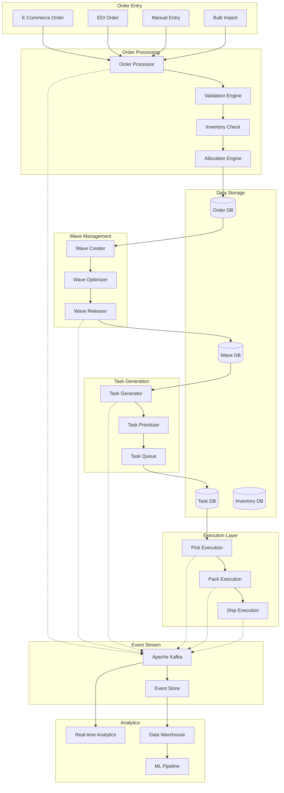
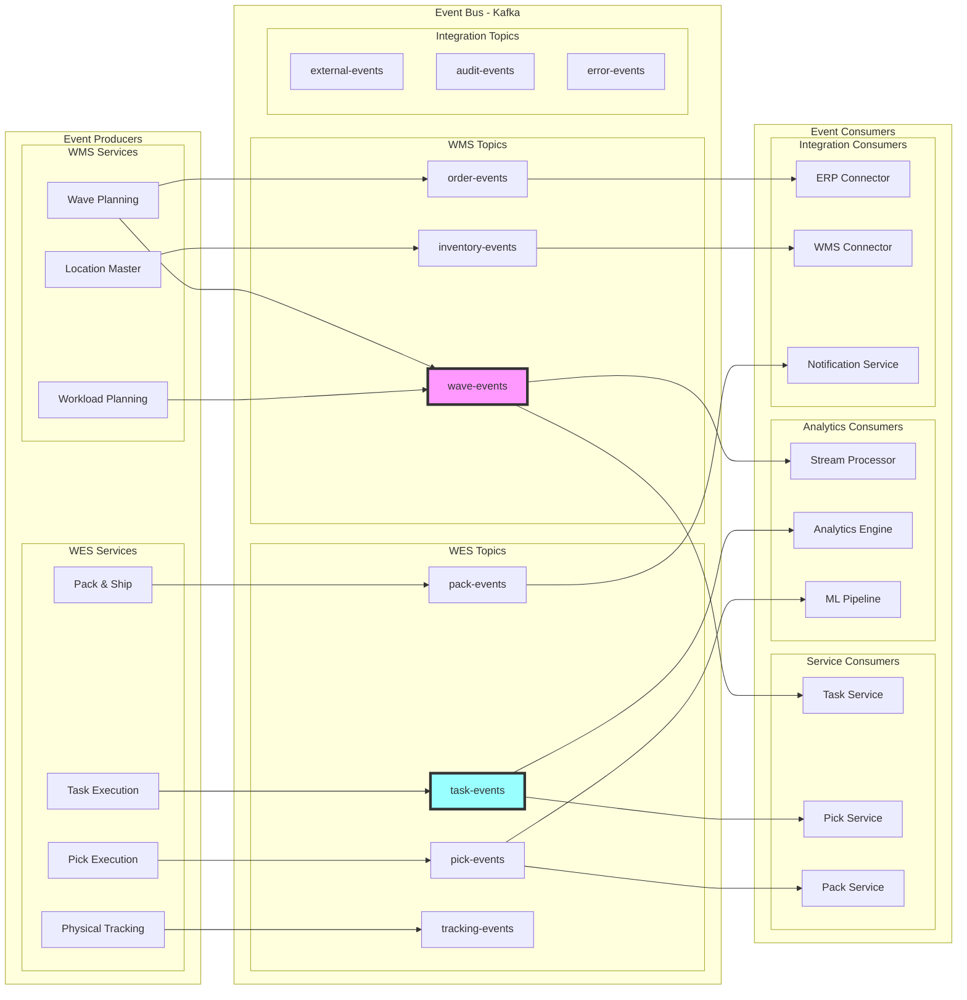
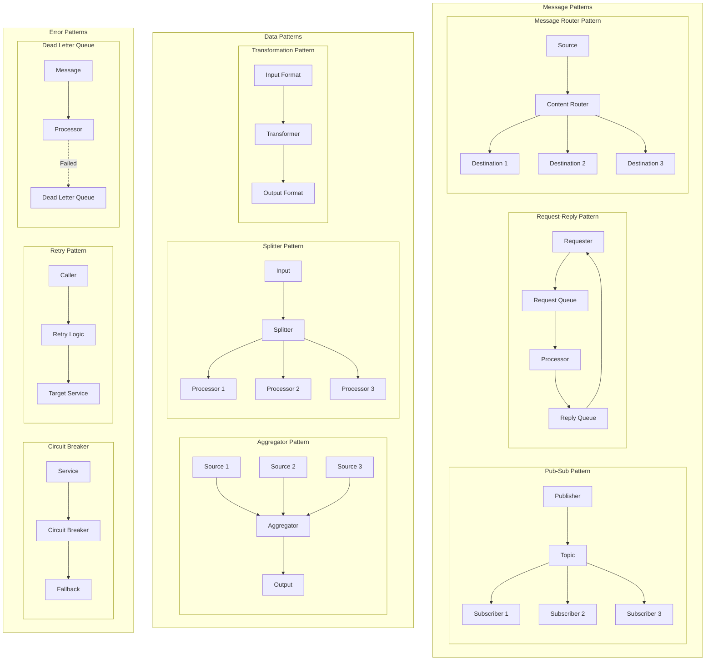
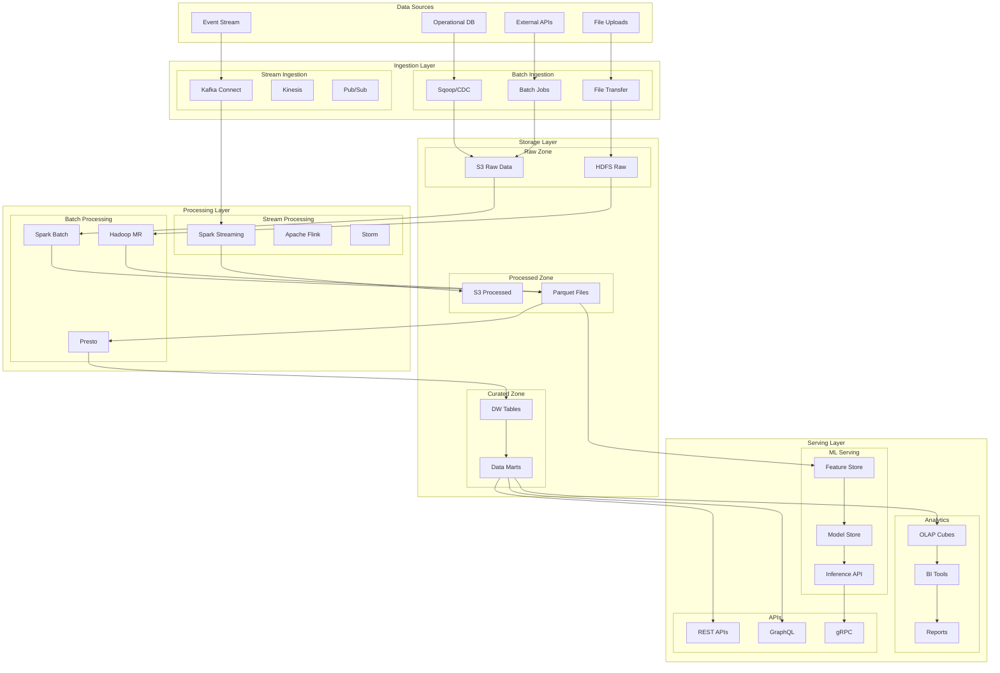
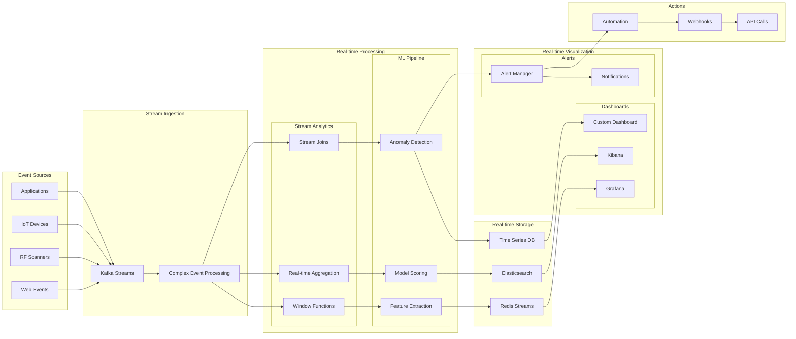
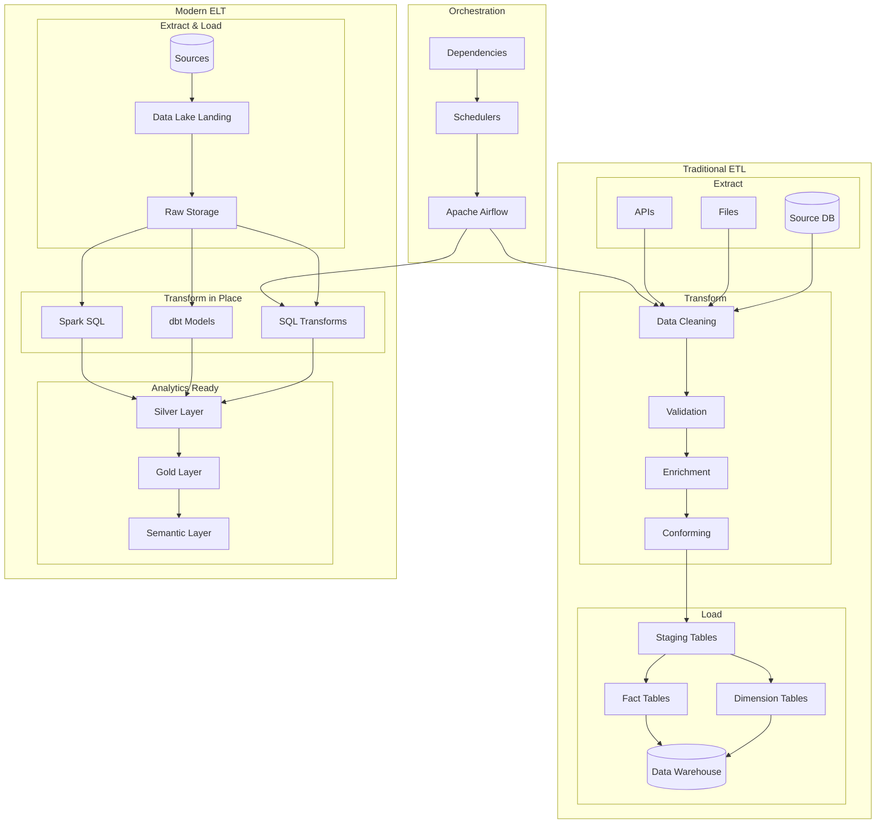
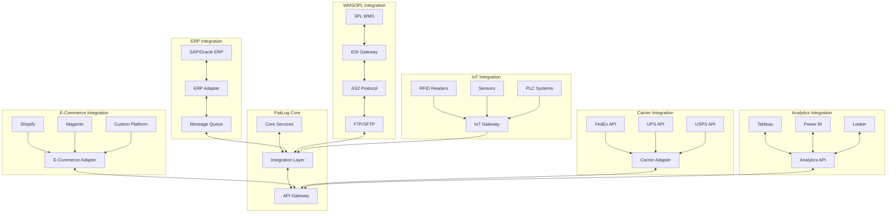
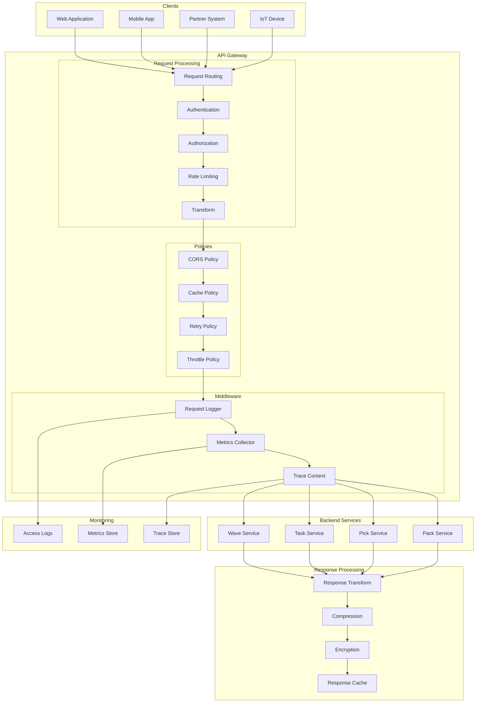
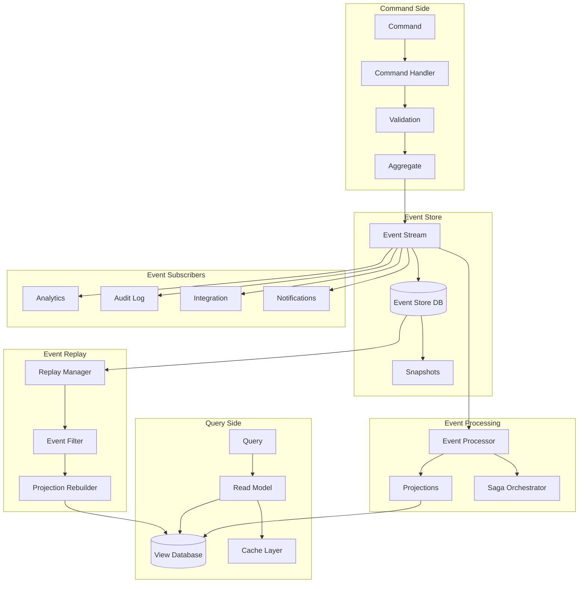
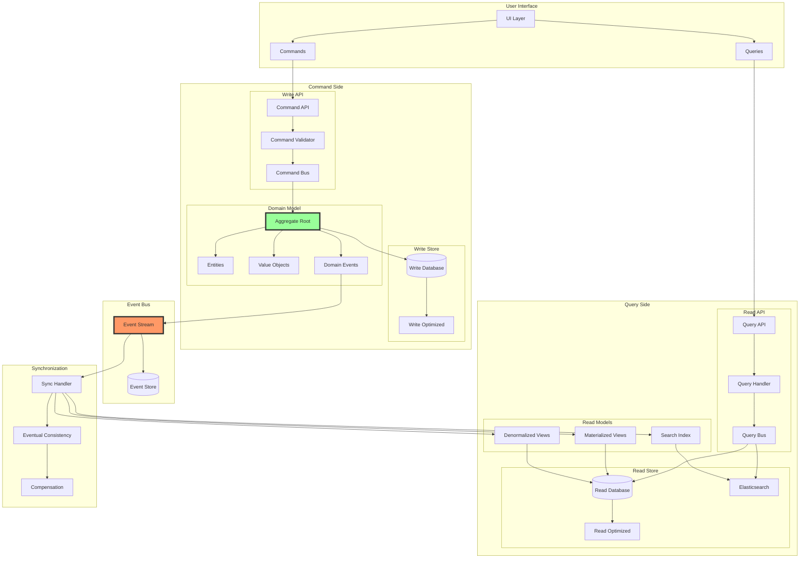

# PakLog Data Flow and Integration Diagrams

## Table of Contents
1. [End-to-End Data Flow](#end-to-end-data-flow)
2. [Event Flow Architecture](#event-flow-architecture)
3. [Integration Patterns](#integration-patterns)
4. [Data Pipeline Architecture](#data-pipeline-architecture)
5. [Real-time Analytics Flow](#real-time-analytics-flow)
6. [ETL/ELT Processes](#etlelt-processes)
7. [External System Integration](#external-system-integration)
8. [API Gateway Flow](#api-gateway-flow)
9. [Event Sourcing Flow](#event-sourcing-flow)
10. [CQRS Implementation](#cqrs-implementation)

---

## End-to-End Data Flow

Complete data flow from order creation to shipment.

---

## Event Flow Architecture

Event-driven architecture with Apache Kafka.

---

## Integration Patterns

Common integration patterns used in the system.

---

## Data Pipeline Architecture

Data pipeline for batch processing and analytics.

---

## Real-time Analytics Flow

Real-time analytics and monitoring pipeline.

---

## ETL/ELT Processes

ETL and ELT data processing pipelines.

---

## External System Integration

Integration with external systems and partners.

---

## API Gateway Flow

API Gateway request flow and processing.

---

## Event Sourcing Flow

Event sourcing implementation pattern.

---

## CQRS Implementation

Command Query Responsibility Segregation pattern.

