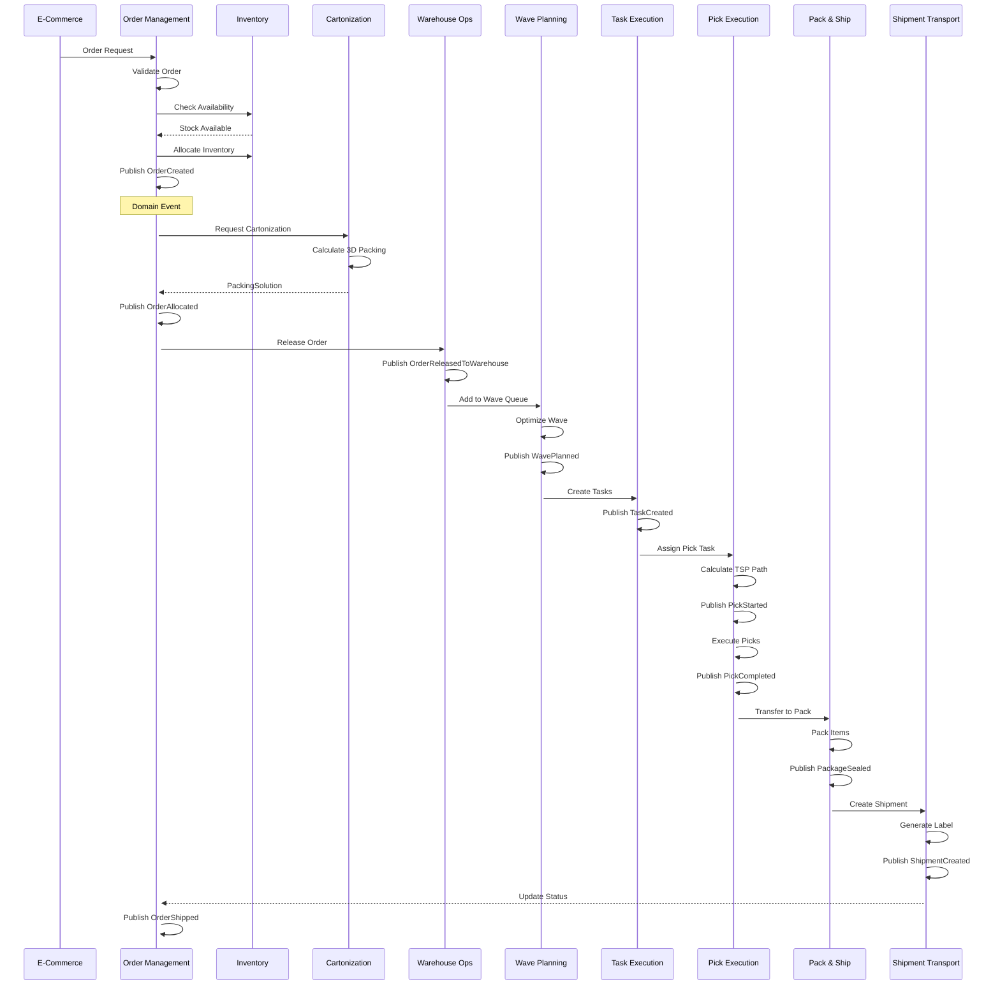

# PakLog Event Flow Diagrams

## Complete Event-Driven Architecture

### Order Fulfillment Flow - End to End



### Returns Processing Flow


### Robotics Fleet Coordination Flow


### Predictive Analytics Integration Flow


### Cross-Docking Flow


### WES Orchestration Saga Flow


## Event Catalog

### Core Domain Events

#### Order Management Events
- `OrderCreated` - New order received
- `OrderValidated` - Order validation complete
- `OrderAllocated` - Inventory allocated
- `OrderReleased` - Released to warehouse
- `OrderPicked` - Picking complete
- `OrderPacked` - Packing complete
- `OrderShipped` - Shipment dispatched
- `OrderDelivered` - Final delivery confirmed
- `OrderCancelled` - Order cancelled
- `OrderModified` - Order details changed

#### Inventory Events
- `InventoryReceived` - New inventory received
- `InventoryMoved` - Location transfer
- `InventoryAdjusted` - Manual adjustment
- `InventoryAllocated` - Reserved for order
- `InventoryDeallocated` - Reservation released
- `InventoryCounted` - Cycle count performed
- `LowStockAlert` - Below reorder point
- `StockoutAlert` - Zero inventory

#### Wave Planning Events
- `WavePlanned` - Wave created
- `WaveOptimized` - Wave re-optimized
- `WaveReleased` - Released for execution
- `WaveStarted` - Execution begun
- `WaveCompleted` - All tasks complete
- `WaveCancelled` - Wave cancelled

#### Task Execution Events
- `TaskCreated` - New task generated
- `TaskQueued` - Added to queue
- `TaskAssigned` - Assigned to worker/robot
- `TaskStarted` - Execution started
- `TaskCompleted` - Successfully completed
- `TaskFailed` - Execution failed
- `TaskReassigned` - Reassigned to different resource

#### Pick Execution Events
- `PickListCreated` - Pick list generated
- `PickStarted` - Picking begun
- `ItemPicked` - Single item picked
- `PickShortage` - Item not available
- `PickCompleted` - All items picked
- `PickException` - Exception during picking

#### Pack & Ship Events
- `PackingStarted` - Packing initiated
- `ItemPacked` - Item added to package
- `PackageSealed` - Package closed
- `LabelGenerated` - Shipping label created
- `PackageWeighed` - Weight captured
- `PackageShipped` - Handed to carrier

#### Robotics Fleet Events
- `RobotAssigned` - Robot assigned to task
- `PathCalculated` - A* path computed
- `MissionStarted` - Robot mission begun
- `CollisionAvoided` - Obstacle detected and avoided
- `BatteryLow` - Charging required
- `ChargingStarted` - Robot charging
- `ChargingCompleted` - Fully charged
- `MissionCompleted` - Task complete
- `RobotError` - Robot malfunction

#### Returns Management Events
- `ReturnRequested` - Customer initiated return
- `ReturnApproved` - RMA approved
- `ReturnDenied` - RMA rejected
- `ReturnReceived` - Physical receipt
- `ReturnInspected` - Quality check complete
- `RefundProcessed` - Money returned
- `ExchangeProcessed` - Replacement sent
- `DispositionDecided` - Final disposition determined

#### Quality Compliance Events
- `InspectionScheduled` - QC planned
- `InspectionStarted` - QC begun
- `DefectDetected` - Quality issue found
- `InspectionCompleted` - QC finished
- `ComplianceViolation` - Rule violation
- `CAPACreated` - Corrective action initiated
- `CAPAClosed` - Corrective action complete

#### Predictive Analytics Events
- `ForecastGenerated` - New prediction created
- `ModelTrained` - ML model updated
- `AnomalyDetected` - Unusual pattern found
- `AlertTriggered` - Threshold exceeded
- `RecommendationGenerated` - Optimization suggestion

## Event Publishing Patterns

### Event Structure (CloudEvents)
```json
{
  "specversion": "1.0",
  "type": "com.paklog.order.OrderCreated",
  "source": "order-management-service",
  "subject": "order/12345",
  "id": "event-uuid",
  "time": "2024-01-15T10:30:00Z",
  "datacontenttype": "application/json",
  "data": {
    "orderId": "12345",
    "customerId": "CUST-789",
    "orderLines": [...],
    "priority": "HIGH"
  }
}
```

### Event Topics

#### Kafka Topic Structure
- `paklog.order.events` - Order lifecycle events
- `paklog.inventory.events` - Inventory movements
- `paklog.warehouse.events` - Warehouse operations
- `paklog.task.events` - Task management
- `paklog.robotics.events` - Robot fleet events
- `paklog.analytics.events` - Predictions and insights
- `paklog.quality.events` - Quality and compliance
- `paklog.returns.events` - Returns processing

### Event Ordering Guarantees
- **Partition Key**: Used to ensure order within aggregate
- **Order Events**: Partitioned by orderId
- **Inventory Events**: Partitioned by SKU
- **Task Events**: Partitioned by workerId
- **Robot Events**: Partitioned by robotId

### Idempotency
- All events include unique `eventId`
- Consumers track processed events
- Duplicate detection window: 7 days

### Event Sourcing Services
- WES Orchestration Engine
- Order Management (audit trail)
- Inventory (movement history)
- Robotics Fleet (mission replay)

### Dead Letter Queue (DLQ) Handling
- Failed events retry 3 times with exponential backoff
- Permanent failures sent to DLQ
- Manual intervention required for DLQ processing
- Monitoring alerts on DLQ depth