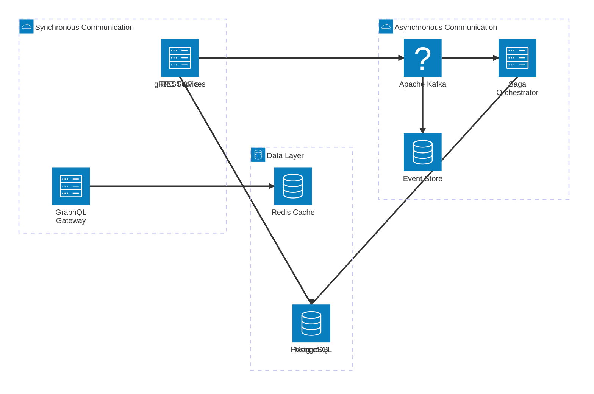

# PakLog Overall System Architecture

## Complete System Architecture

```mermaid
architecture-beta
    group api(cloud)[API Gateway]

    group wms(server)[WMS Services]
    group wes(server)[WES Services]
    group shared(database)[Shared Services]
    group external(internet)[External Systems]

    service apiGateway(server)[API Gateway] in api
    service loadBalancer(server)[Load Balancer] in api

    service orderMgmt(disk)[Order Management] in wms
    service inventory(disk)[Inventory Service] in wms
    service wavePlanning(disk)[Wave Planning] in wms
    service locationMaster(disk)[Location Master] in wms
    service workloadPlanning(disk)[Workload Planning] in wms

    service taskExecution(server)[Task Execution] in wes
    service pickExecution(server)[Pick Execution] in wes
    service packShip(server)[Pack & Ship] in wes
    service physicalTracking(server)[Physical Tracking] in wes
    service wesOrchestration(server)[WES Orchestration] in wes

    service quality(disk)[Quality Management] in shared
    service locationTracking(disk)[Location Tracking] in shared
    service eventBus(queue)[Event Bus - Kafka] in shared
    service cache(database)[Redis Cache] in shared

    service erp(internet)[ERP System] in external
    service tms(internet)[TMS System] in external
    service ecommerce(internet)[E-Commerce] in external

    apiGateway:R --> L:orderMgmt
    apiGateway:R --> L:inventory
    apiGateway:R --> L:wavePlanning
    apiGateway:B --> T:taskExecution
    apiGateway:B --> T:pickExecution

    orderMgmt:B --> T:eventBus
    inventory:B --> T:eventBus
    wavePlanning:B --> T:eventBus

    taskExecution:B --> T:eventBus
    pickExecution:B --> T:eventBus
    packShip:B --> T:eventBus

    eventBus:R --> L:wesOrchestration

    taskExecution:R --> L:cache
    pickExecution:R --> L:cache

    locationMaster:B --> T:locationTracking
    physicalTracking:B --> T:locationTracking

    packShip:R --> L:quality

    ecommerce:B --> T:apiGateway
    erp:R --> L:apiGateway
    tms:R --> L:apiGateway
```

## System Communication Patterns

```mermaid
architecture-beta
    group sync(cloud)[Synchronous Communication]
    group async(cloud)[Asynchronous Communication]
    group data(database)[Data Layer]

    service restApi(server)[REST APIs] in sync
    service grpc(server)[gRPC Services] in sync
    service graphql(server)[GraphQL Gateway] in sync

    service kafka(queue)[Apache Kafka] in async
    service eventStore(database)[Event Store] in async
    service sagaOrch(server)[Saga Orchestrator] in async

    service postgres(database)[PostgreSQL] in data
    service mongodb(database)[MongoDB] in data
    service redis(database)[Redis Cache] in data

    restApi:B --> T:postgres
    grpc:B --> T:mongodb
    graphql:R --> L:redis

    restApi:R --> L:kafka
    grpc:R --> L:kafka

    kafka:B --> T:eventStore
    kafka:R --> L:sagaOrch

    sagaOrch:B --> T:postgres
```

## Deployment Architecture

```mermaid
architecture-beta
    group prod(cloud)[Production Environment]
    group staging(cloud)[Staging Environment]
    group monitoring(server)[Monitoring]

    service k8sProd(server)[Kubernetes Cluster] in prod
    service istio(server)[Istio Service Mesh] in prod
    service nginx(internet)[NGINX Ingress] in prod

    service k8sStage(server)[Kubernetes Cluster] in staging
    service jenkins(server)[Jenkins CI/CD] in staging

    service prometheus(disk)[Prometheus] in monitoring
    service grafana(disk)[Grafana] in monitoring
    service elk(disk)[ELK Stack] in monitoring
    service jaeger(disk)[Jaeger Tracing] in monitoring

    nginx:B --> T:istio
    istio:B --> T:k8sProd

    k8sProd:R --> L:prometheus
    k8sProd:R --> L:elk
    k8sProd:R --> L:jaeger

    prometheus:R --> L:grafana

    jenkins:B --> T:k8sStage
    jenkins:R --> L:k8sProd
```