# Shared Services Architecture

## Quality Management Service

```mermaid
architecture-beta
    group interface(cloud)[Quality Interface]
    group inspection(server)[Inspection Engine]
    group compliance(server)[Compliance]
    group data(database)[Data Storage]

    service qcApp(server)[QC Application] in interface
    service mobileQc(server)[Mobile QC] in interface
    service dashboard(server)[QC Dashboard] in interface

    service inspectionEngine(disk)[Inspection Engine] in inspection
    service sampling(disk)[Sampling Logic] in inspection
    service defectMgmt(disk)[Defect Management] in inspection
    service imageAnalysis(disk)[Image Analysis] in inspection

    service compliance(disk)[Compliance Engine] in compliance
    service standards(disk)[Standards Manager] in compliance
    service certification(disk)[Certification Tracker] in compliance
    service reporting(disk)[Report Generator] in compliance

    service qualityDb(database)[Quality Database] in data
    service imageStore(database)[Image Storage] in data
    service auditLog(database)[Audit Log] in data
    service analytics(database)[Analytics DB] in data

    qcApp:B --> T:inspectionEngine
    mobileQc:B --> T:inspectionEngine
    dashboard:R --> L:reporting

    inspectionEngine:R --> L:sampling
    inspectionEngine:B --> T:defectMgmt
    inspectionEngine:R --> L:imageAnalysis

    inspectionEngine:B --> T:compliance
    compliance:R --> L:standards
    compliance:B --> T:certification
    compliance:R --> L:reporting

    inspectionEngine:B --> T:qualityDb
    imageAnalysis:B --> T:imageStore
    compliance:B --> T:auditLog
    reporting:B --> T:analytics
```

## Location Tracking Service


## Event Bus Architecture (Kafka)

```mermaid
architecture-beta
    group producers(cloud)[Event Producers]
    group kafka(queue)[Kafka Infrastructure]
    group consumers(cloud)[Event Consumers]
    group management(server)[Management]

    service wmsProducer(server)[WMS Services] in producers
    service wesProducer(server)[WES Services] in producers
    service externalProducer(server)[External Systems] in producers

    service broker1(queue)[Broker 1] in kafka
    service broker2(queue)[Broker 2] in kafka
    service broker3(queue)[Broker 3] in kafka
    service zookeeper(database)[Zookeeper] in kafka
    service schemaRegistry(database)[Schema Registry] in kafka

    service wmsConsumer(server)[WMS Consumers] in consumers
    service wesConsumer(server)[WES Consumers] in consumers
    service analyticsConsumer(server)[Analytics Pipeline] in consumers

    service kafkaConnect(disk)[Kafka Connect] in management
    service kafkaStreams(disk)[Kafka Streams] in management
    service monitoring(disk)[Monitoring] in management
    service adminTools(disk)[Admin Tools] in management

    wmsProducer:B --> T:broker1
    wesProducer:B --> T:broker2
    externalProducer:B --> T:broker3

    broker1:R --> L:zookeeper
    broker2:R --> L:zookeeper
    broker3:R --> L:zookeeper

    broker1:B --> T:schemaRegistry
    broker2:B --> T:schemaRegistry
    broker3:B --> T:schemaRegistry

    broker1:B --> T:wmsConsumer
    broker2:B --> T:wesConsumer
    broker3:B --> T:analyticsConsumer

    kafkaConnect:T --> B:broker2
    kafkaStreams:T --> B:broker1
    monitoring:R --> L:broker1
    adminTools:T --> B:zookeeper
```



## Caching Layer Architecture (Redis)


## Authentication & Authorization Service

