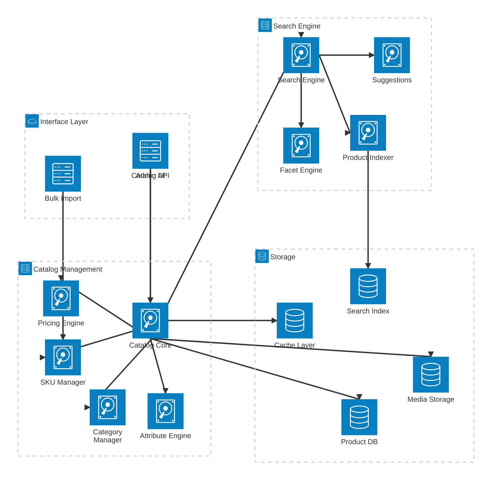
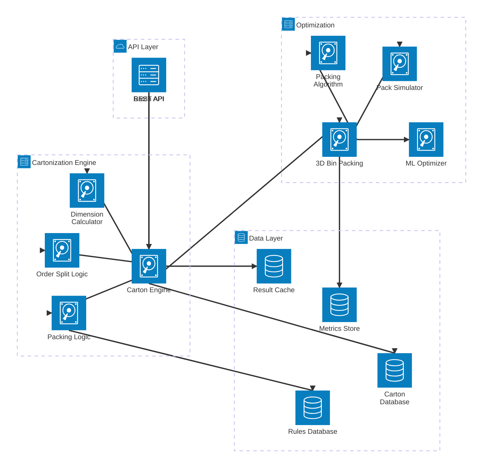

# Supporting Services Architecture

## Product Catalog Service



## Cartonization Service



## Shipment Transportation Service

```mermaid
architecture-beta
    group interface(cloud)[Integration Layer]
    group management(server)[Shipment Management]
    group carriers(internet)[Carrier Integration]
    group storage(database)[Data Storage]

    service api(server)[Shipment API] in interface
    service tracking(server)[Tracking Portal] in interface
    service edi(server)[EDI Gateway] in interface

    service shipmentCore(disk)[Shipment Core] in management
    service routePlanning(disk)[Route Planning] in management
    service consolidation(disk)[Consolidation Engine] in management
    service documentation(disk)[Doc Generator] in management

    service fedex(internet)[FedEx API] in carriers
    service ups(internet)[UPS API] in carriers
    service usps(internet)[USPS API] in carriers
    service ltl(internet)[LTL Carriers] in carriers

    service shipmentDb(database)[Shipment DB] in storage
    service trackingDb(database)[Tracking DB] in storage
    service documentsDb(database)[Documents Store] in storage
    service rateCache(database)[Rate Cache] in storage

    api:B --> T:shipmentCore
    tracking:B --> T:shipmentCore
    edi:B --> T:shipmentCore

    shipmentCore:R --> L:routePlanning
    shipmentCore:B --> T:consolidation
    shipmentCore:R --> L:documentation

    shipmentCore:B --> T:fedex
    shipmentCore:B --> T:ups
    shipmentCore:B --> T:usps
    shipmentCore:B --> T:ltl

    shipmentCore:B --> T:shipmentDb
    tracking:B --> T:trackingDb
    documentation:B --> T:documentsDb
    shipmentCore:R --> L:rateCache
```



## Yard Management System


## Returns Management Service

```mermaid
architecture-beta
    group customer(cloud)[Customer Interface]
    group processing(server)[Returns Processing]
    group disposition(server)[Disposition]
    group storage(database)[Storage]

    service rmaPortal(server)[RMA Portal] in customer
    service customerApi(server)[Customer API] in customer
    service tracking(server)[Return Tracking] in customer

    service returnsCore(disk)[Returns Core] in processing
    service rmaEngine(disk)[RMA Engine] in processing
    service inspection(disk)[Inspection Service] in processing
    service validation(disk)[Validation Engine] in processing

    service disposition(disk)[Disposition Engine] in disposition
    service refund(disk)[Refund Processor] in disposition
    service restock(disk)[Restock Manager] in disposition
    service disposal(disk)[Disposal Handler] in disposition

    service returnsDb(database)[Returns DB] in storage
    service rmaDb(database)[RMA Database] in storage
    service auditLog(database)[Audit Log] in storage
    service metrics(database)[Metrics Store] in storage

    rmaPortal:B --> T:returnsCore
    customerApi:B --> T:returnsCore
    tracking:B --> T:returnsCore

    returnsCore:R --> L:rmaEngine
    returnsCore:B --> T:inspection
    returnsCore:R --> L:validation

    returnsCore:B --> T:disposition
    disposition:R --> L:refund
    disposition:B --> T:restock
    disposition:R --> L:disposal

    returnsCore:B --> T:returnsDb
    rmaEngine:B --> T:rmaDb
    inspection:B --> T:auditLog
    disposition:B --> T:metrics
```