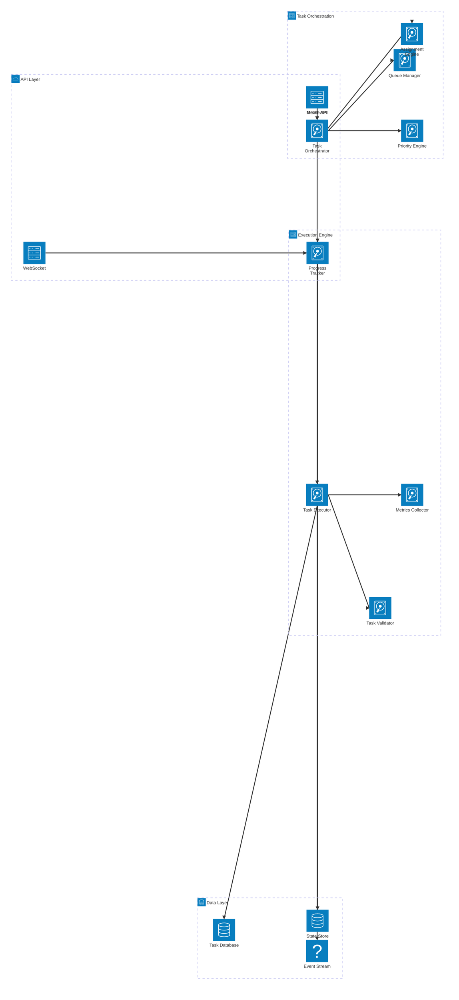
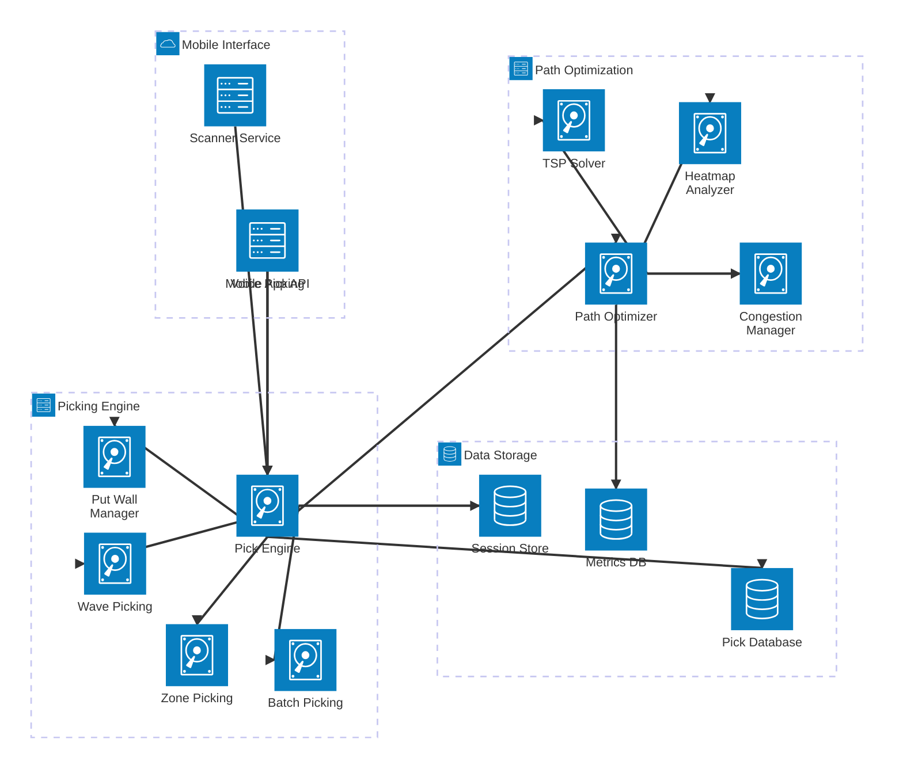
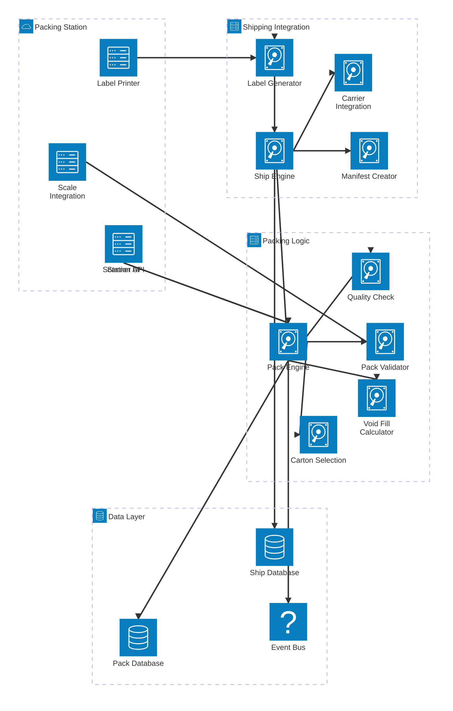
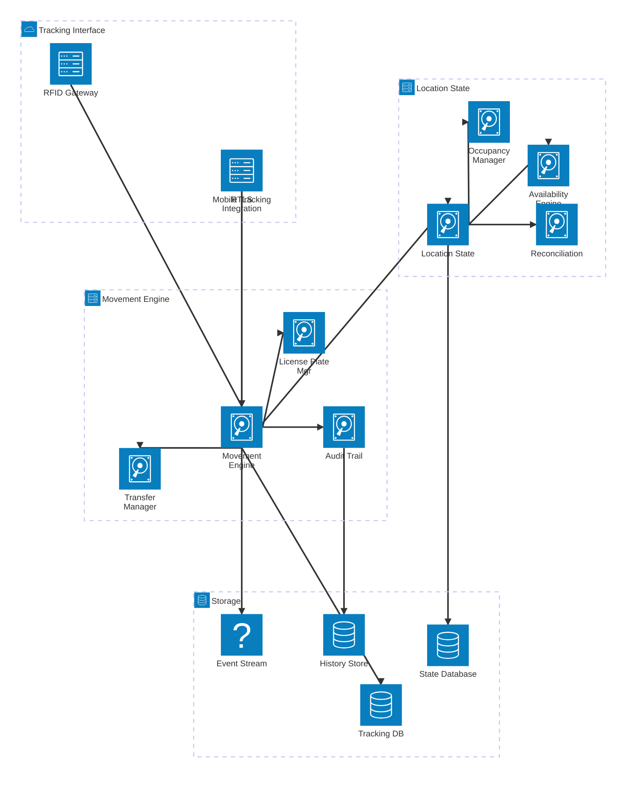
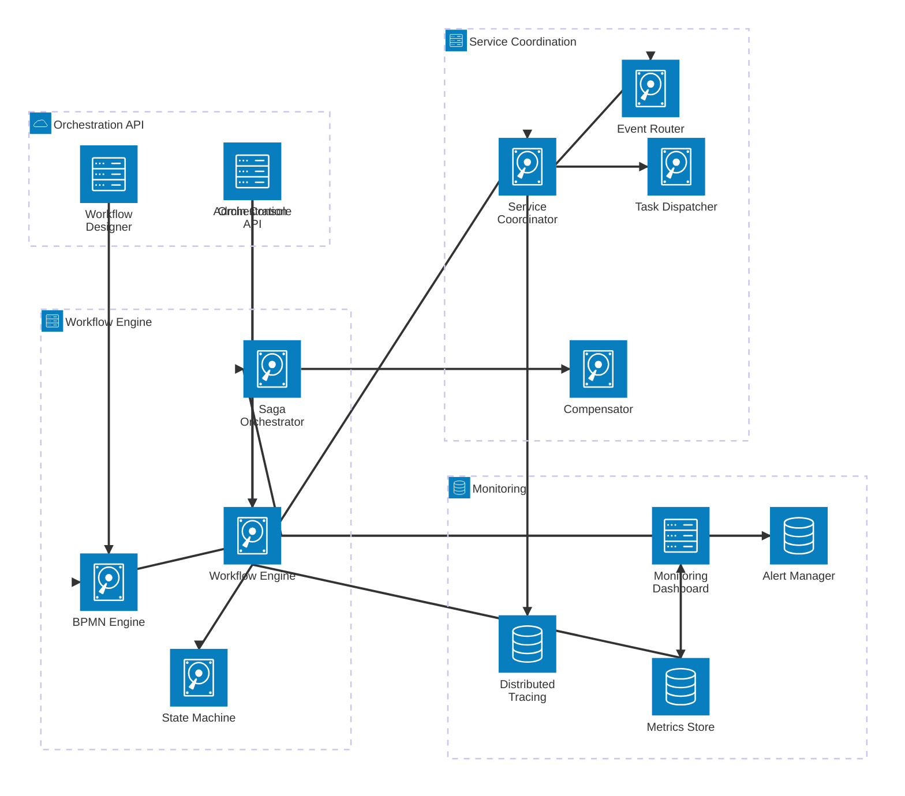

# WES Services Architecture

## Task Execution Service

```mermaid
architecture-beta
    group api(cloud)[API Layer]
    group orchestration(server)[Task Orchestration]
    group execution(server)[Execution Engine]
    group data(database)[Data Layer]

    service restApi(server)[REST API] in api
    service mobileApi(server)[Mobile API] in api
    service websocket(server)[WebSocket] in api

    service taskOrch(disk)[Task Orchestrator] in orchestration
    service queueMgr(disk)[Queue Manager] in orchestration
    service assignmentEngine(disk)[Assignment Engine] in orchestration
    service priorityEngine(disk)[Priority Engine] in orchestration

    service executor(disk)[Task Executor] in execution
    service validator(disk)[Task Validator] in execution
    service tracker(disk)[Progress Tracker] in execution
    service metrics(disk)[Metrics Collector] in execution

    service taskDb(database)[Task Database] in data
    service stateStore(database)[State Store] in data
    service eventStream(queue)[Event Stream] in data

    restApi:B --> T:taskOrch
    mobileApi:B --> T:taskOrch
    websocket:R --> L:tracker

    taskOrch:R --> L:queueMgr
    taskOrch:B --> T:assignmentEngine
    taskOrch:R --> L:priorityEngine

    taskOrch:B --> T:executor
    executor:R --> L:validator
    executor:B --> T:tracker
    executor:R --> L:metrics

    executor:B --> T:taskDb
    tracker:B --> T:stateStore
    executor:B --> T:eventStream
```

## Pick Execution Service

```mermaid
architecture-beta
    group mobile(cloud)[Mobile Interface]
    group picking(server)[Picking Engine]
    group optimization(server)[Path Optimization]
    group data(database)[Data Storage]

    service mobileApp(server)[Mobile App API] in mobile
    service scanner(server)[Scanner Service] in mobile
    service voice(server)[Voice Picking] in mobile

    service pickEngine(disk)[Pick Engine] in picking
    service batchPicking(disk)[Batch Picking] in picking
    service zonePicking(disk)[Zone Picking] in picking
    service wavePicking(disk)[Wave Picking] in picking
    service putWall(disk)[Put Wall Manager] in picking

    service pathOptimizer(disk)[Path Optimizer] in optimization
    service tspSolver(disk)[TSP Solver] in optimization
    service heatmap(disk)[Heatmap Analyzer] in optimization
    service congestion(disk)[Congestion Manager] in optimization

    service pickDb(database)[Pick Database] in data
    service sessionStore(database)[Session Store] in data
    service metricsDb(database)[Metrics DB] in data

    mobileApp:B --> T:pickEngine
    scanner:B --> T:pickEngine
    voice:B --> T:pickEngine

    pickEngine:R --> L:batchPicking
    pickEngine:B --> T:zonePicking
    pickEngine:R --> L:wavePicking
    pickEngine:B --> T:putWall

    pickEngine:B --> T:pathOptimizer
    pathOptimizer:R --> L:tspSolver
    pathOptimizer:B --> T:heatmap
    pathOptimizer:R --> L:congestion

    pickEngine:B --> T:pickDb
    pickEngine:R --> L:sessionStore
    pathOptimizer:B --> T:metricsDb
```

## Pack & Ship Service

```mermaid
architecture-beta
    group station(cloud)[Packing Station]
    group packing(server)[Packing Logic]
    group shipping(server)[Shipping Integration]
    group data(database)[Data Layer]

    service stationUi(server)[Station UI] in station
    service scannerApi(server)[Scanner API] in station
    service scaleApi(server)[Scale Integration] in station
    service printerApi(server)[Label Printer] in station

    service packEngine(disk)[Pack Engine] in packing
    service cartonSelect(disk)[Carton Selection] in packing
    service voidFill(disk)[Void Fill Calculator] in packing
    service validation(disk)[Pack Validator] in packing
    service quality(disk)[Quality Check] in packing

    service shipEngine(disk)[Ship Engine] in shipping
    service carrierInt(disk)[Carrier Integration] in shipping
    service labelGen(disk)[Label Generator] in shipping
    service manifest(disk)[Manifest Creator] in shipping

    service packDb(database)[Pack Database] in data
    service shipDb(database)[Ship Database] in data
    service eventBus(queue)[Event Bus] in data

    stationUi:B --> T:packEngine
    scannerApi:B --> T:packEngine
    scaleApi:R --> L:validation
    printerApi:R --> L:labelGen

    packEngine:R --> L:cartonSelect
    packEngine:B --> T:voidFill
    packEngine:R --> L:validation
    packEngine:B --> T:quality

    packEngine:B --> T:shipEngine
    shipEngine:R --> L:carrierInt
    shipEngine:B --> T:labelGen
    shipEngine:R --> L:manifest

    packEngine:B --> T:packDb
    shipEngine:B --> T:shipDb
    packEngine:B --> T:eventBus
```

## Physical Tracking Service

```mermaid
architecture-beta
    group tracking(cloud)[Tracking Interface]
    group movement(server)[Movement Engine]
    group location(server)[Location State]
    group data(database)[Storage]

    service rtls(server)[RTLS Integration] in tracking
    service rfid(server)[RFID Gateway] in tracking
    service mobile(server)[Mobile Tracking] in tracking

    service moveEngine(disk)[Movement Engine] in movement
    service lpManager(disk)[License Plate Mgr] in movement
    service transferMgr(disk)[Transfer Manager] in movement
    service auditTrail(disk)[Audit Trail] in movement

    service locationState(disk)[Location State] in location
    service occupancy(disk)[Occupancy Manager] in location
    service availability(disk)[Availability Engine] in location
    service reconciliation(disk)[Reconciliation] in location

    service trackingDb(database)[Tracking DB] in data
    service stateDb(database)[State Database] in data
    service historyDb(database)[History Store] in data
    service eventStream(queue)[Event Stream] in data

    rtls:B --> T:moveEngine
    rfid:B --> T:moveEngine
    mobile:B --> T:moveEngine

    moveEngine:R --> L:lpManager
    moveEngine:B --> T:transferMgr
    moveEngine:R --> L:auditTrail

    moveEngine:B --> T:locationState
    locationState:R --> L:occupancy
    locationState:B --> T:availability
    locationState:R --> L:reconciliation

    moveEngine:B --> T:trackingDb
    locationState:B --> T:stateDb
    auditTrail:B --> T:historyDb
    moveEngine:B --> T:eventStream
```

## WES Orchestration Engine

```mermaid
architecture-beta
    group api(cloud)[Orchestration API]
    group workflow(server)[Workflow Engine]
    group coordination(server)[Service Coordination]
    group monitoring(database)[Monitoring]

    service orchApi(server)[Orchestration API] in api
    service admin(server)[Admin Console] in api
    service designer(server)[Workflow Designer] in api

    service workflowEngine(disk)[Workflow Engine] in workflow
    service bpmn(disk)[BPMN Engine] in workflow
    service stateMachine(disk)[State Machine] in workflow
    service sagaOrch(disk)[Saga Orchestrator] in workflow

    service serviceCoord(disk)[Service Coordinator] in coordination
    service taskDispatch(disk)[Task Dispatcher] in coordination
    service eventRouter(disk)[Event Router] in coordination
    service compensator(disk)[Compensator] in coordination

    service metrics(database)[Metrics Store] in monitoring
    service tracing(database)[Distributed Tracing] in monitoring
    service alerting(database)[Alert Manager] in monitoring
    service dashboard(server)[Monitoring Dashboard] in monitoring

    orchApi:B --> T:workflowEngine
    admin:B --> T:workflowEngine
    designer:B --> T:bpmn

    workflowEngine:R --> L:bpmn
    workflowEngine:B --> T:stateMachine
    workflowEngine:R --> L:sagaOrch

    workflowEngine:B --> T:serviceCoord
    serviceCoord:R --> L:taskDispatch
    serviceCoord:B --> T:eventRouter
    sagaOrch:R --> L:compensator

    workflowEngine:B --> T:metrics
    serviceCoord:B --> T:tracing
    workflowEngine:R --> L:alerting
    metrics:T --> B:dashboard
```