# WMS Services Architecture

## Order Management Service

```mermaid
architecture-beta
    group api(cloud)[API Layer]
    group core(server)[Core Services]
    group data(database)[Data Layer]
    group events(queue)[Event Layer]

    service rest(server)[REST API] in api
    service graphql(server)[GraphQL] in api

    service orderService(disk)[Order Service] in core
    service validation(disk)[Validation Engine] in core
    service allocation(disk)[Allocation Service] in core
    service prioritization(disk)[Priority Engine] in core

    service orderDb(database)[Order Database] in data
    service cache(database)[Redis Cache] in data

    service publisher(queue)[Event Publisher] in events
    service consumer(queue)[Event Consumer] in events

    rest:B --> T:orderService
    graphql:B --> T:orderService

    orderService:R --> L:validation
    orderService:B --> T:allocation
    orderService:R --> L:prioritization

    orderService:B --> T:orderDb
    orderService:R --> L:cache

    orderService:B --> T:publisher
    consumer:T --> B:orderService
```



## Inventory Management Service

```mermaid
architecture-beta
    group api(cloud)[API Layer]
    group core(server)[Business Logic]
    group data(database)[Data Storage]
    group integration(internet)[Integration]

    service restApi(server)[REST API] in api
    service grpcApi(server)[gRPC API] in api

    service inventoryCore(disk)[Inventory Core] in core
    service stockEngine(disk)[Stock Engine] in core
    service cycleCount(disk)[Cycle Count] in core
    service adjustment(disk)[Adjustment Service] in core
    service reservation(disk)[Reservation Engine] in core

    service invDb(database)[Inventory DB] in data
    service auditLog(database)[Audit Log] in data
    service cache(database)[Cache Layer] in data

    service eventBus(queue)[Event Bus] in integration
    service erpSync(internet)[ERP Sync] in integration

    restApi:B --> T:inventoryCore
    grpcApi:B --> T:inventoryCore

    inventoryCore:R --> L:stockEngine
    inventoryCore:B --> T:cycleCount
    inventoryCore:R --> L:adjustment
    inventoryCore:B --> T:reservation

    stockEngine:B --> T:invDb
    adjustment:B --> T:auditLog
    inventoryCore:R --> L:cache

    inventoryCore:B --> T:eventBus
    inventoryCore:R --> L:erpSync
```



## Wave Planning Service

```mermaid
architecture-beta
    group api(cloud)[API Gateway]
    group planning(server)[Planning Engine]
    group optimization(server)[Optimization]
    group data(database)[Data Layer]

    service api(server)[Wave API] in api
    service scheduler(server)[Wave Scheduler] in api

    service waveEngine(disk)[Wave Engine] in planning
    service strategyMgr(disk)[Strategy Manager] in planning
    service cutoffMgr(disk)[Cutoff Manager] in planning
    service releaseMgr(disk)[Release Manager] in planning

    service optimizer(disk)[Wave Optimizer] in optimization
    service mlModel(disk)[ML Model] in optimization
    service simulator(disk)[Wave Simulator] in optimization

    service waveDb(database)[Wave Database] in data
    service metricsDb(database)[Metrics Store] in data
    service eventStore(queue)[Event Store] in data

    api:B --> T:waveEngine
    scheduler:B --> T:waveEngine

    waveEngine:R --> L:strategyMgr
    waveEngine:B --> T:cutoffMgr
    waveEngine:R --> L:releaseMgr

    waveEngine:B --> T:optimizer
    optimizer:R --> L:mlModel
    optimizer:B --> T:simulator

    waveEngine:B --> T:waveDb
    optimizer:B --> T:metricsDb
    releaseMgr:B --> T:eventStore
```

## Location Master Service

```mermaid
architecture-beta
    group api(cloud)[API Layer]
    group config(server)[Configuration]
    group analysis(server)[Analysis]
    group data(database)[Storage]

    service restApi(server)[REST API] in api
    service adminUi(server)[Admin UI] in api

    service locationMgr(disk)[Location Manager] in config
    service hierarchy(disk)[Hierarchy Engine] in config
    service capacity(disk)[Capacity Manager] in config
    service restrictions(disk)[Restrictions Engine] in config

    service slotting(disk)[Slotting Engine] in analysis
    service velocity(disk)[Velocity Analyzer] in analysis
    service optimization(disk)[Layout Optimizer] in analysis

    service masterDb(database)[Master Database] in data
    service configCache(database)[Config Cache] in data
    service eventLog(queue)[Event Log] in data

    restApi:B --> T:locationMgr
    adminUi:B --> T:locationMgr

    locationMgr:R --> L:hierarchy
    locationMgr:B --> T:capacity
    locationMgr:R --> L:restrictions

    locationMgr:B --> T:slotting
    slotting:R --> L:velocity
    slotting:B --> T:optimization

    locationMgr:B --> T:masterDb
    locationMgr:R --> L:configCache
    locationMgr:B --> T:eventLog
```



## Workload Planning Service

```mermaid
architecture-beta
    group api(cloud)[External Interface]
    group planning(server)[Planning Core]
    group forecasting(server)[Forecasting]
    group data(database)[Data Storage]

    service api(server)[Planning API] in api
    service dashboard(server)[Dashboard] in api

    service workloadEngine(disk)[Workload Engine] in planning
    service laborPlanning(disk)[Labor Planning] in planning
    service shiftMgr(disk)[Shift Manager] in planning
    service capacityCalc(disk)[Capacity Calculator] in planning

    service demandForecast(disk)[Demand Forecast] in forecasting
    service mlForecasting(disk)[ML Forecasting] in forecasting
    service seasonality(disk)[Seasonality Engine] in forecasting

    service planningDb(database)[Planning DB] in data
    service historicalDb(database)[Historical Data] in data
    service kpi(database)[KPI Store] in data

    api:B --> T:workloadEngine
    dashboard:B --> T:workloadEngine

    workloadEngine:R --> L:laborPlanning
    workloadEngine:B --> T:shiftMgr
    workloadEngine:R --> L:capacityCalc

    workloadEngine:B --> T:demandForecast
    demandForecast:R --> L:mlForecasting
    demandForecast:B --> T:seasonality

    workloadEngine:B --> T:planningDb
    mlForecasting:B --> T:historicalDb
    dashboard:R --> L:kpi
```