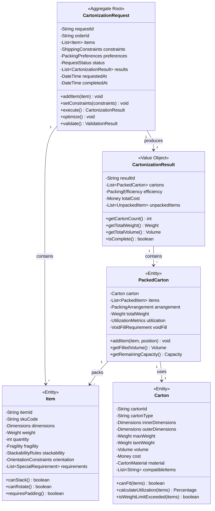
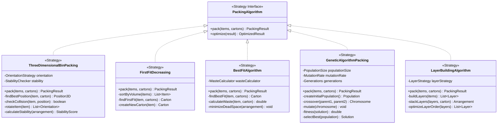
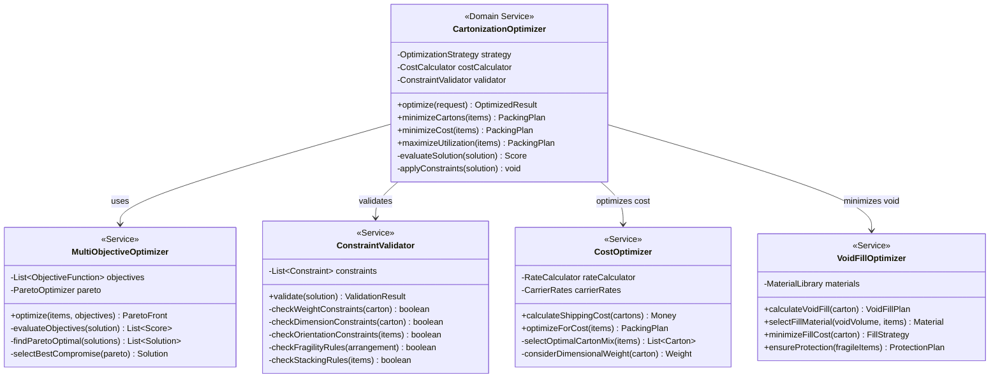
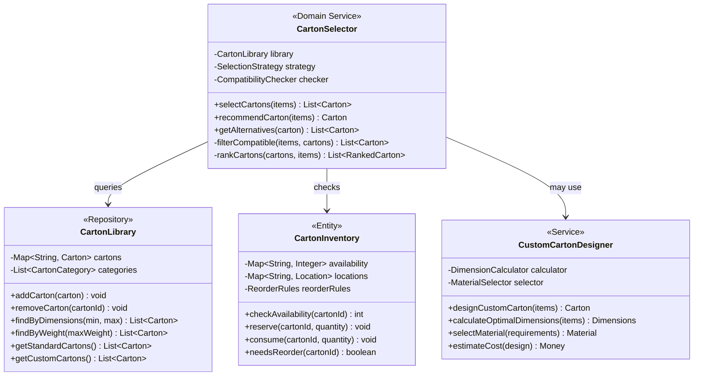
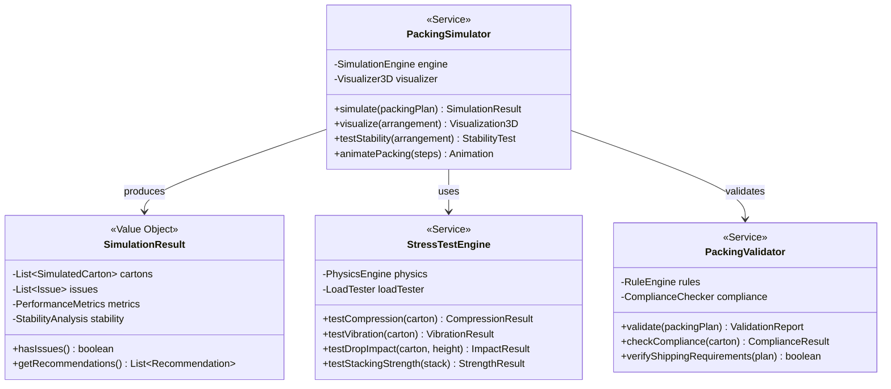
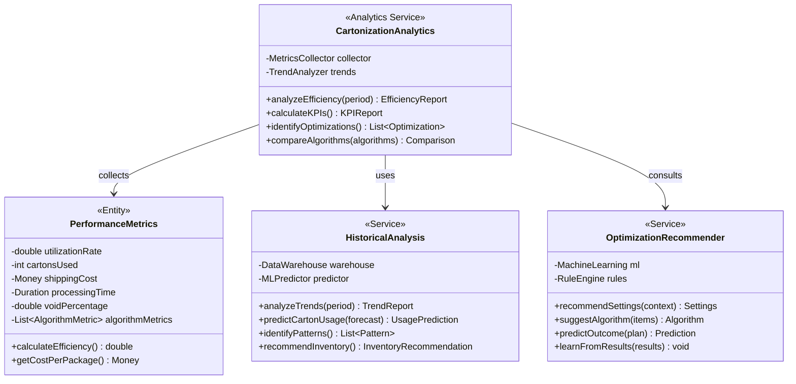
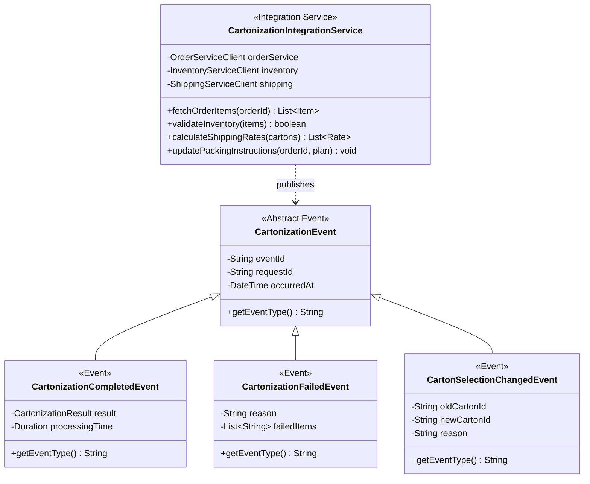

# Cartonization Service - Class Diagrams

## Domain Model Overview

## Packing Algorithms

## Optimization Engine

## Carton Selection and Management

## Simulation and Testing

## Analytics and Reporting

## Integration and Events

