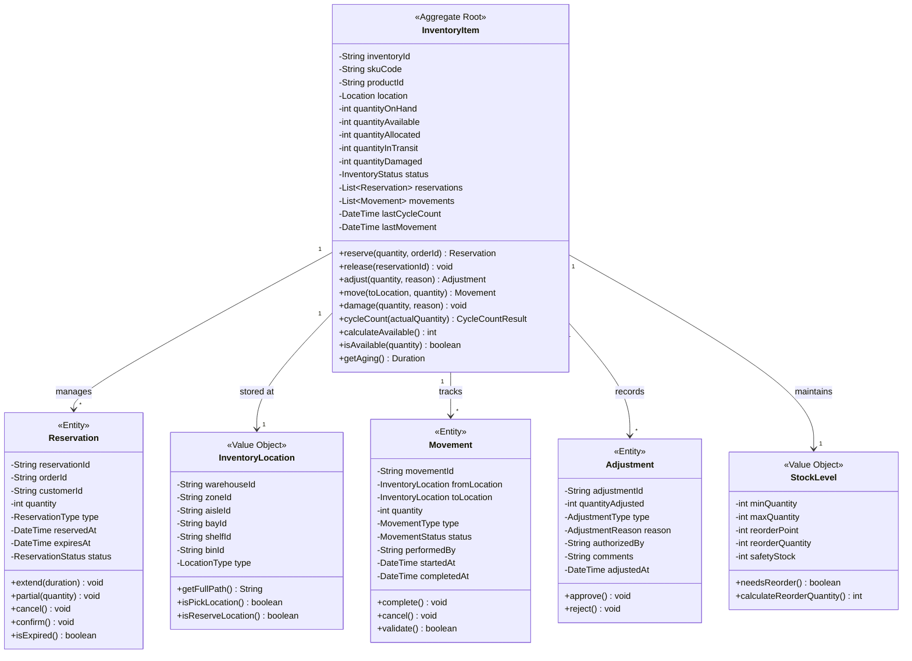

# Inventory Service - Class Diagrams

## Domain Model Overview

## Inventory Tracking and Valuation

## Allocation and Reservation System

## Command and Query Handlers

## Repository and Persistence

## Domain Events

## Integration and External Services

