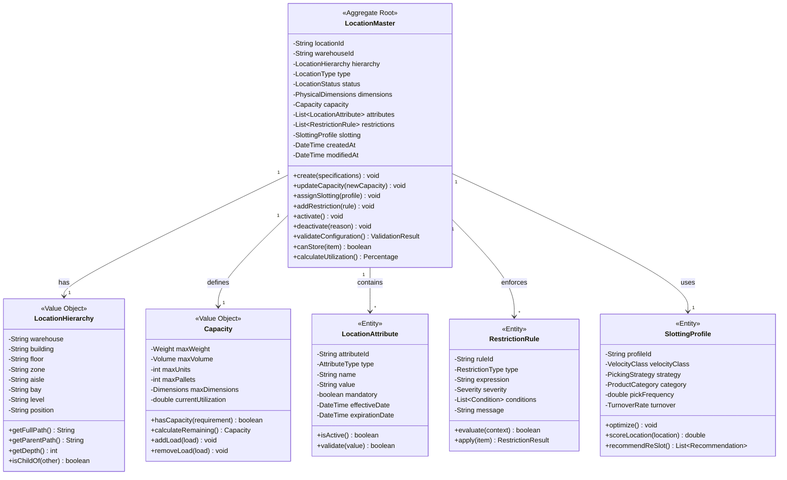
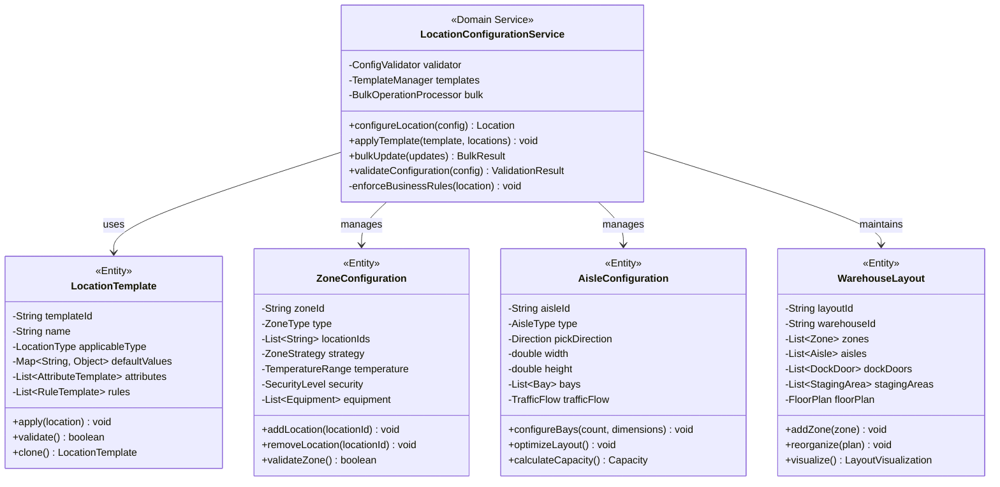
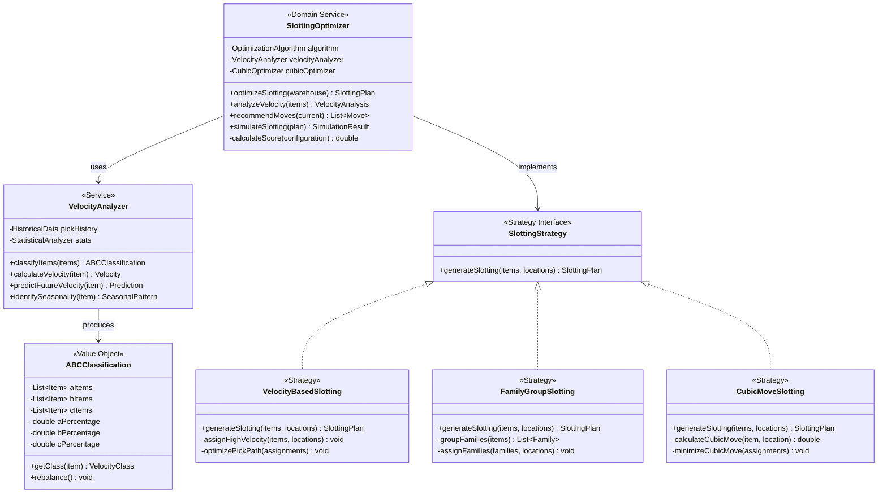
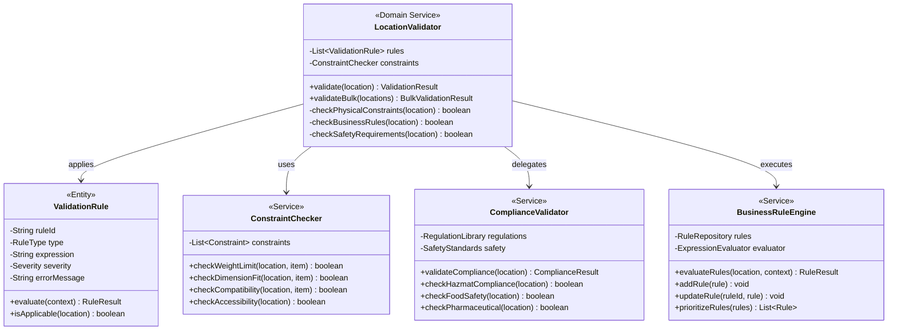
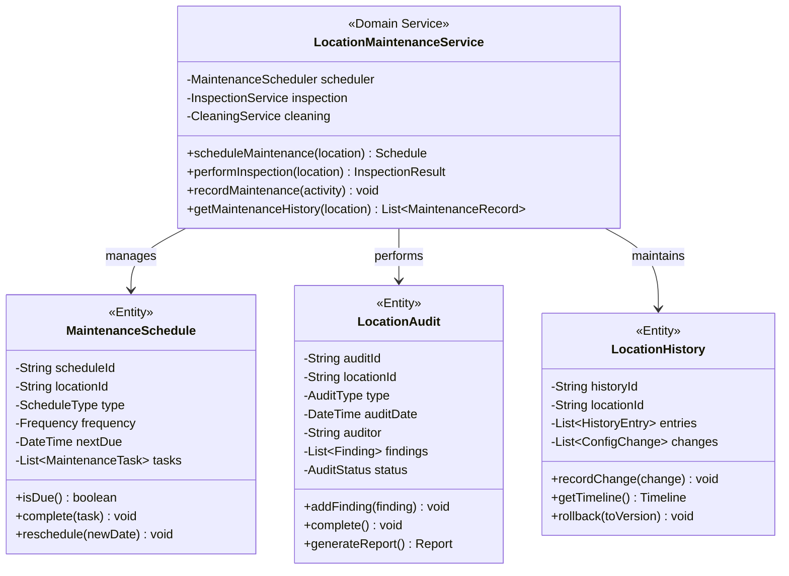
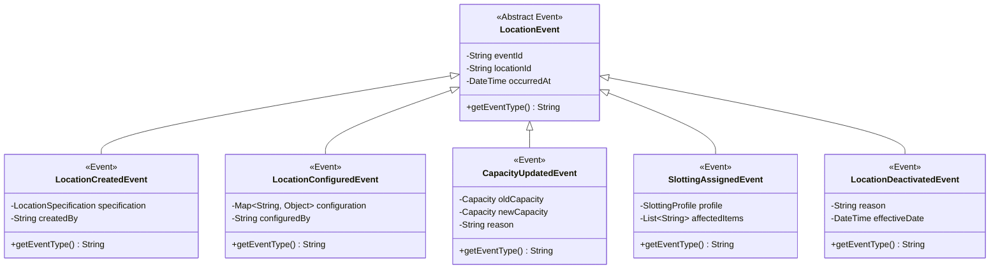
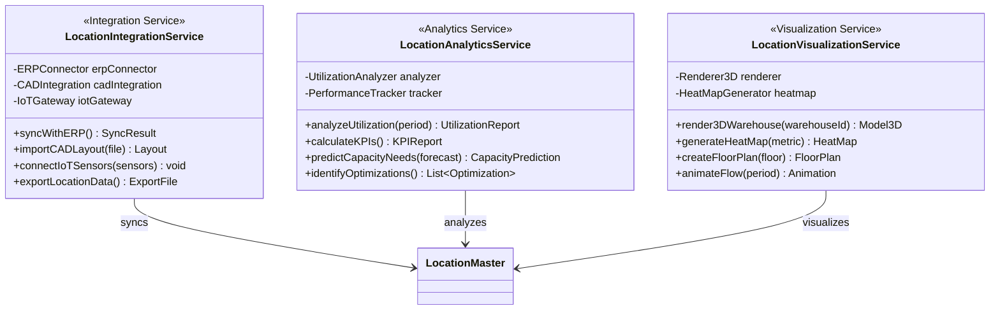

# Location Master Service - Class Diagrams

## Domain Model Overview

## Location Configuration Management

## Slotting Optimization

## Location Validation and Rules

## Location Maintenance

## Command and Query Handlers

```mermaid
classDiagram
    class CreateLocationCommand {
        <<Command>>
        -LocationSpecification specification
        -String warehouseId
        -LocationHierarchy hierarchy
        +validate() ValidationResult
    }

    class UpdateCapacityCommand {
        <<Command>>
        -String locationId
        -Capacity newCapacity
        -String reason
        +validate() ValidationResult
    }

    class AssignSlottingCommand {
        <<Command>>
        -String locationId
        -SlottingProfile profile
        +validate() ValidationResult
    }

    class GetLocationQuery {
        <<Query>>
        -String locationId
        -boolean includeAttributes
        -boolean includeMetrics
    }

    class SearchLocationsQuery {
        <<Query>>
        -LocationSearchCriteria criteria
        -Pagination pagination
        -Sorting sorting
    }

    class LocationQueryHandler {
        <<Query Handler>>
        -LocationReadModel readModel
        +handle(GetLocationQuery) LocationDto
        +handle(SearchLocationsQuery) PagedResult~LocationDto~
        -enrichLocation(location) void
    }
```

## Domain Events

## Integration Services

