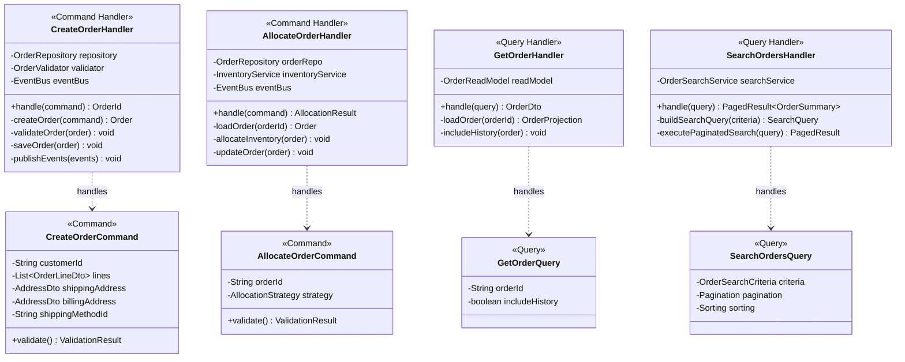
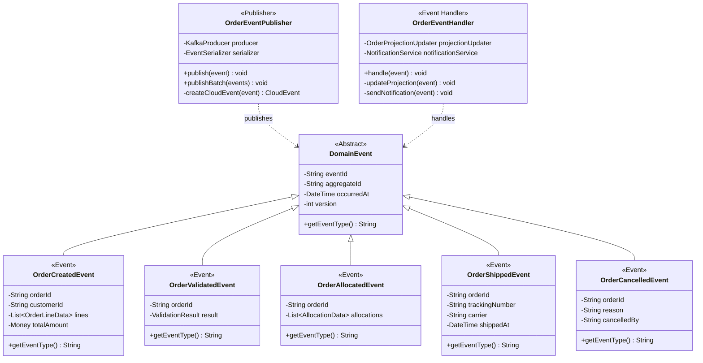

# Order Management Service - Class Diagrams

## Domain Model Overview

## Order State Machine

## Command and Query Handlers

## Repository and Infrastructure

## Domain Events

## Integration Services

## Business Rules and Policies

