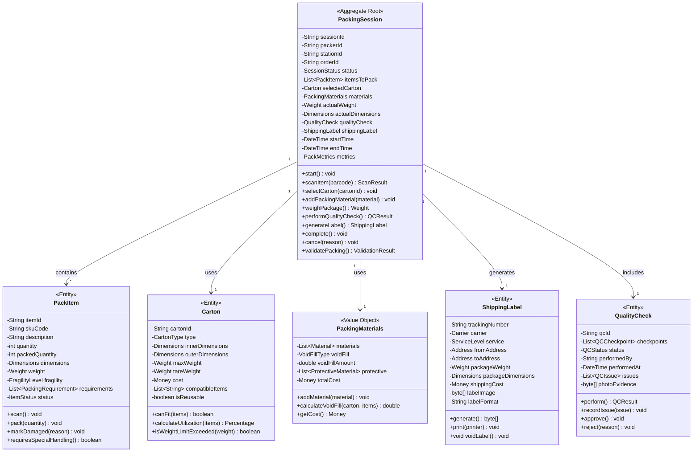
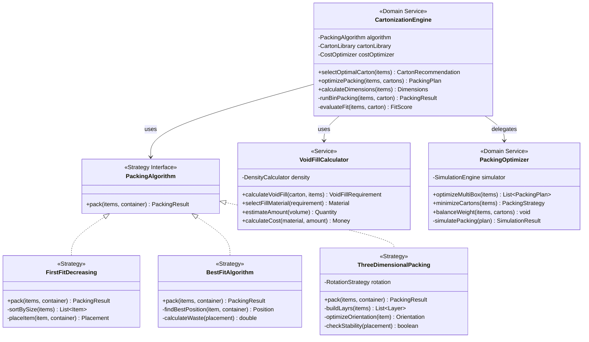
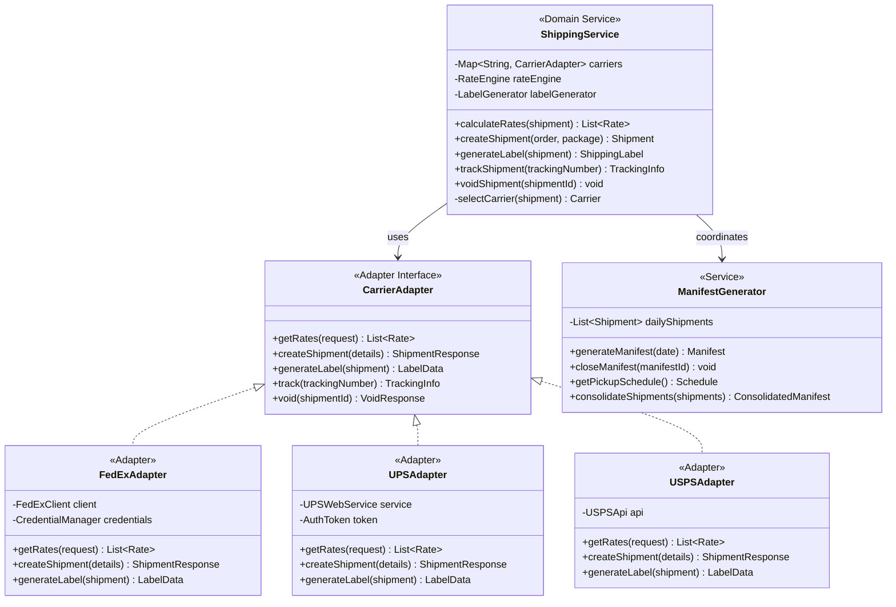
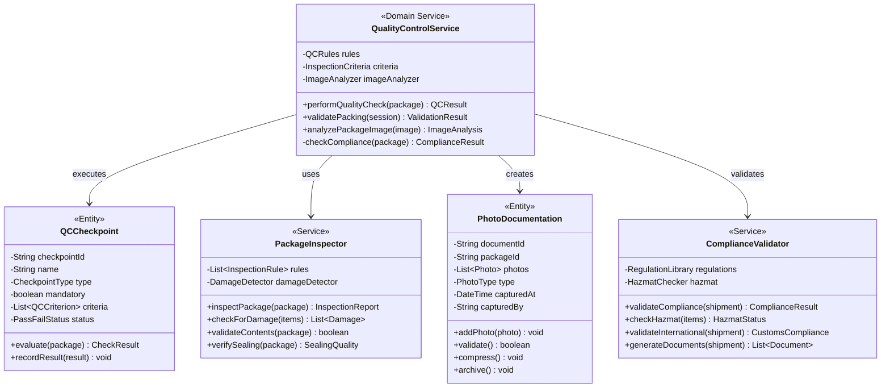
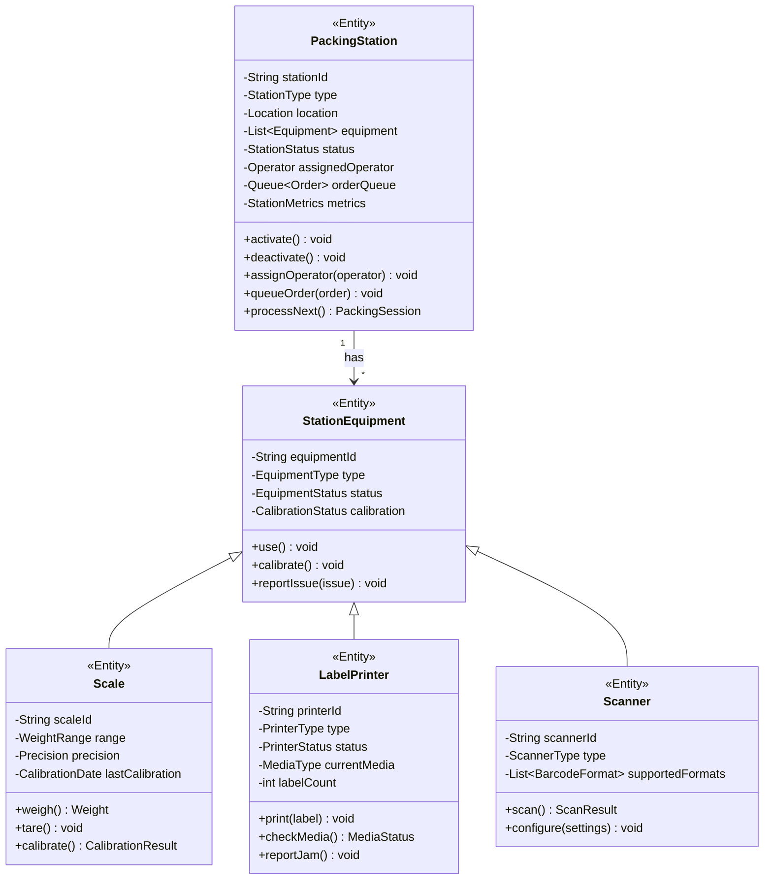
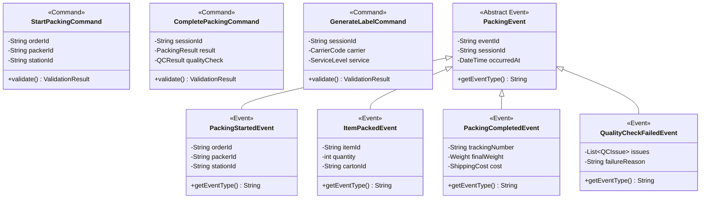
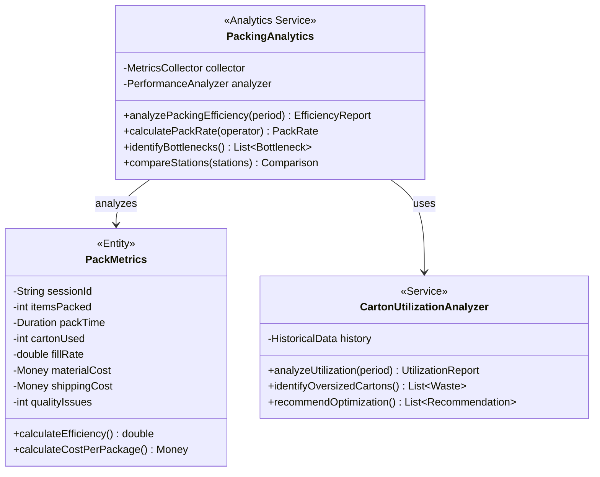

# Pack & Ship Service - Class Diagrams

## Domain Model Overview

## Cartonization and Optimization

## Shipping Integration

## Quality Control System

## Packing Station Management

## Command and Event Handling

## Performance Analytics

