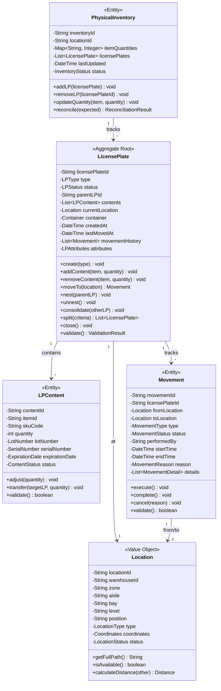
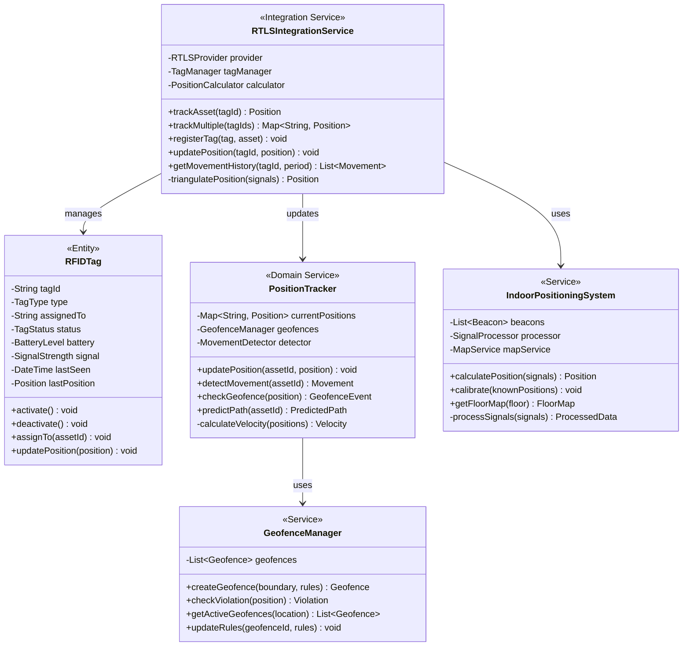
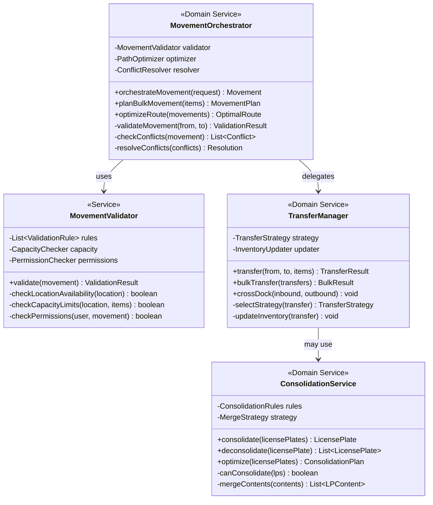
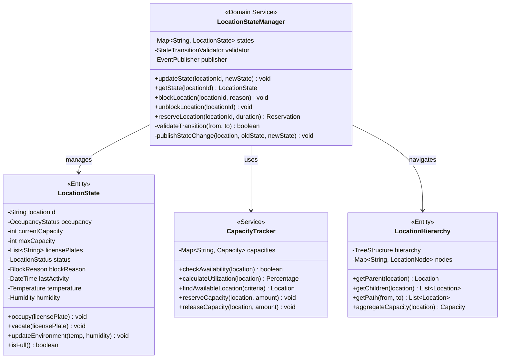
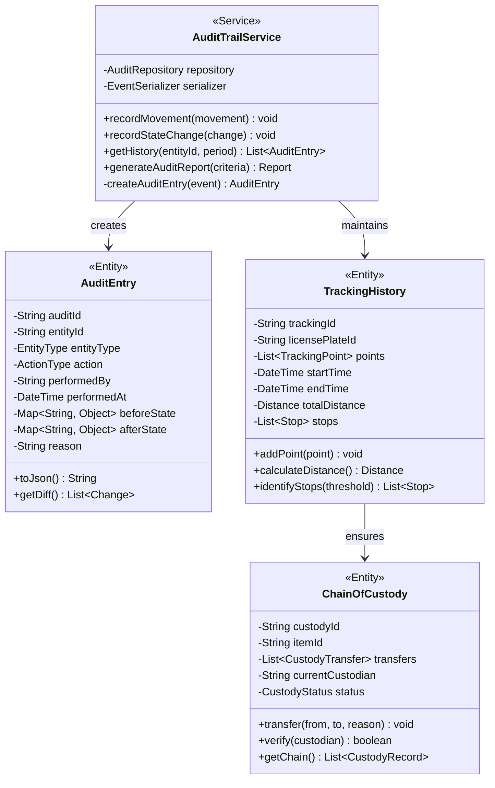
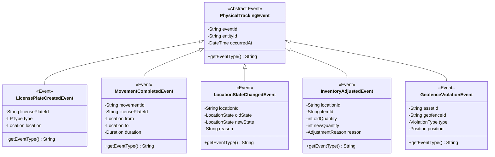
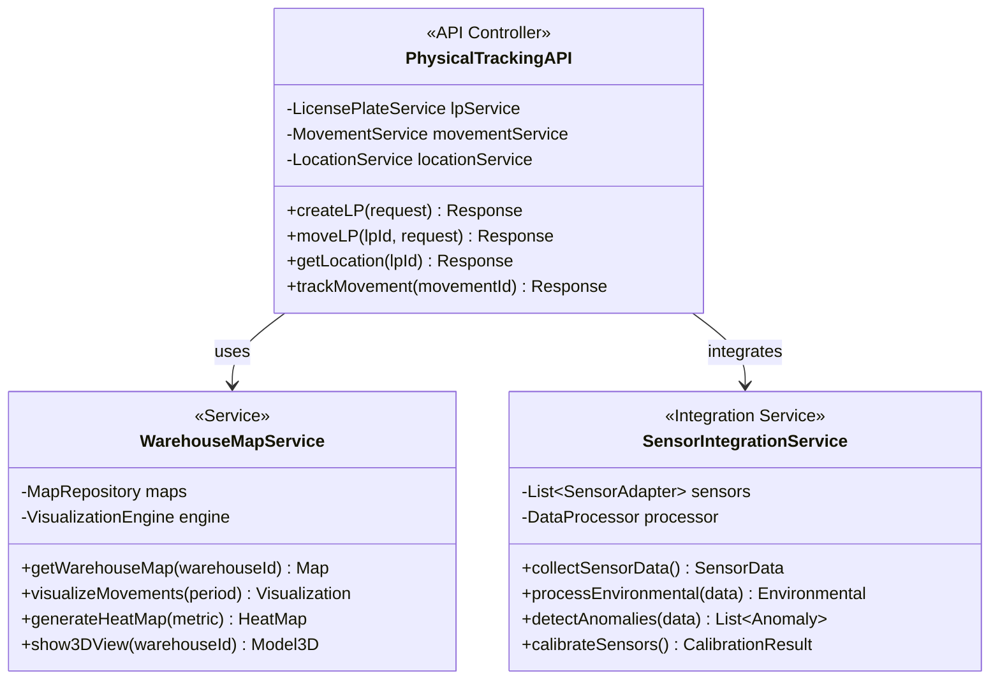

# Physical Tracking Service - Class Diagrams

## Domain Model Overview

## RTLS Integration

## Movement Orchestration

## Location State Management

## Audit and Tracking

## Domain Events

## Integration Services

