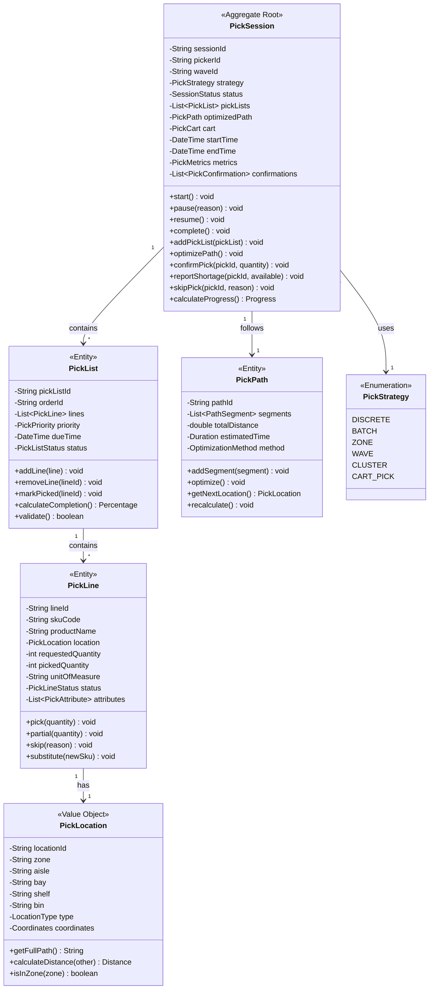
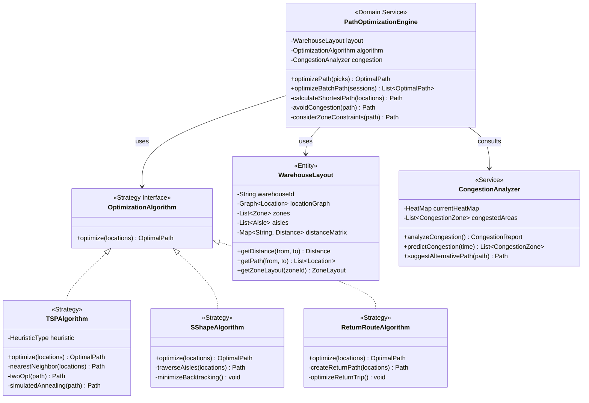
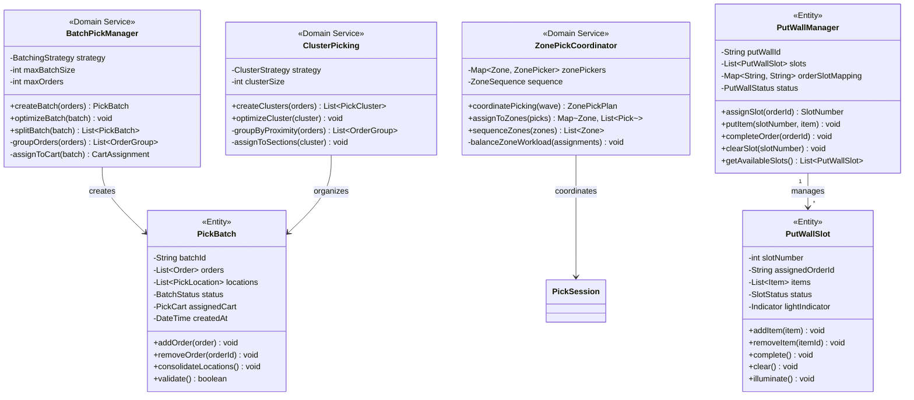
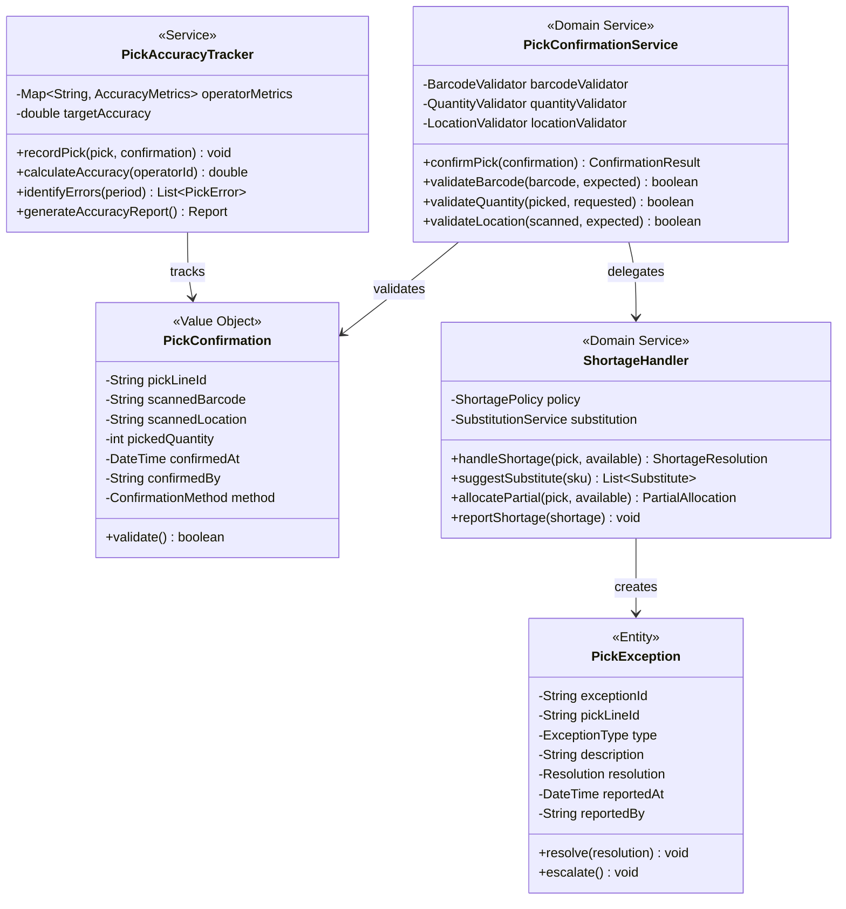
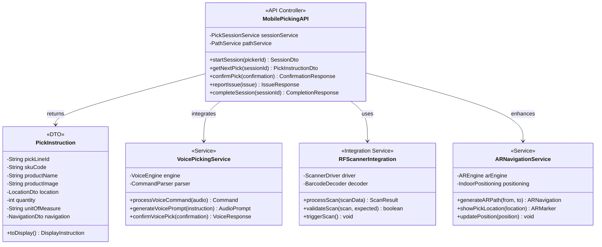
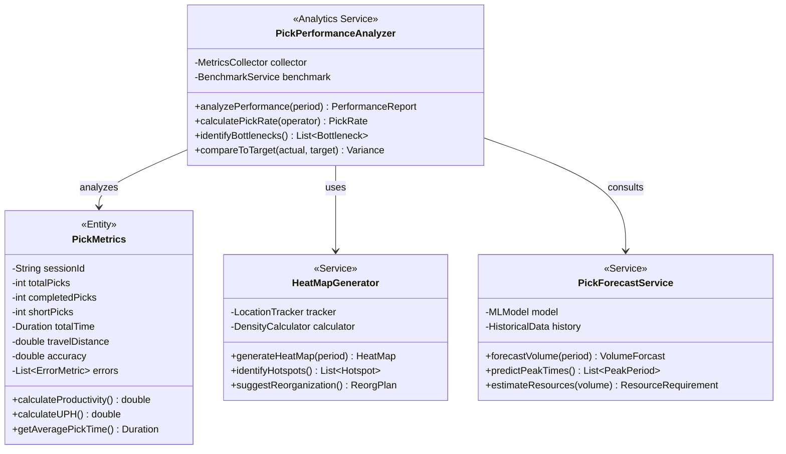
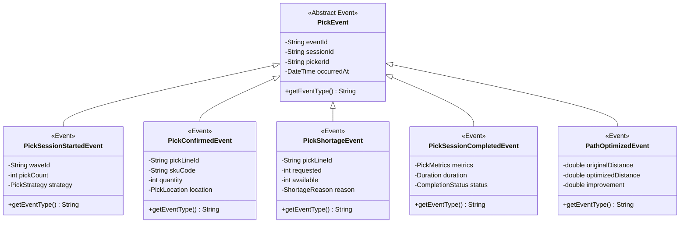

# Pick Execution Service - Class Diagrams

## Domain Model Overview

## Path Optimization Engine

## Batch and Zone Picking

## Pick Confirmation and Validation

## Mobile Picking Interface

## Performance and Analytics

## Domain Events

