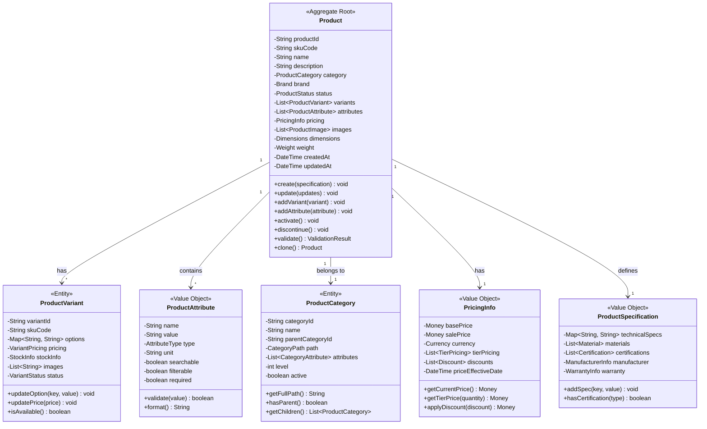
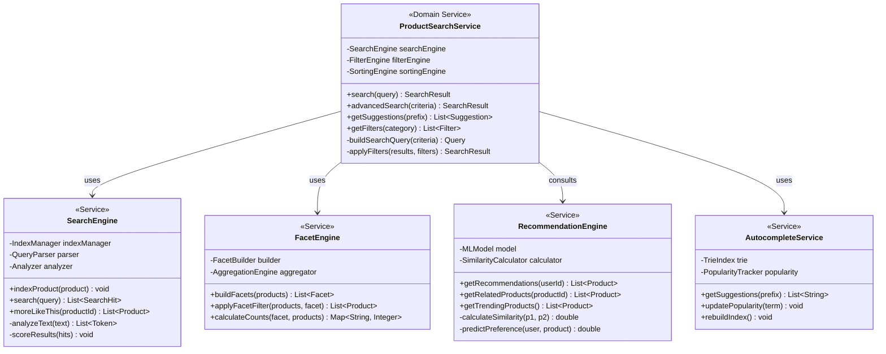
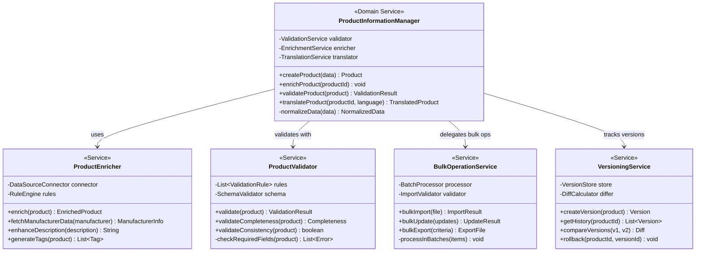
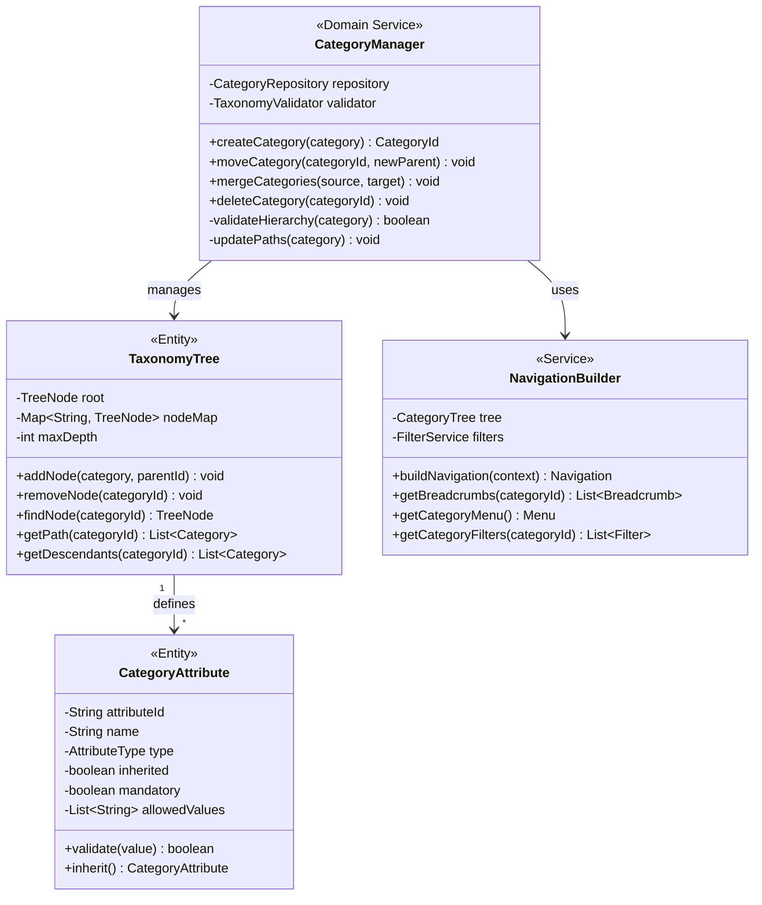
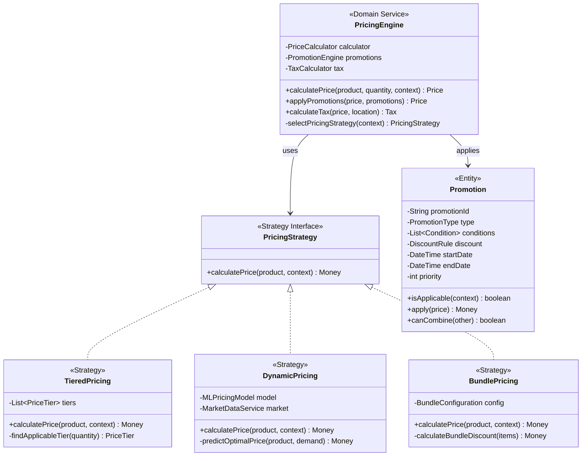
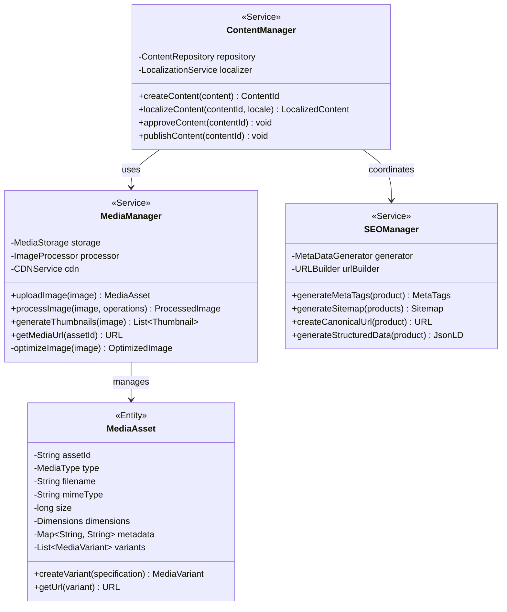
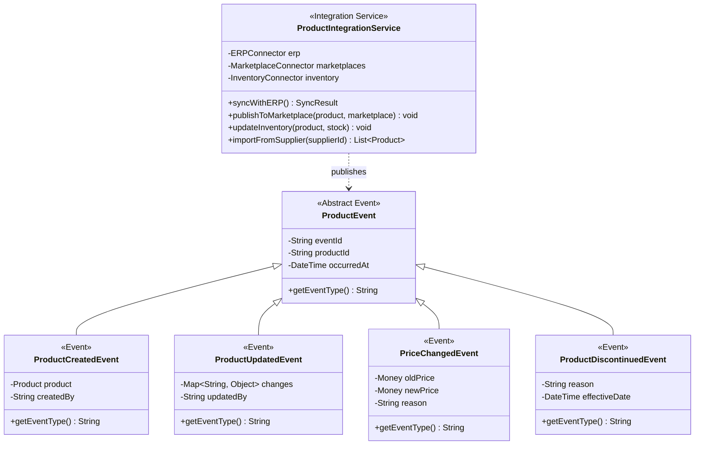

# Product Catalog Service - Class Diagrams

## Domain Model Overview

## Product Search and Discovery

## Product Information Management

## Category and Taxonomy Management

## Pricing and Promotions

## Media and Content Management

## Integration and Events

