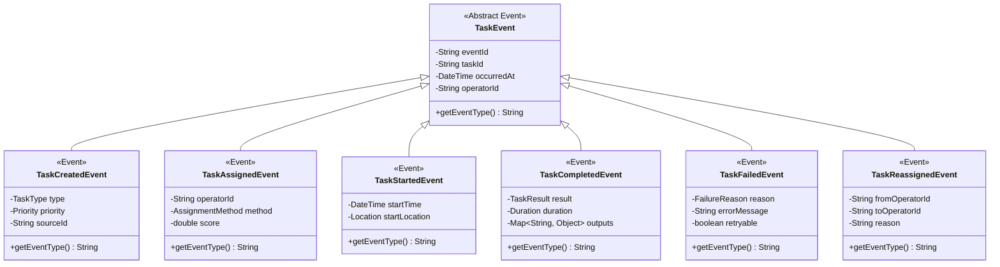

# Task Execution Service - Class Diagrams

## Domain Model Overview

## Task Assignment Engine

## Task Orchestration

## Command and Query Handlers

## Task Execution Tracking

## Domain Events

## Integration and External Services

