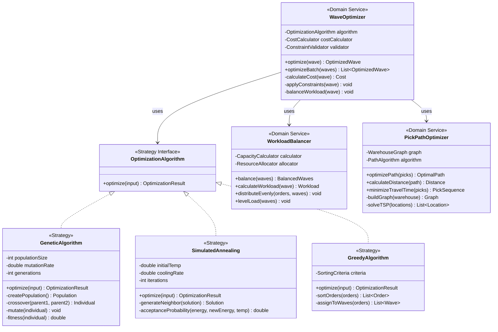

# Wave Planning Service - Class Diagrams

## Domain Model Overview

## Wave Optimization Engine

## Wave Release Management

## Command and Query Handlers

## Wave State Machine

## Domain Events

## Integration Services

## Business Rules and Strategies

