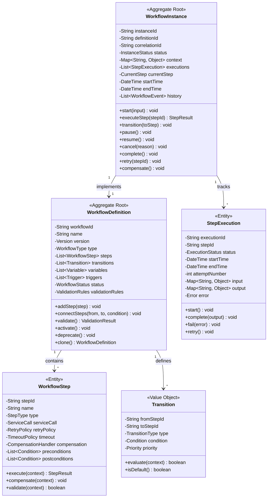
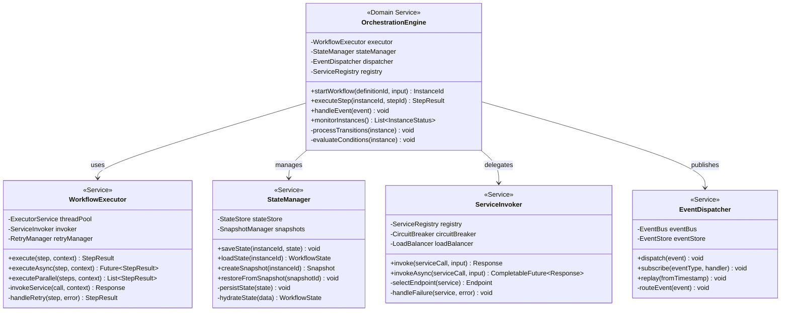
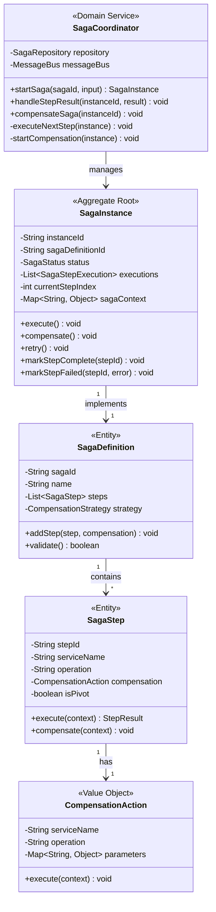
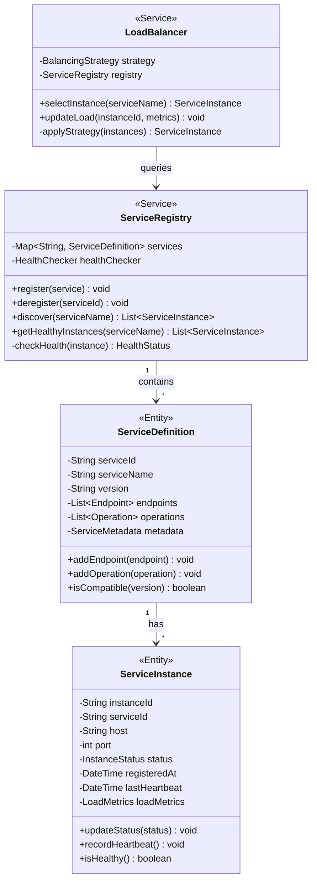
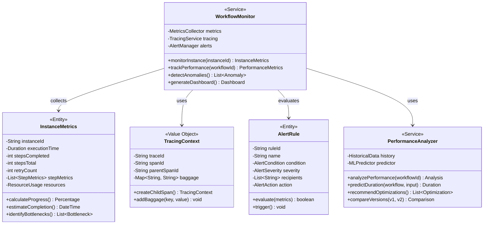
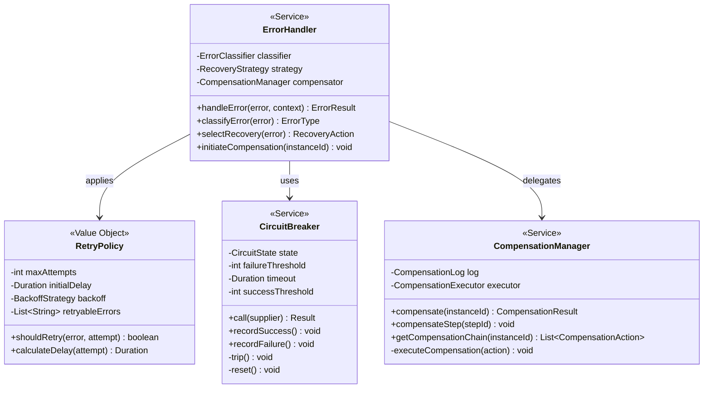
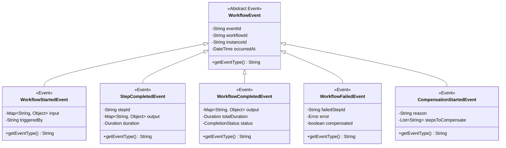

# WES Orchestration Engine - Class Diagrams

## Workflow Domain Model

## Orchestration Engine

## Saga Pattern Implementation

## Service Registry and Discovery

## Monitoring and Observability

## Error Handling and Recovery

## Domain Events

