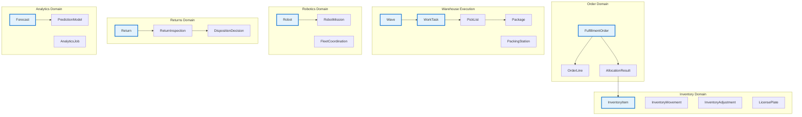

# PakLog Aggregate Catalog

## Complete Aggregate Documentation

### Overview

This document provides a comprehensive catalog of all aggregates across the PakLog microservices ecosystem, including their relationships, invariants, and domain events.

## Aggregate Relationship Map



## Core Aggregates by Service

### 1. Order Management Service

#### FulfillmentOrder (Aggregate Root)
**Purpose**: Manages the complete lifecycle of customer orders

**Attributes**:
- `orderId`: String (unique identifier)
- `customerId`: String
- `orderStatus`: Enum (PENDING, ALLOCATED, RELEASED, PICKING, PACKING, SHIPPED, DELIVERED, CANCELLED)
- `orderLines`: List<OrderLine>
- `priority`: Enum (LOW, NORMAL, HIGH, URGENT)
- `requestedDeliveryDate`: LocalDateTime
- `shippingAddress`: Address
- `allocationResults`: List<AllocationResult>

**Invariants**:
- Order must have at least one order line
- Cannot ship without successful allocation
- Cannot modify after shipping
- Priority changes require justification

**Domain Events**:
- OrderCreated
- OrderAllocated
- OrderReleased
- OrderShipped
- OrderDelivered
- OrderCancelled

**State Transitions**:
```
PENDING -> ALLOCATED -> RELEASED -> PICKING -> PACKING -> SHIPPED -> DELIVERED
     |                                                          |
     +-----------------------> CANCELLED <---------------------+
```

---

### 2. Inventory Service

#### InventoryItem (Aggregate Root)
**Purpose**: Tracks inventory levels and locations

**Attributes**:
- `sku`: String (unique identifier)
- `quantity`: Integer
- `location`: String
- `status`: Enum (AVAILABLE, ALLOCATED, DAMAGED, QUARANTINE)
- `licensePlate`: String
- `lotNumber`: String
- `expirationDate`: LocalDate

**Invariants**:
- Quantity cannot be negative
- Allocated quantity cannot exceed available
- Expired items cannot be allocated

**Domain Events**:
- InventoryReceived
- InventoryMoved
- InventoryAllocated
- InventoryDeallocated
- InventoryAdjusted

---

### 3. Cartonization Service

#### PackingSolution (Aggregate Root)
**Purpose**: Represents optimal packing arrangement for items

**Attributes**:
- `solutionId`: String
- `orderId`: String
- `packages`: List<Package>
- `totalWeight`: BigDecimal
- `totalVolume`: BigDecimal
- `utilizationRate`: BigDecimal
- `algorithm`: String (FIRST_FIT, BEST_FIT, 3D_BIN_PACKING)

**Invariants**:
- Items must fit within carton dimensions
- Weight cannot exceed carton capacity
- Fragile items must be on top

**Domain Events**:
- PackingSolutionCalculated
- PackingSolutionOptimized

---

### 4. Wave Planning Service

#### Wave (Aggregate Root)
**Purpose**: Groups orders for efficient batch processing

**Attributes**:
- `waveId`: String
- `waveNumber`: String
- `status`: Enum (PLANNED, RELEASED, IN_PROGRESS, COMPLETED, CANCELLED)
- `strategy`: Enum (ZONE_BASED, CARRIER_CUTOFF, PRIORITY_BASED, MULTI_STRATEGY)
- `orders`: List<String>
- `plannedStartTime`: LocalDateTime
- `actualStartTime`: LocalDateTime
- `completionTime`: LocalDateTime
- `assignedResources`: List<String>

**Invariants**:
- Cannot release empty wave
- Must respect carrier cutoff times
- Zone capacity constraints must be honored

**Domain Events**:
- WavePlanned
- WaveReleased
- WaveStarted
- WaveCompleted
- WaveCancelled

---

### 5. Task Execution Service

#### WorkTask (Aggregate Root)
**Purpose**: Unified task model for all warehouse work

**Attributes**:
- `taskId`: String
- `taskType`: Enum (PICK, PUT_AWAY, REPLENISHMENT, CYCLE_COUNT, MOVE, PACK, SHIP)
- `status`: Enum (PENDING, ASSIGNED, IN_PROGRESS, COMPLETED, FAILED, CANCELLED)
- `priority`: Integer (0-100)
- `assignedTo`: String (workerId or robotId)
- `context`: TaskContext (polymorphic)
- `startTime`: LocalDateTime
- `completionTime`: LocalDateTime
- `attempts`: Integer

**Invariants**:
- Task must be assigned before starting
- Cannot complete without required confirmations
- Failed tasks must be reassigned

**Domain Events**:
- TaskCreated
- TaskAssigned
- TaskStarted
- TaskCompleted
- TaskFailed
- TaskReassigned

---

### 6. Pick Execution Service

#### PickList (Aggregate Root)
**Purpose**: Manages picking operations with path optimization

**Attributes**:
- `pickListId`: String
- `pickerId`: String
- `status`: Enum (CREATED, IN_PROGRESS, COMPLETED, CANCELLED)
- `items`: List<PickItem>
- `route`: List<Location> (TSP optimized)
- `distance`: BigDecimal
- `estimatedTime`: Duration
- `actualTime`: Duration

**Invariants**:
- Route must visit all pick locations
- Cannot pick more than requested quantity
- Short picks require supervisor approval

**Domain Events**:
- PickListCreated
- PickStarted
- ItemPicked
- PickShortage
- PickCompleted

---

### 7. Pack & Ship Service

#### Package (Aggregate Root)
**Purpose**: Represents packed shipment ready for carrier

**Attributes**:
- `packageId`: String
- `orderId`: String
- `cartonType`: String
- `items`: List<PackedItem>
- `weight`: BigDecimal
- `dimensions`: Dimensions
- `trackingNumber`: String
- `carrier`: String
- `shippingLabel`: byte[]

**Invariants**:
- Package weight must match actual weight
- All order items must be packed
- Label must be generated before shipping

**Domain Events**:
- PackingStarted
- ItemPacked
- PackageSealed
- LabelGenerated
- PackageShipped

---

### 8. Robotics Fleet Management

#### Robot (Aggregate Root)
**Purpose**: Individual robot management and coordination

**Attributes**:
- `robotId`: String
- `type`: Enum (AMR, AGV, PICKING_ROBOT, SORTING_ROBOT)
- `status`: Enum (IDLE, BUSY, CHARGING, MAINTENANCE, ERROR)
- `position`: Coordinates
- `batteryLevel`: Integer (0-100)
- `currentMission`: RobotMission
- `capabilities`: List<String>

**Invariants**:
- Cannot assign mission when battery < 20%
- Must maintain safety distance (30cm)
- Cannot exceed weight capacity

**Domain Events**:
- RobotAssigned
- PathCalculated
- CollisionAvoided
- BatteryLow
- MissionCompleted

#### RobotMission (Entity)
**Purpose**: Represents assigned robot task

**Attributes**:
- `missionId`: String
- `taskId`: String
- `path`: List<Coordinates> (A* algorithm)
- `status`: Enum (PLANNED, EXECUTING, COMPLETED, ABORTED)
- `obstacles`: List<Obstacle>

---

### 9. Returns Management

#### Return (Aggregate Root)
**Purpose**: Manages return merchandise authorization

**Attributes**:
- `returnId`: String
- `rmaNumber`: String
- `orderId`: String
- `status`: Enum (REQUESTED, APPROVED, DENIED, RECEIVED, INSPECTED, REFUNDED, CLOSED)
- `items`: List<ReturnItem>
- `reason`: String
- `fraudScore`: BigDecimal
- `inspectionResult`: InspectionResult
- `disposition`: Enum (RESELL, REFURBISH, LIQUIDATE, DONATE, SCRAP)

**Invariants**:
- Must be within return window (30 days)
- High fraud score requires manual review
- Refund cannot exceed original payment

**Domain Events**:
- ReturnRequested
- ReturnApproved
- ReturnDenied
- ReturnReceived
- ReturnInspected
- RefundProcessed

---

### 10. WES Orchestration Engine

#### WorkflowInstance (Aggregate Root)
**Purpose**: Orchestrates complex multi-service workflows

**Attributes**:
- `workflowId`: String
- `workflowType`: String
- `status`: Enum (CREATED, RUNNING, PAUSED, COMPLETED, FAILED, COMPENSATING)
- `steps`: List<StepExecution>
- `sagaState`: SagaState
- `correlationId`: String
- `compensationStack`: Stack<CompensationAction>

**Invariants**:
- Steps must execute in defined order
- Compensation must reverse in LIFO order
- Cannot modify completed workflow

**Domain Events**:
- WorkflowStarted
- StepExecuted
- StepFailed
- CompensationStarted
- WorkflowCompleted
- WorkflowFailed

---

### 11. Predictive Analytics Platform

#### Forecast (Aggregate Root)
**Purpose**: ML-based predictions for various metrics

**Attributes**:
- `forecastId`: String
- `type`: Enum (DEMAND, INVENTORY, LABOR, EQUIPMENT_FAILURE)
- `horizon`: Enum (DAILY, WEEKLY, MONTHLY, QUARTERLY)
- `predictions`: List<Prediction>
- `confidence`: BigDecimal
- `modelId`: String
- `accuracy`: AccuracyMetrics (MAPE, RMSE, MAE)

**Invariants**:
- Confidence must be between 0 and 1
- Model must be trained before forecasting
- Accuracy below threshold triggers retraining

**Domain Events**:
- ForecastGenerated
- ModelTrained
- AnomalyDetected
- AccuracyDegraded

---

### 12. Yard Management System

#### YardLocation (Aggregate Root)
**Purpose**: Manages dock doors and yard positions

**Attributes**:
- `locationId`: String
- `type`: Enum (DOCK, STAGING, PARKING, MAINTENANCE)
- `status`: Enum (AVAILABLE, OCCUPIED, RESERVED, MAINTENANCE)
- `currentTrailer`: String
- `appointment`: DockAppointment
- `capacity`: Integer

**Invariants**:
- Cannot double-book dock door
- Trailer dwell time cannot exceed 48 hours
- Must maintain safety clearance

**Domain Events**:
- TrailerCheckedIn
- DockAssigned
- TrailerDocked
- TrailerDeparted

---

### 13. Cross-Docking Operations

#### CrossDockOperation (Aggregate Root)
**Purpose**: Coordinates flow-through operations

**Attributes**:
- `operationId`: String
- `type`: Enum (DIRECT, CONSOLIDATED, DECONSOLIDATED)
- `status`: Enum (PLANNED, IN_PROGRESS, COMPLETED, CANCELLED)
- `inboundTrailers`: List<String>
- `outboundTrailers`: List<String>
- `transferOrders`: List<TransferOrder>
- `dwellTime`: Duration

**Invariants**:
- Maximum dwell time: 2 hours
- Must have matching inbound/outbound
- Cannot cross-dock damaged goods

**Domain Events**:
- CrossDockPlanned
- TransferInitiated
- ConsolidationCompleted
- DirectShipmentCreated

---

### 14. Last-Mile Delivery

#### DeliveryRoute (Aggregate Root)
**Purpose**: Optimized delivery routes using VRP

**Attributes**:
- `routeId`: String
- `vehicleId`: String
- `driverId`: String
- `stops`: List<DeliveryStop> (VRP optimized)
- `status`: Enum (PLANNED, IN_PROGRESS, COMPLETED)
- `totalDistance`: BigDecimal
- `estimatedDuration`: Duration
- `actualDuration`: Duration

**Invariants**:
- Maximum 50 stops per route
- Must respect delivery time windows
- Vehicle capacity cannot be exceeded

**Domain Events**:
- RouteOptimized
- DeliveryStarted
- StopCompleted
- DeliveryCompleted
- DeliveryFailed

---

### 15. Quality Compliance

#### InspectionRecord (Aggregate Root)
**Purpose**: Quality control and compliance tracking

**Attributes**:
- `inspectionId`: String
- `type`: Enum (RECEIVING, PICKING, PACKING, SHIPPING)
- `samplingStrategy`: Enum (FULL, AQL_2_5, AQL_4_0, RANDOM)
- `result`: Enum (PASSED, FAILED, CONDITIONAL)
- `defects`: List<Defect>
- `photos`: List<String>
- `inspector`: String

**Invariants**:
- Critical defects require immediate quarantine
- Must follow sampling plan
- Photos required for all defects

**Domain Events**:
- InspectionScheduled
- DefectDetected
- InspectionCompleted
- ComplianceViolation

## Value Objects Catalog

### Common Value Objects

#### Address
- street: String
- city: String
- state: String
- zipCode: String
- country: String

#### Dimensions
- length: BigDecimal
- width: BigDecimal
- height: BigDecimal
- unit: Enum (MM, CM, M, IN, FT)

#### Weight
- value: BigDecimal
- unit: Enum (G, KG, LB, OZ)

#### Money
- amount: BigDecimal
- currency: String (ISO 4217)

#### Coordinates
- x: Double
- y: Double
- z: Double (optional)

#### TimeWindow
- startTime: LocalDateTime
- endTime: LocalDateTime

#### SKU
- value: String
- validation: Pattern

#### LocationCode
- warehouse: String
- zone: String
- aisle: String
- bay: String
- level: String
- position: String

## Aggregate Design Principles

### 1. Consistency Boundaries
- Each aggregate enforces its own invariants
- Transactions don't span aggregates
- Eventual consistency between aggregates

### 2. Aggregate Size
- Keep aggregates small
- Include only what's needed for invariants
- Split large aggregates when possible

### 3. Identity
- Each aggregate has unique identity
- Identity is immutable
- Use UUIDs or business-meaningful IDs

### 4. References
- Reference other aggregates by ID only
- No direct object references
- Lazy loading when needed

### 5. Domain Events
- Publish events for state changes
- Events are immutable
- Include all relevant data in events

## Event Sourcing Aggregates

### Services Using Event Sourcing
1. **WES Orchestration Engine**
   - Full event sourcing for workflow state
   - Event replay for debugging
   - Compensation tracking

2. **Order Management**
   - Audit trail via events
   - State reconstruction capability

3. **Inventory**
   - Movement history tracking
   - Point-in-time inventory queries

4. **Robotics Fleet**
   - Mission replay capability
   - Performance analysis

## Aggregate Anti-Patterns to Avoid

### ❌ Anemic Domain Model
- Aggregates should contain business logic
- Not just data containers

### ❌ Large Aggregates
- Avoid including entire object graphs
- Split when transaction boundaries allow

### ❌ Cross-Aggregate Transactions
- Use eventual consistency
- Leverage domain events

### ❌ Bidirectional References
- Aggregates should not reference each other directly
- Use IDs for loose coupling

### ❌ Leaking Domain Logic
- Keep invariants within aggregate
- Don't rely on application services for consistency