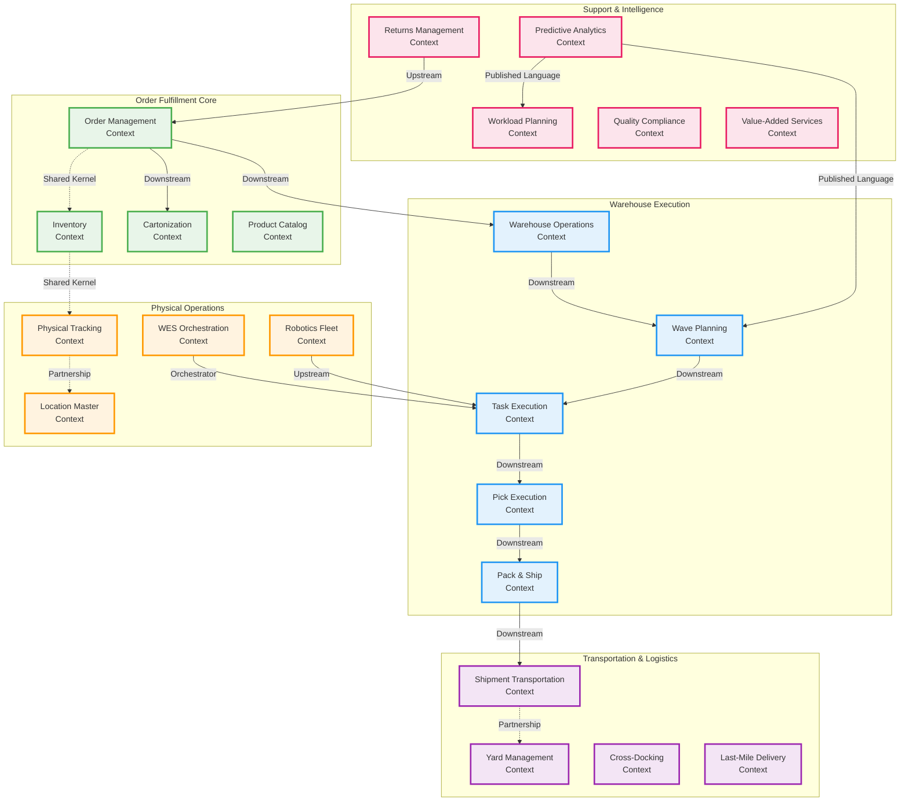

# PakLog Bounded Contexts - Complete Overview

## Strategic Design: Context Map

## Bounded Context Details

### 1. Order Management Context
**Responsibility**: Manages the complete order lifecycle from creation to fulfillment completion

**Core Aggregates**:
- `FulfillmentOrder` - Root aggregate for order processing
- `OrderLine` - Individual items within an order
- `AllocationResult` - Inventory allocation results

**Key Domain Events**:
- OrderCreated
- OrderAllocated
- OrderReleased
- OrderShipped
- OrderCompleted
- OrderCancelled

**Integration Pattern**: Upstream to most services, publishes order lifecycle events

---

### 2. Inventory Context
**Responsibility**: Single source of truth for inventory levels, locations, and movements

**Core Aggregates**:
- `InventoryItem` - Physical inventory with quantity and location
- `InventoryMovement` - Tracks all inventory transactions
- `InventoryAdjustment` - Manual adjustments and cycle counts

**Key Domain Events**:
- InventoryReceived
- InventoryMoved
- InventoryAdjusted
- InventoryAllocated
- InventoryDeallocated
- LowStockAlert

**Integration Pattern**: Shared Kernel with Order Management, Partnership with Physical Tracking

---

### 3. Cartonization Context
**Responsibility**: 3D bin-packing optimization for shipping cartons

**Core Aggregates**:
- `Carton` - Available shipping container definitions
- `PackingSolution` - Calculated optimal packing arrangement

**Key Domain Events**:
- PackingSolutionCalculated
- CartonCreated
- CartonUpdated
- CartonDeactivated

**Integration Pattern**: Downstream from Order Management, provides packing solutions

---

### 4. Product Catalog Context
**Responsibility**: Master data management for SKUs and product information

**Core Aggregates**:
- `Product` - Product master data
- `ProductCategory` - Product categorization
- `ProductAttributes` - Variable product attributes

**Key Domain Events**:
- ProductCreated
- ProductUpdated
- ProductDiscontinued
- CategoryCreated

**Integration Pattern**: Published Language, provides product data to all contexts

---

### 5. Warehouse Operations Context
**Responsibility**: Core warehouse management and coordination

**Core Aggregates**:
- `WarehouseOrder` - Warehouse-specific order representation
- `WorkAssignment` - Work allocation to resources
- `OperationalZone` - Warehouse zone management

**Key Domain Events**:
- WorkAssigned
- ZoneCreated
- OrderReleasedToWarehouse
- OperationCompleted

**Integration Pattern**: Central coordinator for warehouse activities

---

### 6. Wave Planning Context
**Responsibility**: Intelligent grouping of orders into executable waves

**Core Aggregates**:
- `Wave` - Collection of orders for batch processing
- `WaveStrategy` - Rules for wave creation
- `WavePlan` - Planned execution sequence

**Key Domain Events**:
- WavePlanned
- WaveReleased
- WaveStarted
- WaveCompleted
- WaveOptimized

**Integration Pattern**: Downstream from Warehouse Operations, upstream to Task Execution

---

### 7. Task Execution Context
**Responsibility**: Task queue management and worker assignment

**Core Aggregates**:
- `WorkTask` - Unified task model for all work types
- `TaskQueue` - Priority-based task queuing
- `WorkerAssignment` - Task-to-worker allocation

**Key Domain Events**:
- TaskCreated
- TaskAssigned
- TaskStarted
- TaskCompleted
- TaskFailed
- TaskReassigned

**Integration Pattern**: Central hub for all executable work

---

### 8. Pick Execution Context
**Responsibility**: Mobile picking operations with path optimization

**Core Aggregates**:
- `PickList` - Collection of items to pick
- `PickRoute` - Optimized picking path (TSP)
- `PickConfirmation` - Pick verification

**Key Domain Events**:
- PickListCreated
- PickStarted
- ItemPicked
- PickCompleted
- PickException

**Integration Pattern**: Downstream from Task Execution

---

### 9. Pack & Ship Context
**Responsibility**: Packing station operations and shipping label generation

**Core Aggregates**:
- `PackingStation` - Physical packing location
- `Package` - Packed shipment
- `ShippingLabel` - Carrier shipping labels

**Key Domain Events**:
- PackingStarted
- ItemPacked
- PackageSealed
- LabelGenerated
- PackageShipped

**Integration Pattern**: Downstream from Pick Execution, upstream to Shipment Transportation

---

### 10. Physical Tracking Context
**Responsibility**: License plate tracking and physical asset location

**Core Aggregates**:
- `LicensePlate` - Unique identifier for physical containers
- `AssetLocation` - Current location of assets
- `MovementHistory` - Historical tracking

**Key Domain Events**:
- LicensePlateCreated
- AssetMoved
- LocationUpdated
- AssetConsolidated

**Integration Pattern**: Shared Kernel with Inventory, provides physical tracking

---

### 11. Location Master Context
**Responsibility**: Warehouse location configuration and slotting optimization

**Core Aggregates**:
- `Location` - Physical warehouse locations
- `LocationType` - Location categorization
- `SlottingStrategy` - ABC velocity-based slotting

**Key Domain Events**:
- LocationCreated
- LocationConfigured
- SlottingOptimized
- LocationDeactivated

**Integration Pattern**: Partnership with Physical Tracking

---

### 12. Workload Planning Context
**Responsibility**: Labor forecasting and workforce planning

**Core Aggregates**:
- `WorkloadForecast` - Predicted work volume
- `StaffingPlan` - Required staffing levels
- `ShiftSchedule` - Worker shift assignments

**Key Domain Events**:
- ForecastGenerated
- StaffingPlanCreated
- ShiftScheduled
- LaborShortageDetected

**Integration Pattern**: Consumes analytics from Predictive Analytics

---

### 13. Returns Management Context
**Responsibility**: RMA processing and reverse logistics

**Core Aggregates**:
- `Return` - Return merchandise authorization
- `ReturnInspection` - Quality inspection results
- `DispositionDecision` - Return disposition

**Key Domain Events**:
- ReturnCreated
- ReturnApproved
- ReturnReceived
- ReturnInspected
- RefundProcessed
- ReturnDenied

**Integration Pattern**: Upstream to Order Management and Inventory

---

### 14. Robotics Fleet Management Context
**Responsibility**: AMR/AGV orchestration and control

**Core Aggregates**:
- `Robot` - Individual robot management
- `RobotMission` - Assigned robot tasks
- `FleetCoordination` - Multi-robot coordination
- `ChargingSchedule` - Battery management

**Key Domain Events**:
- RobotAssigned
- MissionStarted
- PathCalculated
- CollisionAvoided
- BatteryLow
- MissionCompleted

**Integration Pattern**: Upstream to Task Execution, provides automation

---

### 15. WES Orchestration Engine Context
**Responsibility**: Complex workflow orchestration with saga pattern

**Core Aggregates**:
- `WorkflowInstance` - Running workflow instance
- `StepExecution` - Individual workflow steps
- `SagaCoordinator` - Distributed transaction management

**Key Domain Events**:
- WorkflowStarted
- StepExecuted
- SagaCompleted
- CompensationTriggered
- WorkflowFailed

**Integration Pattern**: Orchestrator for complex multi-service workflows

---

### 16. Predictive Analytics Platform Context
**Responsibility**: ML-based forecasting and predictive insights

**Core Aggregates**:
- `Forecast` - Predictive forecast results
- `PredictionModel` - ML model management
- `AnalyticsJob` - Batch analytics processing

**Key Domain Events**:
- ForecastGenerated
- ModelTrained
- AnomalyDetected
- PredictionUpdated

**Integration Pattern**: Published Language, provides predictions to multiple contexts

---

### 17. Yard Management Context
**Responsibility**: Dock door scheduling and trailer management

**Core Aggregates**:
- `YardLocation` - Yard and dock locations
- `Trailer` - Trailer tracking
- `DockAppointment` - Scheduled dock appointments

**Key Domain Events**:
- TrailerCheckedIn
- DockAssigned
- TrailerDocked
- TrailerDeparted

**Integration Pattern**: Partnership with Shipment Transportation

---

### 18. Cross-Docking Context
**Responsibility**: Flow-through operations without storage

**Core Aggregates**:
- `CrossDockOperation` - Flow-through coordination
- `ConsolidationPlan` - Multi-source consolidation
- `TransferOrder` - Direct transfer orders

**Key Domain Events**:
- CrossDockPlanned
- TransferInitiated
- ConsolidationCompleted
- DirectShipmentCreated

**Integration Pattern**: Specialized operations within Warehouse Operations

---

### 19. Last-Mile Delivery Context
**Responsibility**: Final mile delivery route optimization

**Core Aggregates**:
- `DeliveryRoute` - Optimized delivery routes (VRP)
- `DeliveryStop` - Individual delivery locations
- `ProofOfDelivery` - Delivery confirmation

**Key Domain Events**:
- RouteOptimized
- DeliveryStarted
- StopCompleted
- DeliveryCompleted
- DeliveryFailed

**Integration Pattern**: Downstream from Shipment Transportation

---

### 20. Value-Added Services Context
**Responsibility**: Kitting, customization, and special handling

**Core Aggregates**:
- `VASOrder` - Value-added service request
- `WorkflowStep` - VAS workflow steps
- `QualityCheckpoint` - Quality verification

**Key Domain Events**:
- VASOrderCreated
- KittingCompleted
- CustomizationCompleted
- QualityCheckPassed

**Integration Pattern**: Specialized operations within Warehouse Operations

---

### 21. Quality Compliance Context
**Responsibility**: Quality control and regulatory compliance

**Core Aggregates**:
- `InspectionRecord` - Quality inspection results
- `ComplianceRule` - Regulatory requirements
- `Defect` - Quality defects tracking

**Key Domain Events**:
- InspectionCompleted
- DefectDetected
- ComplianceViolation
- CAPACreated

**Integration Pattern**: Cross-cutting concern for quality assurance

---

### 22. Shipment Transportation Context
**Responsibility**: Carrier integration and shipment tracking

**Core Aggregates**:
- `Shipment` - Outbound shipment
- `Carrier` - Carrier configuration
- `TrackingInfo` - Real-time tracking

**Key Domain Events**:
- ShipmentCreated
- CarrierAssigned
- ShipmentDispatched
- InTransit
- Delivered

**Integration Pattern**: Downstream from Pack & Ship, integrates with external carriers

## Context Integration Patterns

### Shared Kernel
- Order Management ↔ Inventory: Share order and inventory domain concepts
- Inventory ↔ Physical Tracking: Share location and quantity concepts

### Customer-Supplier
- Order Management → Warehouse Operations: OM supplies orders to WO
- Wave Planning → Task Execution: WP supplies waves to TE
- Pick Execution → Pack & Ship: PE supplies picked items to PS

### Partnership
- Physical Tracking ↔ Location Master: Collaborate on location management
- Shipment Transportation ↔ Yard Management: Coordinate dock and shipment

### Conformist
- All contexts conform to Product Catalog for SKU information
- All contexts conform to Location Master for location data

### Anti-Corruption Layer
- External integrations (ERP, TMS, Carriers) use ACL pattern
- Legacy system integrations protected by ACL

### Published Language
- Predictive Analytics publishes forecasts in standard format
- Product Catalog publishes product data in canonical model

## Ubiquitous Language

### Core Terms
- **SKU**: Stock Keeping Unit - unique product identifier
- **License Plate**: Unique identifier for containers/pallets
- **Wave**: Batch of orders processed together
- **Pick Path**: Optimized route through warehouse for picking
- **Slotting**: Assignment of products to warehouse locations
- **Cross-Dock**: Direct transfer without storage
- **VAS**: Value-Added Services (kitting, customization)
- **RMA**: Return Merchandise Authorization
- **SLA**: Service Level Agreement
- **WMS**: Warehouse Management System
- **WES**: Warehouse Execution System
- **WCS**: Warehouse Control System
- **AMR**: Autonomous Mobile Robot
- **AGV**: Automated Guided Vehicle
- **TSP**: Traveling Salesman Problem
- **VRP**: Vehicle Routing Problem
- **SPC**: Statistical Process Control
- **MAPE**: Mean Absolute Percentage Error