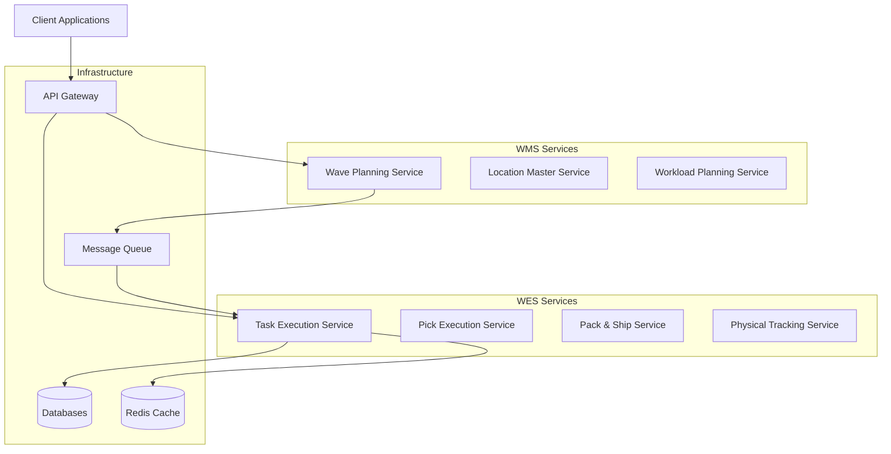

# PakLog WMS/WES Documentation

Welcome to the PakLog Warehouse Management System (WMS) and Warehouse Execution System (WES) documentation. This comprehensive guide covers architecture, design patterns, implementation strategies, and operational procedures for our modern warehouse management platform.

## Quick Navigation

<h3>📐 Architecture & Design</h3>
<ul style="list-style: none; padding: 0;">
<li><a href="diagrams/01-ARCHITECTURE-OVERVIEW">System Architecture</a></li>
<li><a href="diagrams/02-SEQUENCE-DIAGRAMS">Sequence Diagrams</a></li>
<li><a href="diagrams/03-DOMAIN-MODEL-DIAGRAMS">Domain Models</a></li>
<li><a href="diagrams/04-STATE-MACHINE-DIAGRAMS">State Machines</a></li>
<li><a href="diagrams/05-DEPLOYMENT-INFRASTRUCTURE">Infrastructure</a></li>
<li><a href="diagrams/06-DATA-FLOW-INTEGRATION">Data Flow</a></li>
<li><a href="diagrams/07-API-DOCUMENTATION">API Documentation</a></li>
</ul>

<h3>💼 Business Capabilities</h3>
<ul style="list-style: none; padding: 0;">
<li><a href="business-capabilities/inventory/">Inventory Management</a></li>
<li><a href="business-capabilities/order-management/">Order Management</a></li>
<li><a href="business-capabilities/cartonization/">Cartonization</a></li>
<li><a href="business-capabilities/product-catalog/">Product Catalog</a></li>
<li><a href="business-capabilities/shipment-transportation/">Shipment & Transport</a></li>
</ul>

<h3>🎯 Domain-Driven Design</h3>
<ul style="list-style: none; padding: 0;">
<li><a href="domain-driven-design/inventory/ddd">Inventory DDD</a></li>
<li><a href="domain-driven-design/order-management/ddd">Order DDD</a></li>
<li><a href="domain-driven-design/cartonization/ddd">Cartonization DDD</a></li>
<li><a href="domain-driven-design/product-catalog/ddd">Product DDD</a></li>
<li><a href="domain-driven-design/shipment-transportation/ddd">Shipment DDD</a></li>
</ul>

<h3>📋 Implementation Guides</h3>
<ul style="list-style: none; padding: 0;">
<li><a href="decoupling_wes_wms">WMS/WES Decoupling Strategy</a></li>
<li><a href="detailed_plan">Detailed Implementation Plan</a></li>
<li><a href="README">System Overview</a></li>
</ul>

## System Overview

PakLog is a modern, microservices-based warehouse management platform that separates concerns between strategic warehouse management (WMS) and real-time execution (WES). Built with Java 21 and Spring Boot 3.2, the system leverages Domain-Driven Design principles and event-driven architecture.

### Key Features

- **Microservices Architecture**: Modular, scalable services with clear boundaries
- **Event-Driven Design**: Apache Kafka for asynchronous communication
- **Domain-Driven Design**: Clear bounded contexts and aggregates
- **Real-time Execution**: WebSocket support for live updates
- **Cloud Native**: Kubernetes-ready with Istio service mesh
- **Comprehensive Monitoring**: Prometheus, Grafana, and distributed tracing

## Technology Stack

| Component | Technology | Version |
|-----------|------------|---------|
| **Language** | Java | 21 LTS |
| **Framework** | Spring Boot | 3.2 |
| **Messaging** | Apache Kafka | 3.5 |
| **Databases** | PostgreSQL, MongoDB | Latest |
| **Cache** | Redis | 7.0 |
| **Container** | Docker | Latest |
| **Orchestration** | Kubernetes | 1.28+ |
| **Service Mesh** | Istio | 1.19 |
| **API Gateway** | Spring Cloud Gateway | 4.0 |
| **Monitoring** | Prometheus + Grafana | Latest |

## Service Architecture

## Documentation Structure

### 1. Architecture & Design Diagrams
Comprehensive technical diagrams covering:
- C4 Model architecture views
- Business process sequence diagrams
- Domain model representations
- State machine specifications
- Deployment and infrastructure layouts
- Data flow and integration patterns
- API specifications

### 2. Business Capabilities
Detailed documentation of business domains:
- **Inventory Management**: Stock control, adjustments, cycle counting
- **Order Management**: Order processing, allocation, fulfillment
- **Cartonization**: Packing optimization and container selection
- **Product Catalog**: SKU management and product attributes
- **Shipment & Transportation**: Carrier integration and tracking

### 3. Domain-Driven Design
DDD implementation for each bounded context:
- Aggregate definitions
- Entity and value object models
- Domain events
- Repository patterns
- Anti-corruption layers

### 4. Implementation Strategies
- **[WMS/WES Decoupling](decoupling_wes_wms)**: Strangler Fig pattern implementation
- **[Detailed Plan](detailed_plan)**: Sprint-by-sprint implementation roadmap
- **[System Overview](README)**: Quick reference and service catalog

## Getting Started

### For Developers
1. Review the [Architecture Overview](diagrams/01-ARCHITECTURE-OVERVIEW)
2. Understand [Domain Models](diagrams/03-DOMAIN-MODEL-DIAGRAMS)
3. Check [API Documentation](diagrams/07-API-DOCUMENTATION)
4. Follow the [Implementation Plan](detailed_plan)

### For Business Analysts
1. Start with [Business Capabilities](business-capabilities/)
2. Review [Sequence Diagrams](diagrams/02-SEQUENCE-DIAGRAMS)
3. Understand [State Machines](diagrams/04-STATE-MACHINE-DIAGRAMS)

### For Architects
1. Study the [Decoupling Strategy](decoupling_wes_wms)
2. Review [Domain-Driven Design](domain-driven-design/)
3. Examine [Infrastructure Design](diagrams/05-DEPLOYMENT-INFRASTRUCTURE)

## Contributing

This documentation is maintained as part of the PakLog project. To contribute:

1. Fork the repository
2. Create a feature branch
3. Make your changes
4. Submit a pull request

For questions or support, please contact the PakLog development team.

---

<strong>PakLog WMS/WES Platform</strong>

Enterprise Warehouse Management System

Version 1.0.0 | Last Updated: {{ site.time | date: '%B %d, %Y' }}

